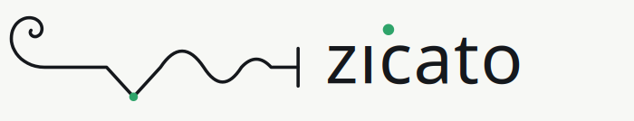
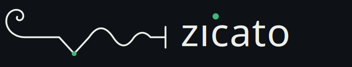

# zicato — brand assets

> One continuous stroke: a golden-spiral scroll unwinds, is plucked (the note),
> and rings out as a decaying sparkline into a bridge tick.

<picture>
  <source media="(prefers-color-scheme: dark)" srcset="zicato-lockup-dark.svg">
  
</picture>

## The mark

The canonical mark is a **single continuous line** that tells the whole story of
the project in one gesture:

1. **The scroll** — a golden (logarithmic) spiral, the same `r = a·e^{bθ}` curve
   you find in a violin scroll, with `b = ln(φ)/(π/2)` so each quarter-turn grows
   by the golden ratio φ. The spiral unwinds and exits tangent-horizontal at the
   baseline.
2. **The string** — the stroke runs taut to the right…
3. **The pluck** — …then dips into a sharp downward notch. The single green
   accent dot sits at the pluck vertex: *the plucked note* (pizzicato → zicato).
4. **The ring-out** — the note rings out as a **damped-sine sparkline** (constant
   wavelength, decaying amplitude) — the loss curve settling generation over
   generation — and lands on a **bridge tick**.

The geometry is generated, not drawn by hand: the spiral is sampled at 72 points
along `θ ∈ [0, 8.6]`, rotated so its outer end leaves horizontal, and translated
so that end meets the string at `(104, 80)`. The sparkline and bridge tick are
fixed quadratic/line segments. The accent dot marks the pluck vertex `(170, 102)`.

References for the framing: the violin scroll and the golden logarithmic spiral;
pizzicato (a *plucked* string); the damped sinusoid as a settling-loss sparkline;
and Tufte's data-ink ethic — every pixel of the mark is the line itself.

## Color tokens — and the theme-adaptive rule

The mark is **theme-adaptive by construction**. It carries no hard-coded ink
color; instead it inherits two values from its host:

| Token | Source | Default | Purpose |
|---|---|---|---|
| **Ink / foreground** | `currentColor` | host text color | the continuous stroke + bridge tick |
| **Accent** | `var(--zicato-accent)` | `#2FA46A` (light), `#3FB87A` (dark) | the single plucked-note dot — the *only* non-foreground color |

- Every adaptive asset strokes the path with `stroke="currentColor"`, so it
  renders **black-on-light, white-on-dark automatically** — it simply follows the
  surrounding text color.
- The accent dot fills with `var(--zicato-accent, #2FA46A)`. A host can override
  `--zicato-accent` (e.g. bump to `#3FB87A` on a dark ground for contrast); with
  no override it still renders green by default.

That is the whole rule: **ink = `currentColor`, accent = one CSS custom
property.** No second accent, no recoloring the stroke.

### Proof

The same `zicato-lockup.svg` on a light ground and on a dark ground — the stroke
flips with `currentColor`, the accent stays green:





(Rasterized with `cairosvg` from the single `zicato-lockup.svg`: on the light
ground `currentColor` resolves to dark ink and the accent default green; on the
dark ground `currentColor` resolves to light ink and `--zicato-accent` is bumped
to `#3FB87A`.)

## Assets

| File | What | Color model |
|---|---|---|
| `zicato-mark.svg` | icon only, transparent | `currentColor` + `var(--zicato-accent)` — adaptive |
| `zicato-mark-mono.svg` | icon, fully monochrome (accent = ink) | `currentColor` only — print / single-color |
| `zicato-lockup.svg` | mark + `zıcato` wordmark, horizontal | `currentColor` + `var(--zicato-accent)` — adaptive |
| `zicato-lockup-light.svg` | fixed-color lockup, dark ink `#15181C` | for hosts that can't supply `currentColor` |
| `zicato-lockup-dark.svg` | fixed-color lockup, light ink `#EDEFEA` | the dark half of a `<picture>` |
| `zicato-tile.svg` | rounded-square app tile, dark `#0E1116` ground | the **full mark** at app-icon scale (180px / large) |
| `zicato-favicon.svg` | **tab favicon** — a bold `z` + green plucked-note on the dark tile | legible at 16px (the full mark muddies that small) |
| `wordmark.svg` | `zıcato` wordmark alone | `currentColor` + `var(--zicato-accent)` — adaptive |
| `favicon-16.png` / `favicon-32.png` | rasterized tab favicons | from `zicato-favicon.svg` |
| `apple-touch-icon-180.png` | iOS home-screen icon | from `zicato-tile.svg` (full mark) |
| `favicon.ico` | multi-res icon (16/32/48) | from `zicato-favicon.svg` |

> **Favicon vs. tile.** The full golden-spiral mark is glorious at the lockup /
> 180px, but collapses into noise at 16px. So the *tab favicon* is a simplified
> `z` + the green plucked-note (`zicato-favicon.svg`); the *full mark* tile stays
> for the 180px apple-touch icon and any large app-icon use. Different mark by
> size — standard favicon practice.

### The wordmark

The wordmark is `zıcato` set in a monospace stack
(`ui-monospace, SFMono-Regular, Menlo, Consolas, monospace`) with a **dotless ı**
(U+0131) — the green accent circle *is* the i's dot, tying the wordmark back to
the plucked note.

> **Note — outlined wordmark is a TODO.** `wordmark.svg` is text-based, so it
> depends on a monospace font being present on the host. A font-independent
> `wordmark-outlined.svg` (text converted to paths) is not shipped here because no
> reliable text-to-path tool (`inkscape`, `picosvg`) was available in this
> environment. When one is, emit it with
> `inkscape --export-type=svg --export-text-to-path wordmark.svg`.

## Usage

### In a web page (adaptive)

Inline the SVG into the DOM (do **not** use `` — an external image can't
inherit `currentColor`), then let it follow the host's text color and define the
accent:

```css
:root        { --zicato-accent: #2FA46A; }
.dark-theme  { --zicato-accent: #3FB87A; }   /* brighter on dark grounds */
.brand-mark  { color: inherit; }             /* stroke follows currentColor */
```

### In a GitHub README (light/dark)

GitHub strips CSS, so use the fixed-color variants with `<picture>`:

```html
<picture>
  <source media="(prefers-color-scheme: dark)" srcset="docs/brand/zicato-lockup-dark.svg">
  
</picture>
```

## Clear space & minimum sizes

- **Clear space:** keep a margin of at least the spiral's diameter (~24 mark
  units) on all sides; never crowd the bridge tick or the wordmark.
- **Minimum size:** the icon reads down to **16 px**; the lockup down to **~120
  px** wide before the wordmark gets fragile. Below 16 px use the tile.
- **Accent dot:** scales with the mark; never drop it — it is the note.

## Do / don't

**Do**
- Let the stroke inherit `currentColor` (black-on-light, white-on-dark).
- Keep the accent as the single green dot; override only `--zicato-accent`.
- Keep the mark **one continuous stroke** from scroll to bridge.

**Don't**
- Don't recolor the stroke arbitrarily, or apply a gradient to it.
- Don't add a second accent color, or recolor the dot away from green.
- Don't break, re-segment, or redraw the line — it is generated geometry.
- Don't stretch non-uniformly or rotate the mark.
