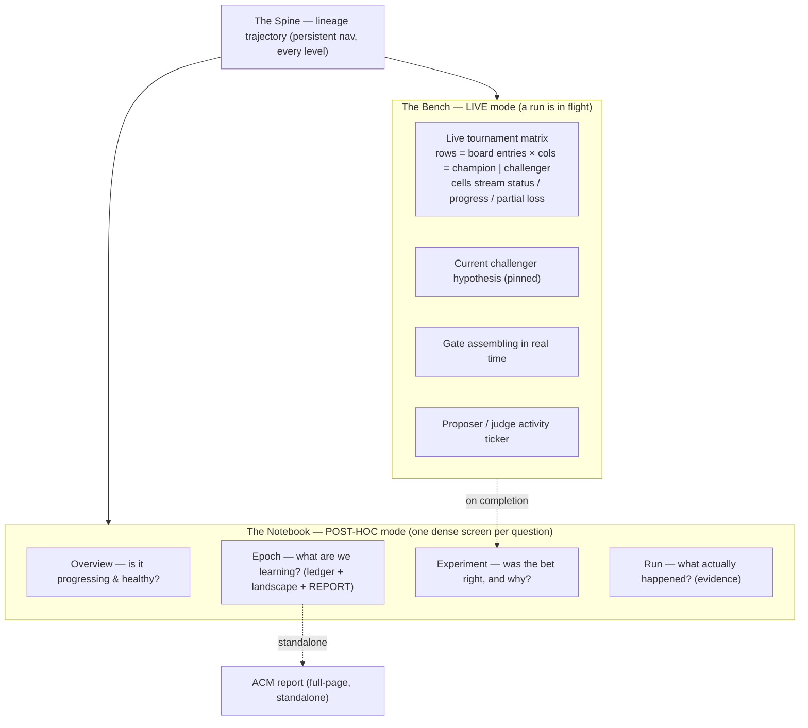

# Dashboard v2 — design philosophy & implementation spec

> **Status.** This is the authoritative spec for the ground-up dashboard
> rewrite. The v1 dashboard (the decision-centric redesign) is retained
> behind the default path until v2 is proven, then swapped. v2 is built
> behind a feature flag. Every implementation agent builds against THIS
> document so the result coheres — the v1 miss came partly from agents
> working off prose prompts with no shared spec.

## 0. The verdict on v1, and why

v1 is a **database browser**: one page per entity (workspace → epoch →
generation → round → run), each a vertical stack of generic cards
showing that entity's *fields*. It answers "what properties does this
object have," not the questions an operator asks. And it has **no live
mode** — a running loop is the whole point of zicato, yet the UI only
becomes meaningful post-hoc. Local legibility improved (the gate ladder
is good) but the *model* was never right. v2 changes the model.

## 1. What zicato is — the framing that drives everything

zicato is an **instrument for automated science**. It forms a hypothesis
(the proposer's experiment), runs it against a benchmark (the board),
measures runtime drift and loss, and renders a verdict (the promote
gate) — accumulating a **lineage of knowledge** across epochs. The
operator is a **lab director** supervising that loop. The UI's job is to
make them a competent one: watch the experiment run, understand each
result and why, see the accumulated trajectory, and drill to the raw
evidence on demand.

## 2. The five principles

1. **Instrument, not database.** Organize around *questions and
   operations*, not entities. Two modes — the **Bench** (live,
   real-time) and the **Notebook** (post-hoc analysis) — unified by the
   **lineage spine**.
2. **Comparison is the default unit of meaning.** No metric in zicato is
   meaningful alone: loss matters only vs the parent, drift only vs
   baseline. Render champion-vs-challenger (and vs-lineage) **by default,
   everywhere** — never behind an opt-in "compare" toggle.
3. **Maximal data density (Tufte).** The data is multivariate and
   comparative (generations × entries × drift-kinds × judges). Use small
   multiples, dense heatmaps and tables, high data-ink — the way the ACM
   report already does. The live dashboard should read as a **living
   version of the report**, not a stack of one-number hero cards.
4. **Honest, progressive states.** Never show "No data" while data is
   streaming. Show *running N/M*, partial results, and clearly
   distinguish four states: **not-yet** (queued), **running** (in
   flight, with progress), **empty-by-nature** (genuinely nothing), and
   **broken** (error, with the reason). No permanent caches over live
   data — re-fetch/refresh as a run progresses.
5. **Every number is a door, and looks like one.** One obvious click from
   any aggregate to its underlying evidence (the transcript / loss
   profile). Discoverability is a first-class requirement: clickable
   things carry affordance (hover, cursor, link styling, an explicit
   drill cue). And **show uncertainty** — never imply false precision.

## 3. Design language (derived from the ACM report)

The interactive UI and the report share **one visual identity**. The
report is not bolted on — it is the canonical *static* form of the same
language.

- **Typography.** A clean text face for prose (hypotheses, reasons,
  analysis); a monospace face for all data (ids, numbers, deltas, code).
  Numbers are tabular-aligned. Generous type scale for the one or two
  numbers that matter per view; small dense type for tables.
- **Color is semantic, never decorative.** Exactly three signal colors:
  **green = improvement** (loss down / pass preserved), **red =
  regression** (loss up / pass lost / fired gate rule), **amber =
  caution** (degraded health, budget pressure, deferred). Everything
  else is neutral ink on a calm ground. Color is always redundant to a
  glyph or label (a11y, grayscale-safe).
- **Density.** High data-ink ratio: minimal borders/chrome, no card
  drowning a single number. Prefer tables, heatmaps, small multiples,
  and inline sparklines. Whitespace structures; it does not pad.
- **Motion.** Only to signal liveness (a pulsing live node, a streaming
  row) — gated by `prefers-reduced-motion`. Never gratuitous.

## 4. Information architecture — two modes + the spine



### 4.1 The Bench (live) — the missing half

Active whenever a run is in flight (the default landing when the loop is
running). One dense operations view:

```
┌ BENCH · epoch 2026-05-30_e0 · round 0/1 · v0 → v1 ─────── ● RUNNING ─┐
│ HYPOTHESIS (v1): Enforce explicit slide-structure + topic discipline │
│   predicts: pass-rate Δ +0.10..+0.20                                 │
├──────────────────────────────────────────────────────────────────────┤
│ TOURNAMENT MATRIX            v0 (champion)        v1 (challenger)      │
│  waffles_single              ✓ done  drift 60.5   ▓▓▓▓░░ 60%  …        │
│  q3_metrics_outline          ✓ done  drift 71.0   ✓ done  drift 63.5  │
│  picky_stakeholder_emulated  ▓▓░░░ 23%            ▓▓░░░ 23%            │
│  …                                                                     │
├──────────────────────────────────────────────────────────────────────┤
│ GATE (forming)  scalar —  pass —  namespace —     7/14 runs complete   │
│ ACTIVITY  …research_agent call · judge incorporates_feedback · …       │
└──────────────────────────────────────────────────────────────────────┘
```

- Rows = board entries; columns = champion | challenger. Cells show the
  four honest states (queued / running-with-progress / done-with-loss /
  aborted), streaming via SSE. This is `/api/active-tournament` +
  `/api/active-runs` rendered as the matrix they describe.
- The current challenger's hypothesis pinned above (what we're testing).
- The gate assembles as scores land; on completion it resolves into the
  full Experiment verdict (§4.4) — "jump to decision" lands HERE during
  the run, then becomes the verdict.
- An activity ticker (proposer / judge / agent calls) from the run log.

### 4.2 Overview — *is it progressing & healthy?*

The loss **trajectory is the hero** (the spine at workspace zoom — every
generation a node, y = scalar, the optimization curve). A health strip
(green/amber/red with the finding). Identity/contract as compact context.
If a run is live, the Bench is embedded or one click away.

### 4.3 Epoch — *what are we trying to learn & what have we learned?*

- Goal + frozen contract (what changed to roll this epoch).
- **Experiment ledger** — a dense table, one row per generation:
  `gen · verdict glyph · hypothesis one-liner · Δscalar · Δdrift · Δpass
  · fired gate rule · open →`. The whole epoch's reasoning, scannable.
- **Drift/loss landscape** — the entry × generation heatmap (and a
  judge × generation toggle), the comparative substrate.
- **The ACM report** — embedded inline AND linked as a **full-page
  standalone** (`analysis.html`, generated by the analyzer). Retained
  verbatim; it is the epoch's publication.

### 4.4 Experiment (generation) — *was the bet right, and why?*

One dense screen (this is where v1's good atoms live, recomposed):
hypothesis→outcome as a single comparative figure (predicted vs actual
drift movements), the **gate ladder**, the **per-entry diverging A/B**,
the **scalar waterfall**, **per-judge attribution**, patches. Champion
context is always present (comparison-by-default). No opt-in picker for
the parent comparison — it is the default; the picker only chooses an
*alternate* comparison.

### 4.5 Run — *what actually happened?*

The conversation as evidence: champion | challenger **side-by-side by
default**, drift / steering / judge verdicts annotated inline, the
header metrics, and the harmonograf deep-link. The honest zero-turn /
aborted fallbacks.

### 4.6 The Spine (always)

The lineage is the persistent backbone and primary navigation — the
trajectory being climbed; click any node to drill to its Experiment.
**Must render well at every scale**, including a one-epoch / mid-first-
run / single-node workspace (a compact, centered, labeled fallback — not
empty space with a stray glyph). Promoted lineage is the through-line;
rejected challengers branch off their parent; the live node pulses.

## 5. Component library

**Reuse (v1 atoms that work):** `gateLadder`, `divergingBar`,
`scalarWaterfall`, `scalarBand`, `verdictGlyph`. Keep their factory
contracts.

**New shared primitives (build these):**
- `dataTable({columns, rows, ...})` — dense, tabular-aligned, sortable,
  every row drillable; the ledger and per-entry/judge tables use it.
- `trajectory({nodes, ...})` — the spine/lineage as an optimization
  curve (y = scalar), the persistent nav; the corrected, scale-robust
  successor to `lineageRibbon` (handles 1..N nodes; no empty-state glyph
  bug).
- `liveMatrix({entries, sides, onCell})` — the Bench tournament matrix;
  per-cell honest-state rendering (queued/running+progress/done/aborted),
  SSE-updating.
- `smallMultiples(...)` — a row of mini comparative charts (per-entry or
  per-judge), for landscape views.
- `stateBlock(kind, ...)` — the canonical honest-state renderer:
  `not_yet | running({done,total}) | empty | broken({reason})`. Every
  async section uses this instead of ad-hoc "No data" strings.

All components are pure factories returning detached, re-render-safe DOM
nodes (the established convention; views import by direct path).

## 6. Architecture

- **Feature flag.** v2 ships behind a flag so v1 stays default until
  proven. Mechanism: a separate entry (`app2.js` + a `?ui=v2` query / a
  persisted toggle) and a `views/v2/` namespace. The dashboard server
  selects the entry; default stays v1 until cutover.
- **Reuse the data layer.** The endpoints are correct — the miss was
  presentation. Reuse `core/` (dom, bus, api, sse, state) and every
  `/api/*` endpoint as-is. The ONE backend change: ensure live/streaming
  data has no permanent client cache (fix the per-entry stale cache; §2
  principle 4) and add any thin aggregation the Bench matrix needs.
- **The standalone ACM report stays.** The analyzer's `analysis.html`
  full-page report is retained unchanged and remains reachable as a
  standalone page (its own URL), plus embedded in the Epoch view. Do not
  touch the analyzer.
- **Known bugs folded in:** the meta-loop harmonograf session id is
  sanitized (`:`/`+` → `-`) so zicato's own harmonograf link works.

## 7. Phasing (implementation waves)

1. **Foundation:** design-language CSS/tokens; the v2 shell + router +
   feature flag + spine nav; the new shared primitives (`dataTable`,
   `trajectory`, `liveMatrix`, `smallMultiples`, `stateBlock`); the
   per-entry cache fix + harmonograf id sanitize.
2. **The Bench (live):** the operations view — highest-value, most-missed.
3. **The Notebook:** Overview, Epoch (ledger + landscape + report),
   Experiment, Run.
4. **Polish & cutover:** discoverability/affordance pass, uncertainty
   surfaces, reconcile the report into the shared language, flip the flag.

## 8. Done-criteria — how we avoid missing again

A view ships only if it passes this checklist:
- **Answers its question** (not "lists fields").
- **Comparison is default** (champion/lineage present without a toggle).
- **Dense** (no single-number hero card; small multiples / tables where
  the data is multivariate).
- **Honest states** (uses `stateBlock`; never "No data" over streaming
  data; live data refreshes).
- **Drillable & discoverable** (every aggregate → evidence in one
  obvious, affordanced click).
- **Verified on a live run AND a closed epoch** (browser-use tour against
  real `zicato evolve` data — both in-flight and post-hoc), not just
  unit tests.

*See also* [`SELECTION.md`](SELECTION.md) (the decision/gate semantics
the Experiment view renders), [`DASHBOARD.md`](DASHBOARD.md) (the shipped
v1 surface + the SSE/API/runtime reference v2 reuses).
