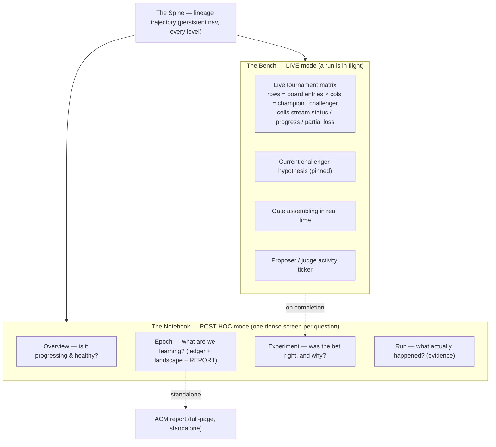

# Two-mode dashboard specification

> **Status: superseded. Retained for the design requirements it states.**
> Neither front end this document names is in the repository. The
> entity-page dashboard it argues against and the two-mode dashboard it
> specifies were both removed from `main` on 2026-06-02 and preserved at
> the git tag `dashboard-v1-v2-archive-2026-06-02`. The single shipping
> front end is the console that came out of the dashboard design
> bake-off. [CONSOLE-DESIGN-LANGUAGE.md](CONSOLE-DESIGN-LANGUAGE.md) is
> the source of truth for what the console does;
> [DASHBOARD-VARIANTS.md](DASHBOARD-VARIANTS.md) records the bake-off
> field it came from. This document is kept because the requirements it
> states — comparison by default, honest progressive states, data
> density, drillability, and a live operations view — are the ones the
> console was built to satisfy. Read the requirements here and the
> shipped behaviour there.

Every implementation of this design builds against this document, so
that separately-built views cohere into one interface rather than each
one interpreting the brief differently.

## 0. What this design rejects

An entity-page dashboard gives one page per entity — workspace, epoch,
generation, round, run — and fills each page with a vertical stack of
generic cards showing that entity's fields. It answers what properties
an object has, and that is not a question the operator asks. Such a
dashboard also has no live mode: a running loop is the point of zicato,
yet an interface built this way becomes meaningful only after the run
ends. Individual atoms of an entity-page dashboard can be good — a gate
ladder rendered well is good wherever it appears — while the model
underneath is still wrong. This design changes the model.

## 1. What zicato is — the framing that drives everything

zicato is an instrument for automated science. It forms a hypothesis,
which is the proposer's experiment; runs that hypothesis against a
benchmark, which is the board; measures runtime drift and loss; and
renders a verdict through the promote gate. Across epochs the results
accumulate into a lineage. The operator supervises that loop. The
interface's job is to let the operator supervise it competently: watch
the experiment run, understand each result and why it came out that
way, see the accumulated trajectory, and drill to the raw evidence on
demand.

## 2. The five principles

1. **Organize around questions and operations rather than entities.**
   Two modes carry the interface — the Bench, which is the live
   real-time mode, and the Notebook, which is the post-hoc analysis
   mode — unified by the lineage spine.
2. **Comparison is the default unit of meaning.** No metric in zicato
   means anything alone: a loss matters only against the parent's loss,
   drift only against a baseline. Render champion against challenger,
   and candidate against lineage, everywhere and by default, never
   behind an opt-in "compare" toggle.
3. **Maximal data density.** The data is multivariate and comparative:
   generations by entries by drift kinds by judges. Use small
   multiples, dense heatmaps and tables, and a high ratio of ink that
   carries data to ink that does not (high data-ink, in Tufte's terms),
   following the report the analyzer already produces. The
   live dashboard should read as a living version of that report rather
   than as a stack of one-number hero cards.
4. **Honest, progressive states.** Never show "No data" while data is
   streaming. Show how many of how many runs are done, show partial
      results, and distinguish four states: **not yet**, meaning queued;
   **running**, with progress; **empty by nature**, meaning the question
   has an answer and the answer is nothing; and **broken**, with the
   reason. No permanent cache sits over live data — re-fetch as a run
   progresses.
5. **Every number is a door, and looks like one.** One obvious click
   takes any aggregate to the evidence underneath it: the transcript,
   or the loss profile. Discoverability is a requirement of the same
   rank as correctness: a clickable thing carries an affordance —
   hover feedback, a cursor change, link styling, an explicit drill
   cue. And show uncertainty; never imply a precision the run did not
   measure.

## 3. Design language: graphical and interactive

Deriving the dashboard's look from the typeset report is a mistake this
design forbids. Dense tables, prose, and monospace numbers everywhere
turn the live mode into a wall of text, turn the epoch view into a
spreadsheet, and lose the navigation. The interactive dashboard and the
report are different artifacts. The dashboard is graphical and
interactive: charts, diagrams, small multiples, sparklines, hover and
click. The dense, typographic, table-heavy style belongs to the
standalone report alone.

The dashboard's job is to be seen and manipulated rather than read like
a paper. Tufte's forms suit comparative, multi-dimensional data of this
kind, and they drive the design:

- **The tournament and its promotions are a slopegraph, or bumps
  chart** — the form Tufte draws for league standings. Rounds on the x
  axis, the scalar loss on the y axis; the champion is the bold
  through-line and each challenger a slope into a matchup. A promote or
  reject is encoded both by colour and by whether the slope joins the
  champion line. One glance gives ranking, value, and direction. This
  is the understandable tournament diagram. It is interactive: hover
  shows the verdict, the deltas, and the fired rule; click drills in.
- **The Bench is small multiples** — a grid of one tiny visual per
  board entry, each pairing champion and challenger as mini-bars beside
  a live progress ring, rather than a table. It is the parallel-boards
  view, improved.
- **Trends are sparklines**; **landscapes are interactive heatmaps**,
  where hovering a cell shows detail and clicking it drills in. Use
  word-sized graphics in place of numbers in cells wherever a trend
  exists.
- **Colour is semantic and never decorative** — green for improvement,
  red for regression, amber for caution — and is always redundant with
  a glyph or a label, so the encoding survives for a colour-blind
  reader.
- **Graphics first, chrome minimal, interaction everywhere.** Hover
  reveals detail; click drills. Give the charts generous visual space.
  Text carries labels and the one or two numbers that anchor a view.
- **Motion signals liveness and nothing else** — a pulsing live node, a
  streaming progress ring — with a correctly centred transform origin,
  and gated by `prefers-reduced-motion`.

### 3.1 Theming

The design ships three switchable themes, each refined from a published
palette rather than copied: Solarized Dark as the default, Solarized
Light, and Monokai. Each is a set of CSS custom properties swapped by a
`data-theme` attribute on the root element, with a switcher in the
shell that persists the choice. The semantic mapping holds across all
three: `--v2-signal-improve` is green, `--v2-signal-regress` red, and
`--v2-signal-caution` amber. The refined default palette, Solarized
Dark, is ground `#04222B`, surface `#0A2D38`, ink `#93A1A1`, dim ink
`#5E7079`, improve `#8BB80E`, regress `#E0483C`, and caution `#C4920A`.
Every component reads tokens and never a hard-coded colour, so a theme
swap restyles the whole dashboard. The standalone report keeps its own
paper styling and is theme-independent.

## 4. Information architecture — two modes and the spine



### 4.1 The Bench — the live operations view

The Bench is active whenever a run is in flight, and it is the default
landing view while the loop is running. It is one dense operations
screen:

```
┌ BENCH · epoch 2026-05-30_e0 · round 0/1 · v0 → v1 ─────── ● RUNNING ─┐
│ HYPOTHESIS (v1): Enforce explicit slide-structure + topic discipline │
│   predicts: pass-rate Δ +0.10..+0.20                                 │
├──────────────────────────────────────────────────────────────────────┤
│ TOURNAMENT MATRIX            v0 (champion)        v1 (challenger)      │
│  waffles_single              ✓ done  drift 60.5   ▓▓▓▓░░ 60%  …        │
│  q3_metrics_outline          ✓ done  drift 71.0   ✓ done  drift 63.5  │
│  picky_stakeholder_emulated  ▓▓░░░ 23%            ▓▓░░░ 23%            │
│  …                                                                     │
├──────────────────────────────────────────────────────────────────────┤
│ GATE (forming)  scalar —  pass —  namespace —     7/14 runs complete   │
│ ACTIVITY  …research_agent call · judge incorporates_feedback · …       │
└──────────────────────────────────────────────────────────────────────┘
```

- Rows are board entries and columns are champion and challenger. Each
  cell shows one of the four honest states — queued, running with
  progress, done with a loss, or aborted — and updates over the event
  stream. The matrix is `/api/active-tournament` and `/api/active-runs`
  rendered as the matrix those payloads describe.
- The current challenger's hypothesis is pinned above the matrix, so
  the operator can see what is under test.
- The gate assembles as scores land. On completion it resolves into the
  full Experiment verdict (§4.4): a "jump to decision" control lands on
  the Bench during the run and on the verdict afterwards.
- An activity ticker reports proposer, judge, and agent calls from the
  run log.

### 4.2 Overview — whether the loop is progressing and healthy

The loss trajectory leads the view: the spine at workspace zoom, with
every generation a node, the scalar on the y axis, and the whole
optimization curve visible. A health strip beneath it carries a green,
amber, or red state and the finding behind it. The workspace identity
and its contract sit alongside as compact context. If a run is live,
the Bench is either embedded here or one click away.

### 4.3 Epoch — what the epoch is trying to learn and what it has learned

- The goal and the frozen contract, including what changed to roll this
  epoch.
- **Experiment ledger** — a dense table with one row per generation:
  generation id, verdict glyph, a one-line hypothesis, the change in
  scalar, drift, and pass rate, the gate rule that fired, and a control
  that opens the generation. The whole epoch's reasoning, scannable.
- **Drift and loss landscape** — the board entry by generation heatmap,
  with a toggle to a judge by generation view. This is the comparative
  substrate the other views drill into.
- **The typeset report** — embedded inline and also linked as a
  full-page standalone document (`analysis.html`, generated by the
  analyzer). It is retained verbatim; it is the epoch's publication.

### 4.4 Experiment — whether the change was right, and why

One dense screen, recomposing the atoms an entity-page dashboard got
right. It carries the hypothesis against the outcome as a single
comparative figure, plotting predicted drift movements against actual
ones. Below that sit the gate ladder, the per-entry diverging
champion-against-challenger chart, the scalar waterfall, the per-judge
attribution, and the patches. Champion context
is always present, because comparison is the default. There is no
opt-in picker for the parent comparison; a picker exists only to choose
an alternate comparison.

### 4.5 Run — what actually happened

The conversation as evidence: champion and challenger side by side by
default, with drift, steering, and judge verdicts annotated inline,
plus the header metrics and the harmonograf deep-link. Zero-turn and
aborted runs get their own honest fallback states.

### 4.6 The Spine, present at every level

The lineage is the persistent backbone and the primary navigation — the
trajectory the loop is climbing. Clicking any node drills to that
node's Experiment view. The spine must render well at every size,
including a workspace holding one epoch, part-way through its first
run, with a single node: that case gets a compact, centred, labelled
fallback rather than empty space with a stray glyph. Promoted
generations form the through-line, rejected challengers branch off
their parent, and the live node pulses.

## 5. Component library

**Carried forward** from the entity-page dashboard, because they work:
`gateLadder`, `divergingBar`, `scalarWaterfall`, `scalarBand`,
`verdictGlyph`. Keep their factory contracts.

**Shared primitives to build:**

- `dataTable({columns, rows, ...})` — dense, tabular-aligned, sortable,
  with every row drillable; the ledger and the per-entry and per-judge
  tables use it.
- `trajectory({nodes, ...})` — the spine and lineage as an optimization
  curve with the scalar on the y axis, serving as the persistent
  navigation. It is the scale-robust successor to `lineageRibbon`: it
  handles anywhere from one node to many, and renders a labelled
  fallback instead of a stray glyph when there is nothing to plot.
- `liveMatrix({entries, sides, onCell})` — the Bench tournament matrix,
  rendering each cell in one of the four honest states (queued, running
  with progress, done, aborted) and updating over the event stream.
- `smallMultiples(...)` — a row of mini comparative charts, per entry
  or per judge, for the landscape views.
- `stateBlock(kind, ...)` — the canonical honest-state renderer:
  `not_yet | running({done,total}) | empty | broken({reason})`. Every
  asynchronous section uses it in place of an ad-hoc "No data" string.

All components are pure factories returning detached, re-render-safe
DOM nodes, which is the established convention; views import them by
direct path.

## 6. Architecture

- **Feature flag.** This front end ships behind a flag, so the existing
  one stays the default until the new one is proven. The mechanism is a
  separate entry point (`app2.js` plus a `?ui=v2` query parameter or a
  persisted toggle) and a `views/v2/` namespace. The dashboard server
  selects the entry point.
- **Reuse the data layer.** The endpoints are correct; presentation is
  what this design changes. Reuse `core/` — dom, bus, api, sse, state —
  and every `/api/*` endpoint unchanged. One backend change is needed:
  live and streaming data must carry no permanent client cache (§2,
  principle 4), and the Bench matrix needs whatever thin aggregation it
  cannot assemble from the existing payloads.
- **The standalone report stays.** The analyzer's full-page
  `analysis.html` is retained unchanged and stays reachable at its own
  URL, as well as embedded in the Epoch view. The analyzer itself is
  not touched.
- **Fixes folded in:** the meta-loop harmonograf session id is
  sanitized, replacing `:` and `+` with `-`, so zicato's own harmonograf
  link resolves.

## 7. Build order

1. **Foundation:** the design-language CSS and tokens; the shell,
   router, feature flag, and spine navigation; the shared primitives
   (`dataTable`, `trajectory`, `liveMatrix`, `smallMultiples`,
   `stateBlock`); the per-entry cache fix and the harmonograf id
   sanitizer.
2. **The Bench:** the live operations view — the highest-value piece,
   and the one an entity-page dashboard lacks entirely.
3. **The Notebook:** Overview, Epoch (ledger, landscape, and report),
   Experiment, and Run.
4. **Polish and cutover:** the discoverability and affordance pass, the
   uncertainty surfaces, reconciling the report into the shared design
   language, and flipping the flag.

## 8. Done criteria

A view ships only if it passes this checklist:

- **It answers its question** rather than listing an object's fields.
- **Comparison is the default**: the champion and the lineage are
  present without a toggle.
- **It is dense**: no single-number hero card, and small multiples or
  tables wherever the data is multivariate.
- **Its states are honest**: it uses `stateBlock`, never renders "No
  data" over streaming data, and refreshes live data.
- **It is drillable and discoverable**: every aggregate reaches its
  evidence in one obvious, affordanced click.
- **It is verified on a live run and on a closed epoch**, by a browser
  tour against real `zicato evolve` data both in flight and post-hoc,
  in addition to unit tests.

*See also* [`SELECTION.md`](SELECTION.md), for the decision and gate
semantics the Experiment view renders, and
[`DASHBOARD.md`](DASHBOARD.md), for the event-stream, API, and runtime
reference this design reuses.
