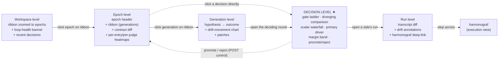
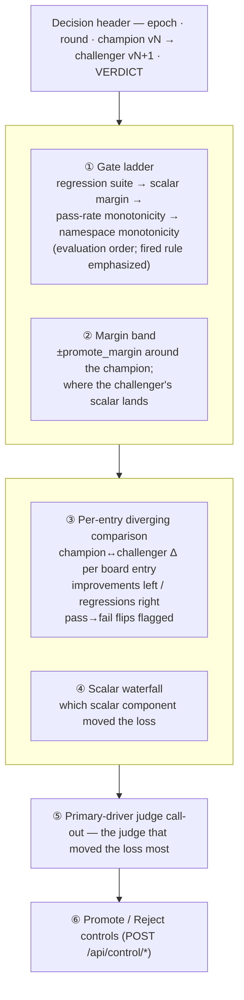

# Dashboard

This document describes the live dashboard for an in-flight zicato
epoch. The dashboard has one job: to make the promote/reject decision
legible. Every surface it carries — the lineage, the heatmaps, the log
tail — serves the operator's single question, whether this challenger
should replace the reigning champion. [SELECTION.md](SELECTION.md)
carries the decision theory behind that question; the dashboard makes
the decision inspectable while it is still in flight. It is the live
counterpart to `analysis.html`, the archival snapshot persisted for
each epoch.

The dashboard is served by a standalone Python (Starlette) service
(`src/zicato/dashboard/`, run as `python -m zicato.dashboard`). `zicato
evolve` spawns it as a separate process alongside the Rust watchdog
supervisor. The Rust binary can also serve a dashboard, but `evolve`
always runs it `--no-dashboard`, so the user interface belongs to the
Python service; [RUNTIME.md](RUNTIME.md) §3.0 records why the two are
separate services. The dashboard's data source is the runtime state
files described in [RUNTIME.md](RUNTIME.md), the `.zicato/index.db`
analytical index, and the committed `epochs/` artifacts. The defense
layers in [ROBUSTNESS.md](ROBUSTNESS.md) cover what each layer catches;
this document covers the operator experience and the HTTP and
server-sent-events surface.

> **Scope.** The front end that ships, named the console, is documented
> in [CONSOLE-DESIGN-LANGUAGE.md](CONSOLE-DESIGN-LANGUAGE.md), the
> visual source of truth for its shell, views, and figure grammar, and in
> [variant-T.md](variant-T.md), the round-by-round record of the design
> bake-off that produced it. The console navigates by a data-model tree
> sidebar plus a champion-spine round timeline. The lineage ribbon of
> §4.1 is a navigation proposal the console did not adopt; read §4.1 as
> the statement of what a lineage figure encodes rather than as a
> description of the shipped navigation. Every other decision surface
> §4 describes is live.

## 1. What the dashboard is

The sibling project harmonograf serves the live interface for a single
goldfive run. It is the execution view: the plan, the per-turn drift
state, the intervention ladder, and the operator's steering controls —
the temporal trace of one run.

The zicato dashboard is the decision view. It shows one epoch: many
goldfive runs across many generations, organized around the
promote/reject decisions that chain those generations into a lineage.
It works one level up from harmonograf, over a whole epoch rather than
a single run.

The two stay separate because they describe different objects. A run is
a trace; a tournament is a comparison of aggregates over many traces.
A per-run drill-down links them: the dashboard opens harmonograf
against the run's `events.jsonl`. The operator moves down the decision
view — workspace, then epoch, then generation, then decision, then run
— and at the run level steps across into harmonograf's execution view.
The full treatment of the split is in
[TOURNAMENT.md §5](TOURNAMENT.md#5-the-harmonograf-split) and
[ARCHITECTURE.md §7](ARCHITECTURE.md#7-the-harmonograf-split-execution-view-vs-competition-view).

| Tool | View | Scope | Cadence |
|---|---|---|---|
| harmonograf | execution | one goldfive run | within one run |
| **zicato dashboard** | **decision** | **one zicato epoch** | **across the promote/reject decisions in the epoch** |
| `analysis.html` | decision (snapshot) | one zicato epoch | regenerated each round; persisted at close |

An operator may hold all three open at once: harmonograf on the run
under inspection, the zicato dashboard on the decision in flight, and
`analysis.html` from a closed epoch in a third tab for comparison.

## 2. Auto-spawn from `zicato evolve`

The common invocation is `zicato evolve --rounds N`. The dashboard
starts automatically under it, and the operator takes no separate
action.

```
$ zicato evolve --rounds 5
...
Dashboard: http://127.0.0.1:7892
[evolve] round 1 of 5...
```

`evolve` prints the URL to standard output once the dashboard service
reports the port it bound, read back from `runtime/dashboard.json`. The
service walks the port up by one when the preferred port is taken, so
the printed URL carries the bound port rather than the requested one.
Both the dashboard service and the watchdog supervisor exit when
`evolve` exits, and the dashboard URL stops working at that point.

### 2.1 Opt-out and tuning flags

These are the flags that actually ship on `zicato evolve`:

| Flag | Default | Meaning |
|---|---|---|
| `--no-dashboard` | off | Do not spawn the dashboard service, nor the watchdog supervisor that guards it. `evolve` still runs the loop. Useful for a non-interactive continuous-integration run. |
| `--dashboard-port <port>` | `7892` | Preferred port for the dashboard HTTP server (always bound on `127.0.0.1`). If taken, the service walks `+1` up to ten times. |

Notes:

- There is **no `--dashboard-bind` flag.** The dashboard always binds
  `127.0.0.1` — the operator views it from the same host as the evolve
  loop, so loopback is correct. (LAN exposure would be a reverse-proxy
  concern; it is not a CLI option.)
- There is **no `--dashboard-only` flag** on `evolve`. For a
  post-mortem against a completed workspace, run the standalone
  `zicato dashboard` command (§2.2).
- There is **no authentication** on the dashboard. It binds to
  loopback by default. Operators who put it behind a reverse proxy own
  the auth story; the dashboard does not include auth itself.

### 2.2 The standalone `zicato dashboard` command

The standalone `zicato dashboard` command serves an existing
workspace — a post-mortem of a completed epoch, or a read-along view of
a workspace that another `zicato evolve` is driving. It is a thin
wrapper that runs the same Python service in the foreground until
interrupted with Ctrl-C:

| Flag | Default | Meaning |
|---|---|---|
| `--workspace <path>` | `.zicato` | Workspace root to serve. |
| `--host <addr>` | `127.0.0.1` | Bind address. |
| `--port <port>` | `7892` | Preferred port (walks `+1` if taken). |
| `--view <name>` | `overview` | The view the URL opens on; `builder` opens the contract editor. |
| `--static-dir <path>` | unset | Asset directory to serve, shadowing the `dashboard.static_dir` config knob. Unset serves the bundled directory. |

> **Planned modes.** Two richer modes are **not yet shipped** as
> `zicato dashboard` flags:
>
> | Planned mode | Use case | Intended behavior |
> |---|---|---|
> | `--read-only` | Post-mortem or shared view | Disable the POST control surface. The capability exists as `create_app(read_only=…)` and as the Rust binary's `--read-only`, but no `zicato dashboard` flag reaches it, so the standalone command serves with the control surface enabled. |
> | `--daemon` | A long-running continuous-integration host | Outlive one `evolve` invocation and pick up the next. (The Rust binary has a `--daemon`; the Python `zicato dashboard` does not.) |

The automatic spawn is the common path, and it needs no command of its
own: `evolve` starts the service.

> **Builder focus.** `zicato dashboard --view builder` is the same service launched focused on
> the tournament builder (it prints the `#/builder` deep-link); the builder is
> also reachable inside any running dashboard via the top-bar ⚙ Settings entry.
> See [`TOURNAMENT-BUILDER.md`](TOURNAMENT-BUILDER.md).

## 3. Architecture (HTTP + SSE)

The dashboard server is a single-page HTML application talking
to the Python (Starlette) HTTP server over two channels:

- **HTTP GET** for initial state and on-demand snapshots.
- **Server-Sent Events** (`text/event-stream`) for live updates.

```
┌────────────────────────────────┐         ┌─────────────────────────────┐
│  Browser (single-page UI)      │         │  zicato.dashboard (Python/  │
│  ──────────────────────────    │         │  Starlette + uvicorn)       │
│  index.html + JS/CSS bundle    │◄────────┤  GET /  → serves index      │
│                                │         │                             │
│  On load:                      │         │  GET /api/state             │
│   1. fetch /api/state          │◄────────┤   ◄ reads .zicato/runtime/  │
│   2. open EventSource(/events) │         │   ◄ + index.db + epochs/    │
│                                │         │                             │
│  On every SSE event:           │         │  watches .zicato/runtime/   │
│   - apply delta to UI state    │◄────────┤   → snapshot then           │
│                                │         │     state_change events     │
│                                │         │                             │
│  On user action:               │         │  POST /api/control/<action> │
│   - POST /api/control/{action} ├────────►│   → write .zicato/runtime/  │
│                                │         │     control/<file>          │
└────────────────────────────────┘         └─────────────────────────────┘
                                                       │
                                                       │ orchestrator consumes
                                                       ▼  at safe points
                                          ┌─────────────────────────────┐
                                          │  zicato evolve (Python)     │
                                          │  reads control/ at safe     │
                                          │  points; archives into      │
                                          │  control_log/.              │
                                          └─────────────────────────────┘
```

The two processes the operator runs into:

| Process | Port | Role |
|---|---|---|
| Rust watchdog supervisor | `:7920` | Watches the orchestrator's heartbeat; restarts / escalates. Serves its own dashboard only when run standalone — under `evolve` it runs `--no-dashboard`. |
| Python dashboard service | `:7892` | The dashboard this document describes. Reads the workspace, serves GET and the event stream, and writes `control/` files on POST. |

The control POST endpoints write the `control/` files, and the
orchestrator consumes them at its safe points (see
[RUNTIME.md](RUNTIME.md) §2.5).

### 3.1 Why the live channel is server-sent events

| Property | SSE | WebSockets |
|---|---|---|
| Server → client only | ✓ (the direction live updates travel) | ✓ |
| Client → server | (separate HTTP POST) | ✓ (same connection) |
| Auto-reconnect with `Last-Event-ID` | ✓ (builtin) | manual |
| Implementation complexity (server + browser) | low | medium |
| Plays nicely with HTTP middleware (gzip, headers) | ✓ | partial |

Live updates are strictly server → client (the orchestrator
generates events; the browser displays them). Client → server
actions are infrequent enough to use plain `POST /api/control/...`.
SSE's auto-reconnect makes the dashboard tolerant of transient
network drops or service restarts; on reconnect the server re-sends a
fresh `snapshot` before resuming the live `state_change` stream.

### 3.2 Bundled assets

The Python dashboard service serves its HTML, CSS, and JS bundle off
disk from `src/zicato/dashboard/static/` (`index.html`, `app.js`,
`style.css`, `icons.svg`, plus `css/` and `js/`). `evolve` resolves the
static directory and hands it to the server; an unknown asset 404s, and
a missing bundle falls back to a placeholder page. No external CDN, no
node_modules at runtime.

Static assets are served `Cache-Control: no-cache` **plus an `ETag`**
derived from the file's identity (`mtime-ns` + size — `server.py`). The
`no-cache` directive stops the browser from serving a stale CSS or JS
bundle, which is the standing hazard while the bundle is being edited.
The ETag makes the resulting revalidation cheap. An unchanged asset
with a matching `If-None-Match` returns a bodyless `304` and is not
re-downloaded; an edited file gets a new ETag and the browser fetches a
fresh `200`. So an edit always reaches the browser, and an unchanged
page reload pays for revalidation rather than a re-transfer.

The dashboard and `analysis.html` share a font stack, a colour palette,
and a set of chart conventions, so the live view and the archival
snapshot of one epoch read as the same surface.

### 3.3 SSE event format

The shipped wire protocol (`src/zicato/dashboard/sse.py`) is: a new
client first receives one `event: snapshot` carrying the full state,
then `event: state_change` frames as files under `.zicato/runtime/`
change. `state_change` frames are **coalesced** — a burst of writes
within a short debounce window collapses into a single frame whose
payload carries the set of changed *kinds* (`payload.kinds`), so the
dashboard does one coalesced refresh instead of a frame per file.

```
event: snapshot
data: { ...the same shape as GET /api/state... }

event: state_change
data: {"kinds": ["active_tournament", "active_runs"]}

event: state_change
data: {"kinds": ["heartbeat"]}
```

The `kind` regions are derived from which file changed (heartbeat,
active_tournament, active_runs, run_log, lineage, …); the dashboard JS
reads `payload.kinds` and re-fetches the affected endpoints. A
keep-alive comment is sent periodically so idle connections survive
proxy read-timeouts.

### 3.4 Data sourcing: files-canonical, index-derived

zicato persistence is **files-canonical, index-derived**. This is
a load-bearing rule for the dashboard, and getting it wrong is a
real bug class — it produced a blank decision view mid-run (see
below). The rule:

> **Live dashboard state MUST read the JSON / JSONL files (or the
> live endpoints that wrap them). Only resolved historical and
> analytical queries may read `index.db`.**

There are two tiers of storage, and they are refreshed on
different cadences:

| Tier | Files | Written | Read for |
|---|---|---|---|
| **Canonical, live** | `runtime/active_tournament.json`, `runtime/heartbeat.json`, `runtime/active_runs/*.json`, `lineage.json`, per-run `events.jsonl` | Live — the moment state changes, by the orchestrator or the worker that owns the file | The live dashboard: anything that must reflect *right now* |
| **Derived, lagging** | `index.db` (SQLite) | Dual-written at **generation/round boundaries** only (see [ANALYTICAL-INDEX.md §2.3](ANALYTICAL-INDEX.md#23-the-orchestrator-dual-writes-live)); fully rebuildable via `zicato repair index` | Resolved historical / analytical queries: closed decisions, cross-run aggregates |

`index.db` is a **derived analytical cache**. It is rebuilt from
the canonical files by `zicato repair index`, and during a live run it
is only refreshed at generation boundaries — so mid-round it does
not yet contain the in-flight generation or the in-progress
decision. It is the right source for *resolved* data (closed
decisions, cross-run aggregates) and the wrong source for *live*
data.

**What the rule prevents.** The index gains no row for a running
tournament until the generation boundary. A decision view that read its
in-progress matchup from `index.db` would therefore render blank for
the whole duration of every round — the window in which an operator
most wants to watch the decision form. The decision view reads
`runtime/active_tournament.json` through `GET /api/active-tournament`
instead, and reads the index only for decisions that have already
closed.

The endpoints in §6 follow that split. `/api/active-tournament`,
`/api/active-runs`, `/api/lineage`, `/api/run-log`, and
`/api/heartbeat` are file-backed and live. `/api/tournaments`, the
resolved decisions, and `/api/tournaments/{id}`, the matchup detail of
a resolved round, read the index. Both degrade rather than fail: a
missing or stale `index.db` yields an empty result carrying a `note`.

## 4. The decision-centric information architecture

The information architecture is organized around the promote/reject
decision and layered over five zoom levels. The levels nest the way the
data does: a workspace contains epochs, an epoch contains generations,
each generation arrives by a decision, and each decision is fed by
runs. The decision level is the centerpiece, and every other level is a
way of reaching it or of summarizing the decisions already made.

The table below defines the five levels. The short ids in the second
column are the pointers `src/zicato/dashboard/endpoints.py` uses in its
docstrings to say which level an endpoint feeds; prose elsewhere in
this document names the level instead.

| Level | Id | Scope | The question the level answers | Primary source |
|---|---|---|---|---|
| **Workspace** | `L0` | cross-epoch | Is the lineage climbing, and is any loop unhealthy? Answered by the lineage figure zoomed to epochs, the loop-health banner, and the recent-decisions strip. | `/api/workspace`, `/api/health-report`, `/api/lineage` |
| **Epoch** | `L1` | one epoch | What contract is this epoch deciding under, and how have its decisions gone? Answered by the epoch header, the lineage figure, the contract diff, and the per-entry and per-judge heatmaps. | `/api/epoch`, `/api/lineage`, `/api/contract-diff/...`, the per-judge endpoints |
| **Generation** | `L2` | one generation | Did the change this generation made pay off? Answered by the hypothesis-to-outcome panel, the drift-movement chart, and the patches. | `/api/lineage`, `/api/generation/...`, `/api/drift-movements/...`, `/api/files/...` |
| **Decision (round)** | `L3` | one promote/reject | Was this promote or reject right, and why? The centerpiece: gate ladder, per-entry diverging champion-versus-challenger chart, scalar waterfall, primary-driver judge, margin band, and the promote/reject controls. | live `active_tournament.json` for the in-flight decision; `/api/round/.../gate` plus the index for closed ones |
| **Run** | `L4` | one run | What did this single side actually do? Answered by the transcript diff, the drift annotations, and the harmonograf deep-link. | `/api/run/...`, transcript endpoints, `/api/run-log` |

### 4.1 The lineage ribbon — one figure at three zoom levels

The lineage ribbon is a single figure that replaces three separate
widgets — the generation spine, the epoch timeline, and the cross-epoch
sparkline — by zooming per level. It shows where the loop stands in the
optimization and how it arrived there, at the workspace, epoch, and
generation levels alike.

What it encodes:

- The **x-axis** is lineage order, by generation index or round; the
  ribbon reads left to right as the loop progresses.
- The **y-position is the scalar**, the drift-derived loss, where lower
  is better. The ribbon therefore plots the optimization trajectory: a
  falling ribbon means the loop is improving, a flat ribbon means it
  has stalled, and a rising tail means a regression. The scalar is the
  generation-level aggregate and is always a loss; the per-entry
  figures below plot whichever channel the contract populates, each on
  its own convention.
- **Promoted generations** sit on the main trace, the spine of the
  ribbon. **Rejected challengers branch off their parent** as short
  stubs that do not continue the trace, each hanging at the y-position
  its scalar earned, so every rejected attempt stays visible.
- **Every node is clickable**: a generation node opens the generation
  level, the decision that promoted or rejected it opens the decision
  level, and the in-flight tip pulses.

Zoom levels:

| Zoom | Shown at | Each node is |
|---|---|---|
| epochs | the workspace level | one epoch, collapsed to its final champion's scalar |
| generations within an epoch | the epoch level | one generation, on the spine if promoted and branched off if rejected |
| round neighborhood | the generation level | the focused generation, its parent, and its rejected siblings |

`GET /api/lineage` drives the ribbon. It walks generation directories,
so it includes in-flight generations carrying `promoted: null`.
`GET /api/score-trajectory` supplies the y-positions and
`GET /api/workspace` supplies the epoch roll-up at the workspace
level.



### 4.2 The decision view

The decision view is the screen the whole dashboard exists to render.
It drills one promote/reject decision, champion against challenger, and
lays out every input the gate weighs, so the operator can see the
verdict, see why it came out that way, and override it. It works both
for the in-flight decision, where data is partial and the verdict is
still forming, and for a closed decision replayed from the index and
the `/gate` endpoint.



**① Gate ladder.** The promote gate (see [SCORING.md](SCORING.md) and
[SELECTION.md §3.2](SELECTION.md#32-the-promote-gate--three-rules-in-order))
is a short-circuiting sequence of rules. The ladder renders them in
evaluation order, each carrying a status of pass, fail, or not-reached,
and the numbers that produced it. The rule that decided the verdict is
emphasized: for a reject that is the first rule that failed, and for a
promote the ladder reports that all rules passed. The rungs, in
order:

1. **Regression suite** — the snapshot's own test suite, run before
   scoring when `regression_gate_enabled`. A failing suite is a hard
   reject; later rungs are "not reached."
2. **Scalar margin** — `child_scalar ≤ parent_scalar − promote_margin`.
   Shows both scalars, the delta, and the margin threshold.
3. **Pass-rate monotonicity** — every board entry the champion passed,
   the challenger must also pass. Names the regressed entries if any.
4. **Namespace monotonicity** — no tracked metric namespace moved in
   its "worse" direction. Names the regressed namespaces if any.

```
┌──────────────────────────────────────────────────────────────────────────┐
│ Gate ladder — round 4 — v4 → v5                              VERDICT: REJECT│
│                                                                            │
│  ✓  1. regression suite        passed (snapshot tests 41/41)               │
│  ✓  2. scalar margin           child 0.31 ≤ parent 0.42 − 0.01  Δ −0.11 ✓  │
│ ▶✗  3. pass-rate monotonicity  FAILED — long_solar_with_constraints pass→fail
│  –  4. namespace monotonicity  not reached                                 │
│                                                                            │
│  Fired rule: pass-rate monotonicity. The scalar improved, but an entry     │
│  the champion passed regressed — a hard per-entry feasibility reject.      │
└──────────────────────────────────────────────────────────────────────────┘
```

The fired-rule emphasis tells the operator which constraint the
decision turned on. A scalar that improved but flipped a passing entry
to fail reads differently from a scalar that failed to clear the
margin.

**② Margin band.** A horizontal band drawn at the champion's scalar
± `promote_margin` (default `0.01`). The challenger's scalar is plotted
against it: inside the band reads "insufficient improvement", below it
reads "clears the margin", and above it reads "regressed". The band
draws the noise threshold the promote gate applies (see
[SELECTION.md §2 Family ②](SELECTION.md#family--statistical-gate-acceptance-replicate-then-test)).
It is a fixed threshold around a point estimate; §4.6 describes the
credible interval the Bradley–Terry rating draws beside it.

**③ Per-entry diverging comparison chart.** One diverging bar per
board entry: the champion-versus-challenger delta for that entry, with
improvements diverging one way and regressions the other, weighted by
the entry's board weight. A pass-to-fail regression carries a distinct
red marker, because the pass-rate monotonicity rung turns on those
flips alone, and an operator scanning the chart should see a
feasibility-killing flip without reading the ladder. The chart is the
per-entry detail behind the gate's aggregate verdict, and it reads the
same paired per-entry deltas the gate consumes:
`/api/matchup-grid/...` for the grid and `/api/round/.../gate` for the
gate-aligned breakdown.

**The per-entry channel.** An entry's outcome is defined on whichever
channel the evaluation contract populates, and every per-entry figure
plots the same one the server resolved the entry's verdict on. The
resolution order is the **continuous score** (higher is better), then
the entry's **pass predicate**, then the **drift loss** (lower is
better); the first channel that separates champion from challenger
decides, and `/api/matchup-grid/...` names it per row as `decided_by`.

Two consequences bind every figure below:

- **Sign conventions are never mixed in one readout.** A score delta of
  `+0.585` is a gain; a loss delta of `+0.585` is a regression. Each
  figure states the convention of the channel it painted.
- **A channel with nothing in it is hidden rather than drawn as
  zeroes.** An adapter that emits no drift stream still records a structural
  `drift_loss` of `0.000` on every entry, which is indistinguishable on
  the wire from a run that watched for drift and saw none. The server
  settles the question with a `drift_present` field on the matchup grid
  and on `/api/generation/.../per-entry`. A client told the channel is
  absent drops it, rather than painting a column of zeroes and letting
  the reader infer a measurement nobody took.

Where more than one replicate ran, the grid also serves
`score_replicates` and `score_se`, the sample standard deviation of the
challenger's replicate scores over the square root of their count. A
single draw measures no spread, so `score_se` is `null` there and the
figures render `--` — never `±0.000`, which would claim a precision the
run does not have.

**Facet slices.** When board entries carry `facet:{name}` tags
(BOARD-FORMAT.md §1.4), two screens report those slices. Each facet is
the candidate re-aggregated over just that slice at the epoch's frozen
weights, so it carries the same `scalar` (lower is better) and
`mean score` (higher is better) the candidate's own aggregate carries —
and a facet scalar therefore reads directly against it.

- The **candidate dossier**, under Per-board scoring: one row per facet,
  with the candidate's own aggregate as the last row to compare against.
- The **per-board drill-down**, under Per-candidate loss: one row per
  candidate, one column per facet the entry feeds. Candidates are rows
  because an epoch adds candidates while the facet list stays fixed.

Both read from `static/js/facets.js`, which owns every label, format and
explanation so the two cannot drift apart.

Three display rules, all for the same reason — a facet number carries no
noise threshold, so the tables must not read as scoreboards:

1. No verdict colour, no bars, no ordering by value, and no dimmed
   column. The emphasised column is as often the worse one.
2. A slice nobody scored shows an em dash, never `0.00`. Its `scalar` is
   still real: an unscored entry still produced drift.
3. The counts travel with the numbers, as `scored/ran/tagged` collapsed
   to the shortest form that loses nothing (`2`, `0/1`, `1/1/3`). All
   three appear because they answer different questions: `tagged` is what
   the BOARD puts in the slice, `ran` is the scalar's denominator, and
   `scored` is the mean score's. A racing rung that runs a board subset
   would otherwise render a mostly-unrun slice as fully covered, which is
   the one thing these counts exist to prevent. The per-board table has
   no room for a count column, so a cell there carries its coverage on
   the number itself (`0.77 · 1/4`) whenever the slice is not whole.

Facets are computed over the TRAIN slice, so `candidate overall` is the
same number the gate compares, and a facet covering the whole board
reports that same number. Holdout entries feed no facet — see
EVAL-VIEW.md §3.4 for why both halves of that matter.

**④ Scalar waterfall.** The scalar is a weighted sum of drift-derived
components (see [SCORING.md](SCORING.md) — the per-`judge_name`
`per_judge_weights` term plus the rest of the loss). The waterfall
decomposes `child_scalar − parent_scalar` into per-component bars, so
the operator sees which component moved the loss. A win driven by one
judge looks different from a broad win across all of them, and a
component moving the wrong way under a net improvement is worth
inspecting.

**⑤ Primary-driver judge call-out.** A single emphasized line naming
the judge that moved the loss the most (the largest single waterfall
component). It names what the decision turned on in one line, fed by
the `primary_driver` field of `/api/round/.../per-judge-comparison`.

**⑥ Promote and reject controls.** The POST
`/api/control/promote/{gen}` and `/api/control/reject/{gen}` endpoints
appear as buttons, alongside pause, resume, skip, kill and brief (§5),
and are disabled when the app is built `read_only`. Clicking one writes
the `control/` file atomically; the orchestrator reads it at its next
safe point and applies the override (see [RUNTIME.md](RUNTIME.md)
§2.5). Overriding the gate — promoting where the gate rejected, or the
reverse — violates the evaluation contract and needs a durable audit
trail; §5.3 describes it.

**The feeding endpoint.**
`GET /api/round/{epoch}/{champion}/{challenger}/gate` feeds the
decision view. It returns a structured gate breakdown: the ladder, with
each rule's status, numbers, and whether it fired; the per-entry deltas
with their pass-to-fail flags; the scalar-component waterfall; the
margin-band geometry; and the primary-driver judge. Every other panel
on the decision view composes endpoints that serve other views as well
(`/api/active-tournament` for the in-flight decision,
`/api/matchup-grid/...`, and
`/api/round/.../per-judge-comparison`). See §6.1.

> **The in-flight decision and a closed one.** For an in-flight
> decision the gate ladder renders against partial results. A rung
> whose inputs are incomplete shows "pending", and the verdict is a
> deterministic projection — best case, worst case, and current trend —
> computed from the board entries that have finished. Once the best and
> worst cases agree, the decision is settled early. The projection is
> computed from `active_tournament.json` alone, with no model call and
> no randomness, so the same partial results always yield the same
> projection.

### 4.3 The workspace level

The workspace level reports whether anything is wrong and whether the
loop is climbing, before the operator drills anywhere. It composes:

- the **lineage ribbon zoomed to epochs** (§4.1) — the cross-epoch
  trajectory at a glance;
- the **loop-health banner** (§4.5) — the green/amber/red "is this loop
  meaningful" signal;
- a **recent decisions** strip — the last few promote/reject verdicts
  with their deltas, each a click into its decision view.

The console's home view realises the workspace read as a set of
per-epoch cards plus a cross-epoch meta-loop ledger. The ledger is one
composed figure combining three marks. A held-floor staircase shows the
best scalar each contract held. Epoch bands take a
width proportional to the generations spent in that epoch. A
contract-component heatstrip shows which part of the contract changed
at each epoch reset, including a proposer column that the plain
contract diff omits. Together they show whether the meta-loop is making
net progress across contracts, which part of the contract moved at each
reset, and whether spending more generations buys a lower floor. The
same `/api/workspace` read serves the ledger as a `ledger` array beside
`epochs`; see
[variant-T.md](variant-T.md#decision-loop-wave-current-default--meta-loop-ledger--settings-drawer--racing-hero--builder-view).

### 4.4 The epoch level

The epoch level reports the contract this epoch decides under and how
its decisions have gone:

- an **epoch header** — the epoch name, its champion, the round count,
  and the running decision counts: promotions, rejections, and
  consecutive rejections measured against the stop threshold;
- the **lineage ribbon** zoomed to this epoch's generations (§4.1);
- the **contract diff** (`/api/contract-diff/{epoch_id}`) — what
  changed in the evaluation contract against the parent epoch, covering
  the scoring configuration with its nested weight dictionaries
  including `per_judge_weights`, the board, the proposer brief, the
  mutation paths, and the proposer. A decision means something only
  relative to the contract it was made under. The `per_judge_weights`
  dictionary survives the subprocess-worker transport intact, so a duel
  reports its scalar under the per-judge weighting the parent
  configured;
- **per-entry and per-judge heatmaps** — which board entries and which
  judges move across the epoch's generations, from the per-judge-trend
  and per-entry endpoints. These show what the lineage is learning.

### 4.5 The loop-health banner

`GET /api/health-report` surfaces zicato's loop-health diagnostics (see
[LOOP-HEALTH.md](LOOP-HEALTH.md)) as a green, amber, or red banner at
the workspace and epoch levels, carrying the top finding. It reports
whether the loop is producing meaningful decisions, and it detects a
loop that runs normally while its evaluation is degenerate and no
decision can distinguish any challenger.

```
┌──────────────────────────────────────────────────────────────────────────┐
│ ● RED  Loop health — round 7                                               │
│   degenerate_scoring: v0..v7 all carry gen_score = 1.000000 — zero score   │
│   variance across 8 generations. The gate cannot tell anyone apart.        │
│   → Inspect scoring.json and the per-entry loss.json files.                │
└──────────────────────────────────────────────────────────────────────────┘
```

The banner turns red on a `critical` finding and carries the single
top finding inline; clicking it expands the full per-detector report.
Without it, a degenerate run is caught only by hand: two generations
that both score `1.000000` look ordinary in every other panel. A red
banner tells the operator that the decision surfaces below carry no
signal, before the operator reads them.

### 4.6 How the decision view reports uncertainty

Four surfaces carry uncertainty, and each states what it measured.

- **The margin band** (§4.2) draws a fixed `promote_margin` around the
  champion's scalar. It is a threshold rather than a measurement of
  spread, and the view labels it as one.
- **The replicate standard error.** Where the contract runs a board
  unit more than once, the matchup grid serves `score_replicates` and
  `score_se` and the figures draw the spread. A single draw measures no
  spread, so `score_se` is `null` there and the figures render an em
  dash (§4.2).
- **The Bradley–Terry rating.** The selection layer fits a
  Bradley–Terry paired-comparison model over the epoch's duels and
  reports a posterior strength for each side with a credible interval,
  together with `p_stronger`, the posterior probability that the
  challenger is stronger than the champion. The candidate view draws
  the two strength estimates as whiskers and `p_stronger` as a bar
  against the configured threshold, so the operator reads the
  statistical case before reading the gate's verdict. A contract that
  sets `promote_confidence_threshold` also lets the rating hold a
  promotion until the evidence separates; the rating can only hold a
  promotion, never force one. The standings table carries the same
  three numbers per candidate, which makes it a race standing: which
  candidate leads, how tight its interval is, and how many replicates
  it has earned. The elitist iterated racing strategy eliminates
  dominated candidates on that same evidence, so the standings are a
  ranked field rather than a bracket. See
  [SELECTION.md §2 Family ③](SELECTION.md#family--single-elimination-bracket-triage-by-resource)
  and [§6](SELECTION.md#6-why-not-double-elimination-or-swiss-the-explicit-verdict)
  for why a bracket suits a small field of expensive, noisy candidates
  poorly.
- **Verdicts that respect the noise floor.** Movement inside the
  measured same-versus-same floor reads as "no detectable signal"
  rather than as an improvement or a plateau.

One surface [SELECTION.md §7](SELECTION.md#7-the-recommended-design)
describes is not built: a per-entry paired rank test carried as its own
rung of the gate ladder, which would report a pass-to-fail regression
only when the flip persists across replicates. The pass-rate
monotonicity rung reads the flip from one comparison.

The dashboard draws no error bar it cannot compute. Where a quantity
has no measured spread, the view renders an em dash and says so, rather
than rendering `±0.000` and claiming a precision the run never
measured.

### 4.7 The generation level

The generation level drills one generation and reports whether the
change it made paid off:

- the **hypothesis-to-outcome panel** — the experiment's `core_idea`,
  what it was modulating and why, the predicted-versus-actual match per
  drift kind, and the realized outcome (`drift_loss_delta`,
  `pass_rate_delta`, and the decision). The panel makes the
  structured-hypothesis discipline visible: the proposer writes the
  hypothesis before the run and the orchestrator fills in the outcome
  after it.
- the **drift-movement chart** (`/api/drift-movements/{generation_id}`)
  — which drift kinds moved, and in which direction, for this generation
  versus its champion.
- the **patches** — the actual edits (`/api/files/.../patches` and
  `.../diff`), each linking the mutation point it touched.

From the generation level the operator opens the deciding round, which
lands on the decision view for that generation's promote or reject.

### 4.8 The run level

The run level shows a single side of one matchup. It is the leaf where
the decision view hands off to the execution view:

- the **transcript diff** — the focused run's transcript beside the
  compare side's (the matchup's other generation), via
  `/api/run/.../transcript` and `/api/matchup/{entry_id}/conversations`;
- the **conversation execution outline** — explicit agent invocation branches
  with delegation observations nested under their stated invocations, beneath
  their owning turns, with unresolved records retained at run scope; see
  [CONVERSATION-EXECUTION.md](CONVERSATION-EXECUTION.md);
- **drift annotations** inline on the transcript turns;
- the **harmonograf deep-link** — "Open in harmonograf," a handoff URL
  (typically a `file://` URL at the run's `events.jsonl`, optionally a
  `harmonograf://` deep link) that opens the execution view for this
  exact run.

The run's live status — phase, wall-clock time against budget,
heartbeat age, and drift count — is read from
`active_runs/{run_id}.json` through `/api/run/{run_id}`. The wall-clock
bar is the fraction of the budget elapsed rather than a measure of task
progress: a run at 73 percent is 73 percent through its wall-clock
budget and may finish at any point.

## 5. Interactivity model

As spawned by `evolve` the dashboard service runs `read_only=False`,
so the control POST endpoints accept writes. Clicking a control button
drops the corresponding `control/` file atomically. The evolve loop
reads `control/` at its safe points, applies the command, and archives
the consumed file into `control_log/` with a JSON audit record (see
[RUNTIME.md](RUNTIME.md) §2.5). A control action therefore changes the
running loop, and the dashboard reads the result back.

### 5.1 The control surface

| Operation | Source / effect |
|---|---|
| All panel data (read) | `.zicato/runtime/` + `.zicato/index.db` + `.zicato/epochs/` |
| Open in harmonograf | Constructs a handoff URL; no zicato state change |
| Reload page | Re-fetches `/api/state`, re-opens SSE (fresh snapshot) |
| **Pause / Resume / Skip / Kill / Promote / Reject / Brief** | `POST /api/control/...` → atomic write of a `control/` file (returns `202`); the orchestrator consumes it at its next safe point. |

The promote and reject buttons live on the decision view (§4.2 ⑥),
where the operator is already looking at the gate ladder; pause,
resume, skip, kill and brief live in the top bar. The read-only posture,
in which the POST endpoints return `403`, is reachable through
`create_app(read_only=…)` and the Rust binary's `--read-only`, but no
`zicato dashboard` flag exposes it (§2.2).

### 5.2 Write-back via the control-file protocol

Operator actions are `POST /api/control/<action>` requests on the
dashboard service. The service writes a file under
`.zicato/runtime/control/`, and the orchestrator polls `control/` at
its safe points and acts on the request.

```
operator clicks "reject" on the decision view
            │
            ▼
browser → POST /api/control/reject/{gen}
            │
            ▼
dashboard service → atomically write
            │ .zicato/runtime/control/reject/{gen}
            │ (JSON payload {generation_id, ts})
            │
            ▼
            ... at end of tournament, before journaling ...
            │
            ▼
orchestrator → reads control/reject/{gen}
            │ archives it into control_log/<ts>_*.json
            │ records override_by_operator in experiment.json
            │
            ▼
dashboard → notices the change via its watcher
            │ emits a state_change SSE frame
            │
            ▼
browser → updates the decision verdict / status pill
```

### 5.3 Command catalogue and safe-point semantics

| Command | File written | Safe point | Priority | Audit log entry |
|---|---|---|---|---|
| `pause_epoch` | `control/pause_epoch` | between rounds | normal | `command=pause_epoch` |
| `resume_epoch` | removes `control/pause_epoch` | while the orchestrator waits in its pause loop | normal | `command=resume_epoch` |
| `skip_round` | `control/skip_round` | between rounds OR start of new round | normal | `command=skip_round`, `skipped_round=N` |
| `kill_run` | `control/kill_runs/{run_id}` | immediate (high priority; orchestrator checks every 500ms) | high | `command=kill_run`, `run_id=...`, `cause=operator` |
| `promote_override` | `control/promote/{gen_id}` | end of tournament, before journaling | gate-override | `command=promote`, `gen=...`, `tournament_decision_was=reject` |
| `reject_override` | `control/reject/{gen_id}` | end of tournament, before journaling | gate-override | `command=reject`, `gen=...`, `tournament_decision_was=promote` |
| `rubric_replace` | `control/rubric_replacement.txt` | between rounds | normal | `command=rubric_replace`, `old_hash=...`, `new_hash=...` |

**The POST endpoints behind the catalogue.** The dashboard exposes
`pause`, `resume`, `skip-round`, `kill/{run_id}`, `promote/{gen_id}`,
`reject/{gen_id}`, and `brief`, which writes the proposer-brief
replacement.

**Safe points** are the orchestrator's natural pause boundaries:
between rounds, between entries within a round, and at the end of a
tournament before journaling. Each command is categorised by the safe
point it applies to. Checking only at safe points is what stops the
orchestrator from dying part-way through a board entry because the
operator clicked pause.

**Gate-override audit.** A promote or reject issued from the decision
view against the gate's computed verdict is the high-stakes case. When
a promote override lands on a tournament the gate would have rejected,
the audit record captures both the override and the decision the gate
reached; the experiment's outcome block records that an operator
overrode it, and the journal and `analysis.md` show it. The override is
visible rather than silent: the gate ladder sits on the same screen,
recording what the operator overrode.

### 5.4 Authorization model

There is no authentication on the dashboard. It binds to loopback by
default, and any local user can issue any command. The audit record
carries a symbolic issuer, because the dashboard does not ask for an
operator identity.

Adding real authentication — for a multi-operator setup, or for remote
access without a reverse proxy — belongs in HTTP middleware in the
dashboard service, between the point where a request is accepted and
the point where the control file is written.

## 6. HTTP API surface

`src/zicato/dashboard/server.py` serves this surface. The GET endpoints
and `/events` are always available; the POST control endpoints (§6.2)
are available unless the app was built `read_only`.

### 6.1 Routes at a glance

The route table:

| Route | Purpose |
|---|---|
| `GET /` | The single-page UI (`index.html`, off-disk bundle). |
| `GET /static/{path}` and `GET /{path}` | UI assets / fallback to the bundle. |
| `GET /events` | SSE stream (§3.3): one `snapshot` then coalesced `state_change` frames. |
| `GET /api/health` | Liveness/identity (§6.1 detail below). |
| `GET /api/state` | Composite live snapshot. |
| `GET /api/environment?run-log-limit=N` | One coalesced read of the whole environment — the front-end refreshes the entire view from this instead of fanning out to many endpoints. |
| `GET /api/workspace` | Cross-epoch workspace summary at the workspace level (feeds the ribbon and the recent-decisions strip). Carries a `ledger` array — one row per epoch (held floor · champion · effort · structure · changed-component map incl. the proposer column) — that backs the cross-epoch meta-loop ledger (§4.3). |
| `GET /api/epoch` | Current epoch's evaluation-contract view (scoring incl. `per_judge_weights`, board, brief, mutation paths). |
| `GET /api/lineage` | Generation graph including in-flight generations — the lineage ribbon's backbone. |
| `GET /api/active-tournament` | In-progress decision shape (live) — feeds the in-flight decision view. |
| `GET /api/active-runs` | In-flight runs with computed progress fields. |
| `GET /api/heartbeat` | Heartbeat snapshot (status pill). |
| `GET /api/run-log?limit=N` | Tail of the active run's `events.jsonl`. |
| `GET /api/tournaments` | Resolved decisions (index). |
| `GET /api/tournaments/{generation_id}` | One resolved decision's matchup detail. |
| `GET /api/matchup-grid/{epoch_id}/{champion_id}/{challenger_id}` | Per-entry champion-versus-challenger grid (feeds the diverging comparison chart). |
| `GET /api/round/{epoch_id}/{champion_id}/{challenger_id}/gate` | Structured gate breakdown for the decision view — the ladder (per-rule status, numbers, fired flag), per-entry deltas with pass-to-fail flags, the scalar-component waterfall, the margin-band geometry, and the primary-driver judge. |
| `GET /api/round/{epoch_id}/{champion_id}/{challenger_id}/per-judge-comparison` | Per-judge champion-versus-challenger comparison plus `primary_driver` for a decision. |
| `GET /api/score-trajectory` | Gen-score trajectory — the lineage ribbon's y-positions. |
| `GET /api/drift-movements/{generation_id}` | Drift-movement and heatmap data (generation level). |
| `GET /api/health-report` | Latest loop-health report (the banner at the workspace and epoch levels). |
| `GET /api/search?...` | Cross-workspace search (⌘K palette). |
| `GET /api/contract-diff/{epoch_id}` | Contract diff against the parent epoch (epoch level). |
| `GET /api/epoch/{epoch_id}/per-judge-trend` | Per-judge loss trend across the epoch (the epoch-level heatmap). |
| `GET /api/generation/{epoch_id}/{generation_id}/per-judge` | Per-judge breakdown for one generation (generation level). |
| `GET /api/generation/{epoch_id}/{generation_id}/per-entry` | Per-entry breakdown for one generation (generation level) — surfaces the continuous outcome score and, where the scorer carries them, the precision / recall metrics per entry. |
| `GET /api/run/{run_id}/per-judge` | Per-judge breakdown for one run (run level). |
| `GET /api/run/{epoch_id}/{generation_id}/{entry_id}/per-judge` | Same, addressed by triple. |
| `GET /api/run/{epoch_id}/{generation_id}/{entry_id}/expectations` | Outcome-check (expectations) results. |
| `GET /api/run/{epoch_id}/{generation_id}/{entry_id}/header` | Run header metadata. |
| `GET /api/run/{epoch_id}/{generation_id}/{entry_id}/transcript` | Run transcript (the run-level diff). |
| `GET /api/conversation/{run_id}` | Multi-turn conversation for a run. |
| `GET /api/matchup/{entry_id}/conversations` | Side-by-side conversations for a matchup entry (the run-level diff). |
| `GET /api/files` and `GET /api/files/{epoch_id}/{generation_id}/{tree,content,patches,diff}` | Snapshot file tree, content, patches, and diffs (the generation-level patches panel). |
| `GET /api/mutations/{epoch_id}` and `.../{mutation_id}` | Mutation surface listing and detail. |
| `GET /api/epoch/{epoch_id}/journal` and `.../journal.md` | Journal as data or rendered markdown. |
| `GET /api/epoch/{epoch_id}/analysis` and `.../analysis.html` | Analysis as data or rendered HTML. |
| `POST /api/control/{pause,resume,skip-round,kill/{run_id},promote/{gen},reject/{gen},brief}` | Control surface (§6.2). |
| `GET/POST /settings/models` | Secret-safe per-role LLM config (harness · auxiliary · builder · judge) for the Settings drawer's Models section — only the `api_key_env` NAME + a set/unset flag is ever serialized, never a secret (`settings_api.py`). |
| `GET /builder/config`, `GET /builder/draft`, `POST /builder/op`, `POST /builder/apply`, `POST /builder/chat` (SSE) | The tournament-builder REST surface (the form + the copilot share one draft / op vocabulary). See [TOURNAMENT-BUILDER.md](TOURNAMENT-BUILDER.md). |

The sections below detail the endpoints whose response shape is
load-bearing.

#### `GET /api/round/{epoch_id}/{champion_id}/{challenger_id}/gate`

The structured gate breakdown that feeds the decision view (§4.2). It
composes what the gate computes (see [SCORING.md](SCORING.md) and
[SELECTION.md §3.2](SELECTION.md#32-the-promote-gate--three-rules-in-order))
into a single payload, so the front end does not re-derive the ladder
client-side. The shape:

```json
{
  "epoch_id": "hardened_research",
  "champion": "v4",
  "challenger": "v5",
  "verdict": "reject",
  "fired_rule": "pass_rate_monotonicity",
  "ladder": [
    {"rule": "regression_suite",       "status": "pass",        "fired": false, "detail": "41/41 snapshot tests"},
    {"rule": "scalar_margin",          "status": "pass",        "fired": false, "child": 0.31, "parent": 0.42, "delta": -0.11, "margin": 0.01},
    {"rule": "pass_rate_monotonicity", "status": "fail",        "fired": true,  "regressed_entries": ["long_solar_with_constraints"]},
    {"rule": "namespace_monotonicity", "status": "not_reached", "fired": false}
  ],
  "margin_band": {"center": 0.42, "margin": 0.01, "challenger": 0.31},
  "entry_deltas": [
    {"entry_id": "short_solar", "weight": 1.0, "delta": -0.11, "pass_flip": null},
    {"entry_id": "long_solar_with_constraints", "weight": 1.5, "delta": 0.04, "pass_flip": "pass_to_fail"}
  ],
  "scalar_waterfall": [
    {"component": "judge:citation_grounding", "delta": -0.14},
    {"component": "judge:tool_discipline",     "delta": 0.03}
  ],
  "primary_driver": "judge:citation_grounding"
}
```

It is read-only and degrades the way its siblings do: an unsafe id, or
a decision with no resolved data, returns the same envelope with an
empty `ladder` and `entry_deltas` and a `null` verdict rather than a
`500`. It exists so that the rule-ordered ladder and the margin-band
geometry arrive in one authoritative read, rather than being
reassembled on the client from `/api/matchup-grid/...` and
`/api/round/.../per-judge-comparison`.

#### `GET /api/state`

Returns a complete live snapshot (`state_reader.build_snapshot`),
joining `heartbeat.json`, `active_tournament.json`, `active_runs/*`,
and derived `epochs/` + index data. It is the same shape sent as the
SSE `snapshot` frame and used on first load and on reconnect.

#### `GET /events`

Server-Sent Events stream. On connect it sends one `event: snapshot`,
then `event: state_change` frames as files under `.zicato/runtime/`
change. Frames are **coalesced** over a short debounce window and carry
the set of changed `kinds` (§3.3). A keep-alive comment keeps idle
connections open through proxy read-timeouts.

#### `GET /api/active-tournament`

The in-flight decision's data only. It feeds the live decision view:
the gate ladder rendered against partial results, the diverging
comparison chart as entries finish, and the deterministic verdict
projection. It is cheaper than `/api/state`.

#### `GET /api/active-runs`

The active runs list only. Each element carries the raw
`active_runs/{run_id}.json` fields plus three computed fields the
per-entry progress bars need:

| Field | Meaning |
|---|---|
| `progress` | A `0..1` fraction, or `null`. This is the **deadline-elapsed fraction** — `elapsed / budget` clamped to `[0,1]` — NOT a measure of true task progress. A run at `progress: 0.9` is 90% through its wall-clock budget, not 90% done with its work. |
| `elapsed_seconds` | Wall-clock seconds since the run started. |
| `budget_seconds` | The run's wall-clock budget (`wall_clock_budget_seconds`). |

`progress` is `null` when the run carries no budget or no start time.
The dashboard renders it as an elapsed-versus-budget bar rather than a
completion bar. The distinction matters because a run can finish well
before its deadline.

#### `GET /api/lineage`

Lineage DAG plus per-generation metadata — the backbone of the lineage
ribbon (§4.1). The response is `{"generations": [...]}`; each node is:

```json
{
  "generation_id": "v5",
  "epoch_id": "hardened_research",
  "parent_generation_id": "v4",
  "promoted": null,
  "created_at": "2026-05-14T12:34:55Z"
}
```

The view is built by walking every generation **directory** in
every epoch, so it includes **in-flight generations** — a
candidate that has been proposed and applied but whose decision
has not yet resolved. `promoted` is a tri-state:

| `promoted` | Meaning | Ribbon rendering |
|---|---|---|
| `true` | Promoted (won its decision). | on the spine |
| `false` | Rejected. | branched off its parent as a stub |
| `null` | Still being scored — decision in flight. | pulsing tip |

`lineage.json` lists only resolved, promoted generations. It serves as
a fallback for a root node's `created_at` and `parent_generation_id`,
while the directory walk stays authoritative. The directory walk is
what lets the ribbon draw the seed generation alongside an unresolved
challenger mid-run, rather than waiting for the decision to close.

#### `GET /api/run-log?limit=N`

Tails the active run's `events.jsonl` and returns the last `N`
goldfive events for the log-tail panel. `limit` defaults to `40`
and is clamped to `1..=500` (an absent or zero value falls back to
the default; `?after=<cursor>` requests only events past a cursor so
the dashboard appends rather than re-rendering). When there is no
active run, it falls back to the most recent `events.jsonl` under
`epochs/`.

Response shape:

```json
{
  "events": [
    {
      "seq": 1423,
      "kind": "drift_detected",
      "ts": "2026-05-14T12:35:05.412Z",
      "summary": "CONFABULATION_RISK · sev=MEDIUM"
    }
  ]
}
```

| Field | Meaning |
|---|---|
| `seq` | The event's sequence number, or `null` if the record carries none. |
| `kind` | The goldfive payload kind, **normalized to snake_case**. |
| `ts` | RFC-3339 emission timestamp, or `null` if unknown. |
| `summary` | A short human-readable summary; falls back to `kind`. |

goldfive writes events in two envelope shapes — a camelCase shape
(`steeringDecisionMade`, `taskProgress`, ...) and a normalized
`{kind, payload, emitted_at, ...}` shape from the reducer's
proto-reparse path. The endpoint handles both and normalizes
every `kind` to snake_case so the dashboard keys on one stable
vocabulary. Every failure mode — missing file, truncated tail line,
unparseable record — degrades to fewer or zero events; the endpoint
never `500`s.

#### `GET /api/health`

A liveness/identity endpoint for the dashboard footer and for
process-level health checks. Always `200`:

```json
{
  "status": "ok",
  "version": "0.3.0",
  "uptime_seconds": 412,
  "read_only": false,
  "workspace": "/home/op/myagent/.zicato",
  "port": 7893,
  "build": "0.3.0"
}
```

| Field | Meaning |
|---|---|
| `port` | The TCP port the server actually **bound** (`app.state.bound_port`) — useful because the default `:7892` walks `+1` on a port clash, so the bound port is not always the requested one. |
| `version` / `build` | The dashboard version string (`_dashboard_version()`). Both fields carry it. |
| `read_only` | `true` when the app was built `read_only=True`; the POST control endpoints return `403` in that state. As spawned by `evolve` the dashboard runs `read_only=False`. |

### 6.2 POST control endpoints

The POST control endpoints are mounted under `/api/control/` and gated
by the `read_only` flag.

| Endpoint | Body | Effect |
|---|---|---|
| `POST /api/control/pause` | optional `{"reason": "..."}` | Atomically write `control/pause_epoch` (JSON `{reason, ts}`). |
| `POST /api/control/resume` | (none) | Remove `control/pause_epoch`. Idempotent: resuming a workspace that is not paused is an accepted no-op reporting `removed: false`. |
| `POST /api/control/skip-round` | optional `{"reason": "..."}` | Write `control/skip_round`. |
| `POST /api/control/kill/{run_id}` | (none) | Write `control/kill_runs/{run_id}`. |
| `POST /api/control/promote/{generation_id}` | (none) | Write `control/promote/{generation_id}`. |
| `POST /api/control/reject/{generation_id}` | (none) | Write `control/reject/{generation_id}`. |
| `POST /api/control/brief` | raw text body | Write `control/rubric_replacement.txt` (the on-disk file keeps its protocol name; the UI calls it the proposer brief). |

Each writes its `control/` file atomically and returns `202 Accepted`.
The effect is asynchronous: the orchestrator applies the command at its
next safe point (see §5 and [RUNTIME.md](RUNTIME.md) §2.5), so the
`202` acknowledges the write rather than the effect. The surface
carries no separate confirmation step for a gate override.

### 6.3 Error responses

| Code | When |
|---|---|
| `202` | Success — the control file was written. |
| `400` | A path-parameter `run_id` / `generation_id` is unsafe (fails the `[A-Za-z0-9._-]` id check). |
| `403` | The dashboard is in `read_only` mode; the control endpoint refuses. |

## 7. Progressive `analysis.html` and the dashboard

`analysis.html` is regenerated after every generation completes
(see [EPOCHS-AND-JOURNALING.md](EPOCHS-AND-JOURNALING.md) §5.2).
It is the **persisted archival snapshot**; the dashboard is the
live view.

| Property | dashboard | `analysis.html` |
|---|---|---|
| Updates | live (SSE) | regenerated each round |
| Source | `.zicato/runtime/` + `index.db` + `epochs/` | `epochs/` only |
| Process | the Python dashboard service | orchestrator (Python) |
| Reachable while orchestrator is paused | partially (heartbeat shows phase) | yes (it is a file) |
| Reachable after `evolve` exits | no (the auto-spawned service exits with evolve — but `zicato dashboard` can re-serve the workspace) | yes (the file persists) |
| Includes LLM narrative | no | yes (at epoch close) |

The two overlap by design. The dashboard is for watching a decision
form; `analysis.html` is a single file that can be sent to a colleague.
Either stands alone.

## 8. What ships and what is not built

| Capability | Status |
|---|---|
| The dashboard as a separate Python service, auto-spawned from `zicato evolve`, with a standalone `zicato dashboard` command | Shipped. |
| Every GET endpoint in §6.1, including `/gate` | Shipped. |
| Drill-down navigation across the five zoom levels, the ⌘K palette, and the status pill | Shipped. |
| Live panels read the runtime JSON files, while resolved decisions and cross-run analytics read the analytical index (§3.4) | Shipped. |
| Server-sent events for live updates: one snapshot then coalesced `state_change` frames | Shipped. |
| The POST control endpoints under `/api/control/`, the orchestrator's consumption of them at safe points, and the `control_log/` audit | Shipped. |
| The decision view — gate ladder, diverging comparison chart, scalar waterfall, primary-driver call-out, margin band (§4.2) | Shipped. |
| The loop-health banner (§4.5), backed by `/api/health-report` | Shipped. |
| Replicate standard errors and the Bradley–Terry rating with its credible interval and `p_stronger` (§4.6) | Shipped. |
| The lineage ribbon as the unified navigation figure (§4.1) | Not adopted; the console navigates by a tree sidebar and a round timeline. |
| A per-entry paired rank test carried as its own rung of the gate ladder (§4.6) | Not built. |
| A separate confirmation step for a gate override (§6.2) | Not built. |
| `--read-only` and `--daemon` as `zicato dashboard` flags (§2.2) | Not built. |

## 9. Cross-references

| Topic | Document |
|---|---|
| The candidate-selection decision theory and the racing/replication roadmap | [SELECTION.md](SELECTION.md) |
| The promote gate's rules (regression suite → scalar margin → pass-rate → namespace) | [SELECTION.md §3.2](SELECTION.md#32-the-promote-gate--three-rules-in-order), [SCORING.md](SCORING.md) |
| The replication and rating machinery behind §4.6 | [SELECTION.md §7](SELECTION.md#7-the-recommended-design) |
| State file layout the dashboard reads from | [RUNTIME.md](RUNTIME.md) §2 |
| The watchdog supervisor + the dashboard-as-separate-service split | [RUNTIME.md](RUNTIME.md) §3, §3.0 |
| `control/` and `control_log/` file shapes and the consume side | [RUNTIME.md](RUNTIME.md) §2.5 |
| The tournament competition model — matchup detail, analytics | [TOURNAMENT.md](TOURNAMENT.md) |
| The harmonograf split — the execution view beside the decision view | [TOURNAMENT.md](TOURNAMENT.md) §5 |
| Loop-health diagnostics behind the loop-health banner | [LOOP-HEALTH.md](LOOP-HEALTH.md) |
| The analytical index — derived, refreshed at generation boundaries, read only for resolved decisions (see §3.4) | [ANALYTICAL-INDEX.md](ANALYTICAL-INDEX.md) |
| The dual-write discipline behind the files-canonical / index-derived rule | [ANALYTICAL-INDEX.md §2.3](ANALYTICAL-INDEX.md#23-the-orchestrator-dual-writes-live) |
| The `experiment.json` shape shown in the generation level's hypothesis-to-outcome panel | [EPOCHS-AND-JOURNALING.md](EPOCHS-AND-JOURNALING.md) §3 |
| Progressive `analysis.html` generation | [EPOCHS-AND-JOURNALING.md](EPOCHS-AND-JOURNALING.md) §5.2 |
| The defense layers backing the supervisor | [ROBUSTNESS.md](ROBUSTNESS.md) |
| CLI surface (`zicato evolve --no-dashboard`, `zicato dashboard`) | [CLI.md](CLI.md) |
