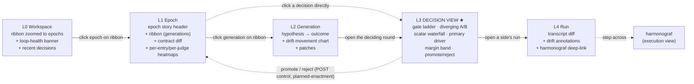
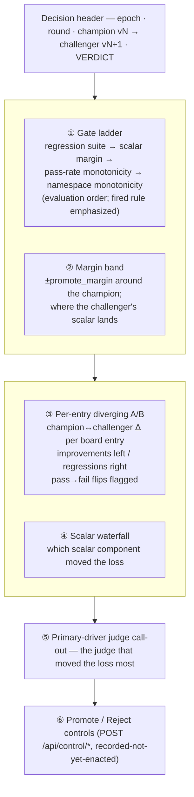

# Dashboard

This document describes the **live dashboard** for an in-flight
zicato epoch. The dashboard has exactly one job, and the whole
information architecture is bent toward it:

> **Make the promote/reject DECISION legible.**

Everything else — the lineage, the heatmaps, the log tail — exists
to support the operator standing in front of one question: *should
this challenger replace the reigning champion?* That decision is
the most consequential thing zicato does (the decision theory under
it is [SELECTION.md](SELECTION.md)); the dashboard is the instrument
that makes it inspectable while it is still in flight. It is the
live counterpart to `analysis.html`, the persisted archival snapshot
of the epoch.

The dashboard is served by a **standalone Python (Starlette) service**
(`src/zicato/dashboard/`, run as `python -m zicato.dashboard`), spawned
by `zicato evolve` alongside — but separate from — the Rust watchdog
supervisor. (The Rust binary can also serve a dashboard, but `evolve`
always runs it `--no-dashboard`; the UI is the Python service's job.
This split-out into its own service was a deliberate decision — see
[RUNTIME.md](RUNTIME.md) §3.0.) The runtime state files described in
[RUNTIME.md](RUNTIME.md) — plus the `.zicato/index.db` analytical index
and the committed `epochs/` artifacts — are the dashboard's data
source. The robustness phasing in [ROBUSTNESS.md](ROBUSTNESS.md) covers
what each layer of defense catches; this document covers the operator
experience and the HTTP / SSE surface.

> **SUPERSEDED IN PART — read this first.** The UI that ships today is
> **Console** (bake-off Variant T): its shell, views, and figure grammar
> are documented in [variant-T.md](variant-T.md) (round-by-round
> changelog) and
> [CONSOLE-DESIGN-LANGUAGE.md](CONSOLE-DESIGN-LANGUAGE.md) (the visual
> source of truth). In particular, the **lineage-ribbon navigation
> metaphor** this document teaches in §4.1 (and references from the L0/L1
> level tables) was superseded by Console's tree sidebar + the
> champion-spine **round timeline**; read those sections as design
> history, not as the shipped navigation. The decision-centric ideas of
> §4 themselves DID ship — the L3 decision view (gate ladder, per-entry
> A/B read, primary-driver call-out, margin band) is live, fed by
> `GET /api/round/.../gate`.
>
> Two older claims in this document are corrected here rather than
> rewritten throughout:
>
> * **Controls are enacted.** The POST control endpoints (§6.2) are wired
>   live AND the orchestrator now *consumes* the `control/` files at safe
>   points (`zicato.runtime.control_consumer`; pause/resume, skip-round,
>   per-run kill, and per-challenger promote/reject overrides all take
>   effect and are read back on the dashboard). The "recorded but not
>   yet enacted" caveat below is stale.
> * **Uncertainty is first-class.** The Bradley–Terry rating pre-gate
>   (θ̂ ± CI, `p_stronger`, the credible-interval band on the gate) and
>   the noise-floor-honest trajectory verdicts ship today; "error bars
>   are planned" below is stale.
>
> The `zicato dashboard` CLI exposes only `--workspace` / `--host` /
> `--port`; the `--read-only` / `--daemon` standalone modes in §2.2 are
> **not shipped** on that CLI.

## 1. What the dashboard is

zicato's ecosystem already has a live UI for one goldfive run:
**harmonograf**. Harmonograf is the **execution view** — it
shows the plan, the per-turn drift state, the intervention
ladder, the operator-driven steering controls: the temporal
trace of a single run.

The zicato dashboard is the **decision view**. It shows **one
epoch**: many goldfive runs across many generations, but always
organized around the promote/reject decisions that chain those
generations into a lineage. It is the cadence above harmonograf.

The two are **not merged** — they are different objects (a run
is a trace; a tournament is a comparison of aggregates over many
traces). They are *linked* by a per-run drill-down: the
dashboard's drill-down opens harmonograf against the run's
`events.jsonl`. The operator moves *down* the decision view
(workspace → epoch → generation → decision → run) and at the run
level steps *across* into harmonograf's execution view. The full
treatment of this split is in
[TOURNAMENT.md §5](TOURNAMENT.md#5-the-harmonograf-split) and
[ARCHITECTURE.md §7](ARCHITECTURE.md#7-the-harmonograf-split-execution-view-vs-competition-view).

| Tool | View | Scope | Cadence |
|---|---|---|---|
| harmonograf | execution | one goldfive run | within one run |
| **zicato dashboard** | **decision** | **one zicato epoch** | **across the promote/reject decisions in the epoch** |
| `analysis.html` | decision (snapshot) | one zicato epoch | regenerated each round; persisted at close |

The same operator may have all three open at once: harmonograf
focused on the specific run they're inspecting, the zicato
dashboard for the decision in flight, `analysis.html` from a
closed epoch in a third tab for comparison.

## 2. Auto-spawn from `zicato evolve`

The common case is `zicato evolve --rounds N`. In this case, the
dashboard auto-starts; the operator doesn't think about it.

```
$ zicato evolve --rounds 5
...
Dashboard: http://127.0.0.1:7892
[evolve] round 1 of 5...
```

The URL is printed to stdout once the dashboard service reports the
port it actually bound (read back from `runtime/dashboard.json` — the
service walks `+1` if the preferred port is taken, so the URL is the
real one, not an assumed one). Both the dashboard service and the
watchdog supervisor exit when `evolve` exits; the dashboard URL stops
working at that point.

### 2.1 Opt-out and tuning flags

These are the flags that actually ship on `zicato evolve`:

| Flag | Default | Meaning |
|---|---|---|
| `--no-dashboard` | off | Do not spawn the dashboard service (and the watchdog supervisor that guards it). `evolve` still runs the loop. Useful for non-interactive CI. |
| `--dashboard-port <port>` | `7892` | Preferred port for the dashboard HTTP server (always bound on `127.0.0.1`). If taken, the service walks `+1` up to ten times. |

Notes:

- There is **no `--dashboard-bind` flag.** The dashboard always binds
  `127.0.0.1` — the operator views it from the same host as the evolve
  loop, so loopback is correct. (LAN exposure would be a reverse-proxy
  concern; it is not a CLI option.)
- There is **no `--dashboard-only` flag** on `evolve`. For a
  post-mortem against a completed workspace, run the standalone
  `zicato dashboard` command (§2.2).
- There is **no authentication** on the dashboard. It binds to
  loopback by default. Operators who put it behind a reverse proxy own
  the auth story; the dashboard does not include auth itself.

### 2.2 The standalone `zicato dashboard` command

A standalone `zicato dashboard` command **ships today** for serving an
*existing* workspace — a post-mortem of a completed epoch, or a
read-along view of a workspace another `zicato evolve` is currently
driving. It is a thin wrapper that runs the same Python service in the
foreground until interrupted (Ctrl-C):

| Flag | Default | Meaning |
|---|---|---|
| `--workspace <path>` | `.zicato` | Workspace root to serve. |
| `--host <addr>` | `127.0.0.1` | Bind address. |
| `--port <port>` | `7892` | Preferred port (walks `+1` if taken). |

> **Planned modes.** Two richer modes are **not yet shipped** as
> `zicato dashboard` flags:
>
> | Planned mode | Use case | Intended behavior |
> |---|---|---|
> | `--read-only` | Post-mortem / shared view | Disable the POST control surface. (The capability exists — `create_app(read_only=…)` and the Rust binary's `--read-only` — but is not surfaced as a `zicato dashboard` flag; the standalone command currently serves with the control surface enabled.) |
> | `--daemon` | Long-running CI | Outlive one `evolve` invocation and pick up the next. (The Rust binary has a `--daemon`; the Python `zicato dashboard` does not.) |

The auto-spawn case is the common one and gets the simplest entry
point: no command, just `evolve` doing it for you.

> **Builder focus.** `zicato dashboard --view builder` is the same service launched focused on
> the tournament builder (it prints the `#/builder` deep-link); the builder is
> also reachable inside any running dashboard via the top-bar ⚙ Settings entry.
> See [`TOURNAMENT-BUILDER.md`](TOURNAMENT-BUILDER.md).

## 3. Architecture (HTTP + SSE)

The dashboard server is a single-page HTML application talking
to the Python (Starlette) HTTP server over two channels:

- **HTTP GET** for initial state and on-demand snapshots.
- **Server-Sent Events** (`text/event-stream`) for live updates.

```
┌────────────────────────────────┐         ┌─────────────────────────────┐
│  Browser (single-page UI)      │         │  zicato.dashboard (Python/  │
│  ──────────────────────────    │         │  Starlette + uvicorn)       │
│  index.html + JS/CSS bundle    │◄────────┤  GET /  → serves index      │
│                                │         │                             │
│  On load:                      │         │  GET /api/state             │
│   1. fetch /api/state          │◄────────┤   ◄ reads .zicato/runtime/  │
│   2. open EventSource(/events) │         │   ◄ + index.db + epochs/    │
│                                │         │                             │
│  On every SSE event:           │         │  watches .zicato/runtime/   │
│   - apply delta to UI state    │◄────────┤   → snapshot then           │
│                                │         │     state_change events     │
│                                │         │                             │
│  On user action:               │         │  POST /api/control/<action> │
│   - POST /api/control/{action} ├────────►│   → write .zicato/runtime/  │
│                                │         │     control/<file>          │
└────────────────────────────────┘         └─────────────────────────────┘
                                                       │
                                                       │ (planned) orchestrator
                                                       ▼  consumes at safe points
                                          ┌─────────────────────────────┐
                                          │  zicato evolve (Python)     │
                                          │  PLANNED: read control/ at  │
                                          │  safe points; archive into  │
                                          │  control_log/.              │
                                          └─────────────────────────────┘
```

The two processes the operator runs into:

| Process | Port | Role |
|---|---|---|
| Rust watchdog supervisor | `:7920` | Watches the orchestrator's heartbeat; restarts / escalates. Serves its own dashboard only when run standalone — under `evolve` it runs `--no-dashboard`. |
| Python dashboard service | `:7892` | The UI in this document. Reads the workspace; serves GET + SSE; writes `control/` files on POST. |

The control POST endpoints write the `control/` files today; the
orchestrator's *consumption* of them is the planned half (see
[RUNTIME.md](RUNTIME.md) §2.5).

### 3.1 Why SSE, not WebSockets

| Property | SSE | WebSockets |
|---|---|---|
| Server → client only | ✓ (exactly what we want) | ✓ |
| Client → server | (separate HTTP POST) | ✓ (same connection) |
| Auto-reconnect with `Last-Event-ID` | ✓ (builtin) | manual |
| Implementation complexity (server + browser) | low | medium |
| Plays nicely with HTTP middleware (gzip, headers) | ✓ | partial |

Live updates are strictly server → client (the orchestrator
generates events; the browser displays them). Client → server
actions are infrequent enough to use plain `POST /api/control/...`.
SSE's auto-reconnect makes the dashboard tolerant of transient
network drops or service restarts; on reconnect the server re-sends a
fresh `snapshot` before resuming the live `state_change` stream.

### 3.2 Bundled assets

The Python dashboard service serves its HTML, CSS, and JS bundle off
disk from `src/zicato/dashboard/static/` (`index.html`, `app.js`,
`style.css`, `icons.svg`, plus `css/` and `js/`). `evolve` resolves the
static directory and hands it to the server; an unknown asset 404s, and
a missing bundle falls back to a placeholder page. No external CDN, no
node_modules at runtime.

Static assets are served `Cache-Control: no-cache` **plus an `ETag`**
derived from the file's identity (`mtime-ns` + size — `server.py`). The
`no-cache` keeps the browser from ever serving a stale CSS/JS bundle (a
long-lived edit-during-development hazard), while the ETag makes that
revalidation cheap: an unchanged asset with a matching `If-None-Match`
returns a bodyless **`304`** (no re-download), and the moment a file is
edited its ETag changes and the browser gets a fresh `200`. So edits
always reach the browser, but an unchanged page reload pays only
revalidation, not re-transfer.

Styling mirrors `analysis.html`'s aesthetic — same font stack,
same colour palette, same chart conventions. The two should look
like the same thing in two modes: live and archival.

### 3.3 SSE event format

The shipped wire protocol (`src/zicato/dashboard/sse.py`) is: a new
client first receives one `event: snapshot` carrying the full state,
then `event: state_change` frames as files under `.zicato/runtime/`
change. `state_change` frames are **coalesced** — a burst of writes
within a short debounce window collapses into a single frame whose
payload carries the set of changed *kinds* (`payload.kinds`), so the
dashboard does one coalesced refresh instead of a frame per file.

```
event: snapshot
data: { ...the same shape as GET /api/state... }

event: state_change
data: {"kinds": ["active_tournament", "active_runs"]}

event: state_change
data: {"kinds": ["heartbeat"]}
```

The `kind` regions are derived from which file changed (heartbeat,
active_tournament, active_runs, run_log, lineage, …); the dashboard JS
reads `payload.kinds` and re-fetches the affected endpoints. A
keep-alive comment is sent periodically so idle connections survive
proxy read-timeouts.

### 3.4 Data sourcing: files-canonical, index-derived

zicato persistence is **files-canonical, index-derived**. This is
a load-bearing rule for the dashboard, and getting it wrong is a
real bug class — it produced a blank decision view mid-run (see
below). The rule:

> **Live dashboard state MUST read the JSON / JSONL files (or the
> live endpoints that wrap them). Only resolved historical and
> analytical queries may read `index.db`.**

There are two tiers of storage, and they are refreshed on
different cadences:

| Tier | Files | Written | Read for |
|---|---|---|---|
| **Canonical, live** | `runtime/active_tournament.json`, `runtime/heartbeat.json`, `runtime/active_runs/*.json`, `lineage.json`, per-run `events.jsonl` | Live — the moment state changes, by the orchestrator or the worker that owns the file | The live dashboard: anything that must reflect *right now* |
| **Derived, lagging** | `index.db` (SQLite) | Dual-written at **generation/round boundaries** only (see [ANALYTICAL-INDEX.md §2.3](ANALYTICAL-INDEX.md#23-the-orchestrator-dual-writes-live)); fully rebuildable via `zicato repair index` | Resolved historical / analytical queries: closed decisions, cross-run aggregates |

`index.db` is a **derived analytical cache**. It is rebuilt from
the canonical files by `zicato repair index`, and during a live run it
is only refreshed at generation boundaries — so mid-round it does
not yet contain the in-flight generation or the in-progress
decision. It is the right source for *resolved* data (closed
decisions, cross-run aggregates) and the wrong source for *live*
data.

**The bug this rule prevents.** The decision view previously read
its in-progress matchup from `index.db`. Because the index is only
refreshed at generation boundaries, mid-round there was no row for
the running tournament — so the panel rendered **blank** for the
entire duration of every round, exactly when an operator most wants
to watch the decision form. The fix: the decision view now reads
`runtime/active_tournament.json` (via `GET /api/active-tournament`)
live. The index is still read — but only for decisions that have
already *closed*.

The endpoints in §6 follow this split: `/api/active-tournament`,
`/api/active-runs`, `/api/lineage`, `/api/run-log`, and
`/api/heartbeat` are file-backed and live; `/api/tournaments`
(the resolved decisions) and `/api/tournaments/{id}` (matchup
detail of resolved rounds) read the index and degrade gracefully —
a missing or stale `index.db` yields an empty result with a `note`
rather than an error.

## 4. The decision-centric IA

The information architecture is **decision-centric, layered over the
L0→L4 spatial hierarchy**. The levels nest the way the data does —
workspace contains epochs, epochs contain generations, each
generation arrives by a decision, each decision is fed by runs — but
the **L3 decision view is the centerpiece**, and every other level is
a way of getting to it or summarizing the decisions already made.

| Level | Scope | The decision framing | Primary source |
|---|---|---|---|
| **L0 Workspace** | cross-epoch | "Is the lineage climbing, and is any loop unhealthy?" — lineage ribbon zoomed to epochs, loop-health banner, recent decisions | `/api/workspace`, `/api/health-report`, `/api/lineage` |
| **L1 Epoch** | one epoch | "What contract is this epoch deciding under, and how have its decisions gone?" — epoch story header, lineage ribbon, contract diff, per-entry/per-judge heatmaps | `/api/epoch`, `/api/lineage`, `/api/contract-diff/...`, the per-judge endpoints |
| **L2 Generation** | one generation | "Did the bet this generation made pay off?" — hypothesis→outcome panel, drift-movement chart, patches | `/api/lineage`, `/api/generation/...`, `/api/drift-movements/...`, `/api/files/...` |
| **L3 Decision / round** | one promote/reject | **The centerpiece** — gate ladder, per-entry diverging A/B chart, scalar waterfall, primary-driver judge, margin band, promote/reject controls | live `active_tournament.json` for the in-flight decision; `/api/round/.../gate` + the index for closed ones |
| **L4 Run** | one run | "What did this single side actually do?" — transcript diff, drift annotations, harmonograf deep-link | `/api/run/...`, transcript endpoints, `/api/run-log` |

### 4.1 The lineage ribbon — one navigation metaphor at every level

The **lineage ribbon** is the consistent navigation metaphor. It
**subsumes** three formerly-separate widgets — the generation-spine,
the epoch-timeline, and the cross-epoch sparkline — into one object
that simply *zooms* per level. The ribbon is the answer to "where am
I in the optimization, and how did I get here?" at L0, L1, and L2
alike.

What it encodes:

- **x-axis** is lineage order (generation index / round); the ribbon
  reads left → right as the loop progresses.
- **y-position encodes the scalar** (the drift-derived loss; lower is
  better). So the ribbon *is* the optimization trajectory — a falling
  ribbon is a loop that is winning, a flat ribbon is a loop that has
  stalled, a rising tail is a regression. This is the generation-level
  aggregate and it is always a loss; the per-entry figures below read
  whichever channel the contract populates, on their own conventions.
- **Promoted generations** sit on the main trace (the spine of the
  ribbon). **Rejected challengers branch off their parent** as short
  stubs that do not continue the trace — a visual record of every bet
  that did not pay off, hanging at the y-position its scalar earned.
- **Click any node to drill in** — a generation node opens L2, the
  decision that produced (or rejected) it opens L3, the in-flight tip
  pulses.

Zoom levels:

| Zoom | Shown at | Each node is |
|---|---|---|
| epochs | L0 | one epoch (collapsed to its final champion's scalar) |
| generations within an epoch | L1 | one generation, promoted on the spine or branched off if rejected |
| round neighborhood | L2 | the focused generation, its parent, and its rejected siblings |

The ribbon is driven by `GET /api/lineage` (which walks generation
**directories**, so it includes in-flight generations with
`promoted: null`) plus `GET /api/score-trajectory` for the
y-positions, and `GET /api/workspace` for the L0 epoch roll-up.



### 4.2 The L3 decision view — the heart of the redesign

L3 is the screen the whole dashboard exists to render. It drills one
promote/reject decision — champion vs challenger — and lays out
*every input the gate weighs*, so the operator can see not only the
verdict but **why** it came out that way, and override it if the
machine got it wrong. It works equally for the **in-flight** decision
(partial data, the verdict still forming) and a **closed** one
(replayed from the index + the new `/gate` endpoint).



**① Gate ladder.** The promote gate (see [SCORING.md](SCORING.md) and
[SELECTION.md §3.2](SELECTION.md#32-the-promote-gate--three-rules-in-order))
is a short-circuiting sequence of rules; the ladder renders them **in
evaluation order**, each with a per-rule **pass / fail / not-reached**
status, the **actual numbers**, and the **fired rule emphasized** (the
rule that decided the verdict — for a reject, the first rule that
failed; for a promote, "all passed"). The rungs, in order:

1. **Regression suite** — the snapshot's own test suite, run before
   scoring when `regression_gate_enabled`. A failing suite is a hard
   reject; later rungs are "not reached."
2. **Scalar margin** — `child_scalar ≤ parent_scalar − promote_margin`.
   Shows both scalars, the delta, and the margin threshold.
3. **Pass-rate monotonicity** — every board entry the champion passed,
   the challenger must also pass. Names the regressed entries if any.
4. **Namespace monotonicity** — no tracked metric namespace moved in
   its "worse" direction. Names the regressed namespaces if any.

```
┌──────────────────────────────────────────────────────────────────────────┐
│ Gate ladder — round 4 — v4 → v5                              VERDICT: REJECT│
│                                                                            │
│  ✓  1. regression suite        passed (snapshot tests 41/41)               │
│  ✓  2. scalar margin           child 0.31 ≤ parent 0.42 − 0.01  Δ −0.11 ✓  │
│ ▶✗  3. pass-rate monotonicity  FAILED — long_solar_with_constraints pass→fail
│  –  4. namespace monotonicity  not reached                                 │
│                                                                            │
│  Fired rule: pass-rate monotonicity. The scalar improved, but a            │
│  previously-passing entry regressed — a hard per-task feasibility reject.  │
└──────────────────────────────────────────────────────────────────────────┘
```

The fired-rule emphasis is the single most important pixel on the
screen: it tells the operator *which constraint the decision turned on*
— a scalar that improved but flipped a passing task to fail reads very
differently from a scalar that simply didn't clear the margin.

**② Margin band.** A horizontal band drawn at the champion's scalar
± `promote_margin` (default `0.01`). The challenger's scalar is plotted
against it: inside the band is "insufficient improvement," below it is
"clears the margin," above it is "regressed." This is the AlphaGo-Zero
noise threshold made visual (see
[SELECTION.md §2 Family ②](SELECTION.md#family--statistical-gate-acceptance-replicate-then-test)).
Today the band is a *fixed* threshold around a *point* estimate; §4.6
describes the planned upgrade to a confidence interval once replication
lands.

**③ Per-entry diverging A/B chart.** One diverging bar per board
entry: the champion-vs-challenger delta for that entry, **improvements
diverging one way and regressions the other**, weighted by the entry's
board weight. **pass→fail regressions are flagged** distinctly (a red
marker) because Rule 3 turns on exactly those — an operator scanning
the chart should see a feasibility-killing flip without reading the
ladder. This is the per-entry detail behind the gate's aggregate
verdict; it reads from the same paired per-entry deltas the gate
consumes (`/api/matchup-grid/...` for the grid,
`/api/round/.../gate` for the gate-aligned breakdown).

**The per-entry channel.** An entry's outcome is defined on whichever
channel the evaluation contract populates, and every per-entry figure
plots the same one the server resolved the entry's verdict on. The
resolution order is the **continuous score** (higher is better), then
the entry's **pass predicate**, then the **drift loss** (lower is
better); the first channel that separates champion from challenger
decides, and `/api/matchup-grid/...` names it per row as `decided_by`.

Two consequences bind every figure below:

- **Sign conventions are never mixed in one readout.** A score delta of
  `+0.585` is a gain; a loss delta of `+0.585` is a regression. Each
  figure states the convention of the channel it painted.
- **A channel with nothing in it is hidden, not drawn as zeroes.** An
  adapter that emits no drift stream still records a structural
  `drift_loss` of `0.000` on every entry, which is indistinguishable on
  the wire from a run that watched for drift and saw none. The server
  answers this directly — `drift_present` on the matchup grid and on
  `/api/generation/.../per-entry` — and a client that is told the
  channel is absent drops it rather than painting a column of zeroes
  and letting the reader infer a measurement that was never taken.

Where more than one replicate ran, the grid also serves
`score_replicates` and `score_se`, the sample standard deviation of the
challenger's replicate scores over the square root of their count. A
single draw measures no spread, so `score_se` is `null` there and the
figures render `--` — never `±0.000`, which would claim a precision the
run does not have.

**Facet slices.** When board entries carry `facet:{name}` tags
(BOARD-FORMAT.md §1.4), two screens report those slices. Each facet is
the candidate re-aggregated over just that slice at the epoch's frozen
weights, so it carries the same `scalar` (lower is better) and
`mean score` (higher is better) the candidate's own aggregate carries —
and a facet scalar therefore reads directly against it.

- The **candidate dossier**, under Per-board scoring: one row per facet,
  with the candidate's own aggregate as the last row to compare against.
- The **per-board drill-down**, under Per-candidate loss: one row per
  candidate, one column per facet the entry feeds. Candidates are rows
  because an epoch grows candidates, not facets.

Both read from `static/js/facets.js`, which owns every label, format and
explanation so the two cannot drift apart.

Three display rules, all for the same reason — a facet number carries no
noise threshold, so the tables must not read as scoreboards:

1. No verdict colour, no bars, no ordering by value, and no dimmed
   column. The emphasised column is as often the worse one.
2. A slice nobody scored shows an em dash, never `0.00`. Its `scalar` is
   still real: an unscored entry still produced drift.
3. The counts travel with the numbers, as `scored/ran/tagged` collapsed
   to the shortest form that loses nothing (`2`, `0/1`, `1/1/3`). All
   three appear because they answer different questions: `tagged` is what
   the BOARD puts in the slice, `ran` is the scalar's denominator, and
   `scored` is the mean score's. A racing rung that runs a board subset
   would otherwise render a mostly-unrun slice as fully covered, which is
   the one thing these counts exist to prevent. The per-board table has
   no room for a count column, so a cell there carries its coverage on
   the number itself (`0.77 · 1/4`) whenever the slice is not whole.

Facets are computed over the TRAIN slice, so `candidate overall` is the
same number the gate compares and a facet covering the whole board
reports exactly it. Holdout entries feed no facet — see EVAL-VIEW.md
§3.4 for why both halves of that matter.

**④ Scalar waterfall.** The scalar is a weighted sum of drift-derived
components (see [SCORING.md](SCORING.md) — the per-`judge_name`
`per_judge_weights` term plus the rest of the loss). The waterfall
decomposes `child_scalar − parent_scalar` into per-component bars, so
the operator sees **which component moved the loss**: a win driven by
one judge looks different from a broad win across all of them, and a
component moving the wrong way under a net improvement is a smell.

**⑤ Primary-driver judge call-out.** A single emphasized line naming
the judge that moved the loss the most (the largest single waterfall
component). It is the one-glance "what is this decision actually
about?" — fed by the `primary_driver` field of
`/api/round/.../per-judge-comparison`.

**⑥ Promote / reject controls.** The POST `/api/control/promote/{gen}`
and `/api/control/reject/{gen}` endpoints surfaced as buttons (plus
pause / skip / kill / brief — §5), gated by `read_only`. **Honest
status:** the write side ships — clicking writes the `control/` file
atomically — but the orchestrator does not yet *consume* control files
at safe points (see [RUNTIME.md](RUNTIME.md) §2.5). So these are
**recorded-but-not-yet-enacted / planned-enactment**: the dashboard
records the operator's override on disk; the loop will act on it once
the consume side lands. A gate-override (promote when the gate would
reject, or vice versa) is a contract violation needing a durable audit
trail — see §5.3.

**The feeding endpoint.** L3 is fed by a new
`GET /api/round/{epoch}/{champion}/{challenger}/gate` endpoint — a
structured gate breakdown returning the ladder (each rule with its
status, numbers, and whether it fired), the per-entry deltas with
pass→fail flags, the scalar-component waterfall, the margin-band
geometry, and the primary-driver judge. It is the one **new** endpoint
this redesign adds; everything else on L3 composes the existing
endpoints (`/api/active-tournament` for the in-flight decision,
`/api/matchup-grid/...`, `/api/round/.../per-judge-comparison`). See
§6.1.

> **In-flight vs closed.** For the in-flight decision the gate ladder
> renders against *partial* results — rungs whose inputs are not yet
> complete show "pending," and the verdict is the deterministic
> projection (best-case / worst-case / current-trend) computed from
> completed board entries. Once both best- and worst-case agree, the
> decision is settled early. The projection is computed from
> `active_tournament.json`; no LLM, no randomness, same partial results
> in → same projection out.

### 4.3 L0 — the workspace decision summary

L0 answers "is anything wrong, and is the loop climbing?" before the
operator drills anywhere. It composes:

- the **lineage ribbon zoomed to epochs** (§4.1) — the cross-epoch
  trajectory at a glance;
- the **loop-health banner** (§4.5) — the green/amber/red "is this loop
  meaningful" signal;
- a **recent decisions** strip — the last few promote/reject verdicts
  with their deltas, each a click into its L3 decision view.

In the Console (Variant T) home view this L0 read is realised as a fleet of
per-epoch cards plus a **cross-epoch meta-loop ledger** — one composed figure
that braids a **held-floor staircase** (the best scalar each contract held),
**effort-proportional epoch bands** (band width ∝ generations spent), and a
**contract-component heatstrip** (which lever moved at each epoch reset,
including a proposer column the plain contract diff omits). It answers, in one
scan, "is the meta-loop making net progress across contracts, which lever moved
each reset, and is effort buying floor." It is served as a `ledger` sibling of
`epochs` on the same `/api/workspace` read; see
[variant-T.md](variant-T.md#decision-loop-wave-current-default--meta-loop-ledger--settings-drawer--racing-hero--builder-view).

### 4.4 L1 — the epoch and its decisions

L1 frames "what contract is this epoch deciding under, and how have its
decisions gone?":

- an **epoch story header** — the epoch name, its champion, round count,
  and the running decision tally (promotions / rejections / consecutive
  rejections against the stop threshold);
- the **lineage ribbon** zoomed to this epoch's generations (§4.1);
- the **contract diff** (`/api/contract-diff/{epoch_id}`) — what changed
  in the evaluation contract (scoring with nested weight dicts incl.
  `per_judge_weights` — which now survives the subprocess-worker transport
  intact, so the scalar a duel reports is scored under the same per-judge
  weighting the parent configured — board, proposer brief, mutation paths,
  and the proposer) versus the parent epoch, since a decision is only
  meaningful relative to the contract it was made under;
- **per-entry and per-judge heatmaps** — which board entries and which
  judges are moving across the epoch's generations (the per-judge-trend
  and per-entry endpoints), the "what is the lineage learning?" view.

### 4.5 The loop-health banner

`GET /api/health-report` surfaces zicato's loop-health diagnostics (see
[LOOP-HEALTH.md](LOOP-HEALTH.md)) as a **green / amber / red banner at
L0 and L1**, carrying the top finding. It is the "is this loop
meaningful?" signal — the detector for a *running but meaningless* loop
where the evaluation is degenerate and no decision can distinguish any
challenger.

```
┌──────────────────────────────────────────────────────────────────────────┐
│ ● RED  Loop health — round 7                                               │
│   degenerate_scoring: v0..v7 all carry gen_score = 1.000000 — zero score   │
│   variance across 8 generations. The gate cannot tell anyone apart.        │
│   → Inspect scoring.json and the per-entry loss.json files.                │
└──────────────────────────────────────────────────────────────────────────┘
```

The banner turns red on a `critical` finding and carries the single
top finding inline; clicking it expands the full per-detector report.
This is the signal that the *motivating incident* depended on noticing
by hand — a real run had `v0` and `v1` both score exactly `1.000000`,
found only by inspection. When the banner is red, the operator knows
the decision view downstream is meaningless *before* squinting at it.

### 4.6 Uncertainty as first-class (PLANNED, aligned with SELECTION.md)

> **This whole subsection is PLANNED.** It is gated on the replication
> work in [SELECTION.md §7](SELECTION.md#7-the-recommended-design)
> (levers 0–2: a multi-candidate field, replication, a paired
> significance gate). None of it ships today.

Today the dashboard shows **point estimates** — one scalar per
generation, one per-entry delta — plus the **margin band** (§4.2),
which is the *only* uncertainty surface that ships. That is honest for
the shipped mechanism: zicato runs the board once, so there is no
distribution to draw error bars from (see
[SELECTION.md §4](SELECTION.md#4-the-reframe-this-is-a-degenerate-elitist-iterated-race)
— "no replication" is exactly the gap). The fixed `promote_margin` is
a stand-in for a confidence interval the loop never measures.

When replication lands, three things become first-class in the
decision view:

| Planned surface | Where it lands | Depends on |
|---|---|---|
| **Error bars / confidence intervals** on every scalar and per-entry delta — the ribbon's y-positions and the diverging A/B bars gain CIs that tighten with replication depth | L2 ribbon, L3 diverging A/B, the margin band becomes a CI band | replication (lever 1) |
| **Paired-significance verdict in the gate ladder** — Rule 2 (scalar margin) gains a Wilcoxon signed-rank line: "significant AND effect ≥ margin"; Rule 3 reports a per-task regression only if the flip *persists under replication* | L3 gate ladder | paired-significance gate (lever 2) |
| **Field leaderboard** — when the tournament becomes an iterated race of K challengers, a ranked table of champion + K challengers with **tightening CIs and replication-depth**, the dominated eliminated by paired test | a new L3 mode (or an L1 panel) | multi-candidate field + racing (levers 0, 5) |

The leaderboard is explicitly **not an e-sports bracket** — brackets
are the wrong primitive for a small field of expensive, noisy
candidates (see
[SELECTION.md §2 Family ③](SELECTION.md#family--single-elimination-bracket-triage-by-resource)
and [§6](SELECTION.md#6-why-not-double-elimination-or-swiss-the-explicit-verdict)).
It is a *race standing*: who is ahead, how confident are we, and how
many replications has each candidate earned. The display owes its
shape to irace's "return the most-replicated survivor," not to a
single-elimination tree.

**WRONG-vs-FUTURE discipline.** The doc and the UI both label what
*ships* (point estimates + margin band) versus what is *planned* (CIs,
significance verdict, leaderboard). The dashboard must never draw an
error bar it cannot compute; until replication lands, the margin band
is the whole uncertainty story and is labelled as the fixed-threshold
stand-in it is.

### 4.7 L2 — did the bet pay off?

L2 drills one generation and asks "did the bet this generation made pay
off?":

- the **hypothesis → outcome panel** — the experiment's `core_idea`,
  what it was modulating and why, the per-drift-kind predicted-vs-actual
  match (✓/✗), and the realized outcome (`drift_loss_delta`,
  `pass_rate_delta`, decision). This is the structured-hypothesis
  discipline made visible: the hypothesis was written *before* the run,
  the outcome filled in *after*.
- the **drift-movement chart** (`/api/drift-movements/{generation_id}`)
  — which drift kinds moved, and in which direction, for this generation
  versus its champion.
- the **patches** — the actual edits (`/api/files/.../patches` and
  `.../diff`), each linking the mutation point it touched.

From L2 the operator opens "the deciding round" to land on the L3
decision view for this generation's promote/reject.

### 4.8 L4 — one run

L4 is the single side of one matchup — the leaf where the decision view
hands off to the execution view:

- the **transcript diff** — the focused run's transcript beside the
  compare side's (the matchup's other generation), via
  `/api/run/.../transcript` and `/api/matchup/{entry_id}/conversations`;
- the **conversation execution outline** — explicit agent invocation branches
  with delegation observations nested under their stated invocations, beneath
  their owning turns, with unresolved records retained at run scope; see
  [CONVERSATION-EXECUTION.md](CONVERSATION-EXECUTION.md);
- **drift annotations** inline on the transcript turns;
- the **harmonograf deep-link** — "Open in harmonograf," a handoff URL
  (typically a `file://` URL at the run's `events.jsonl`, optionally a
  `harmonograf://` deep link) that opens the execution view for this
  exact run.

The run's live status (phase, wall-clock vs budget, heartbeat age,
drift count) is read from `active_runs/{run_id}.json` via
`/api/run/{run_id}`; the wall-clock bar is an **elapsed-vs-budget**
fraction, NOT task progress — a run at `73%` is 73% through its
wall-clock budget and may finish at any point.

## 5. Interactivity model

> **What ships vs what's planned.** As spawned by `evolve` the
> dashboard service runs `read_only=False`, so the **control POST
> endpoints are live and the write side works**: clicking a control
> button drops the corresponding `control/` file atomically. What is
> **planned** is the orchestrator's *consumption* of those files — the
> evolve loop does not yet read `control/` at safe points (see
> [RUNTIME.md](RUNTIME.md) §2.5), and there is no `control_log/`
> audit-on-consume yet. So today a control action is recorded on disk
> but does not yet change the running loop. The safety review framing
> below (gate overrides as contract violations needing a durable audit
> trail) still governs the planned consume side.

### 5.1 The control surface (shipped write side)

| Operation | Source / effect |
|---|---|
| All panel data (read) | `.zicato/runtime/` + `.zicato/index.db` + `.zicato/epochs/` |
| Open in harmonograf | Constructs a handoff URL; no zicato state change |
| Reload page | Re-fetches `/api/state`, re-opens SSE (fresh snapshot) |
| **Pause / Skip / Kill / Promote / Reject / Brief** | `POST /api/control/...` → atomic write of a `control/` file (returns `202`). **Consumption is planned** (see §5 banner). |

The promote / reject buttons live on the **L3 decision view** (§4.2 ⑥)
where the operator is already looking at the gate ladder; pause / skip /
kill / brief live in the top bar. The `--read-only` posture (where the
POST endpoints return `403`) is available via `create_app(read_only=…)`
and the Rust binary's `--read-only`, but is not surfaced as a `zicato
dashboard` flag yet (§2.2).

### 5.2 Write-back via the control-file protocol

Operator actions are `POST /api/control/<action>` requests on the
dashboard service. The service writes a file under
`.zicato/runtime/control/` (today). The orchestrator is *to* poll
`control/` at safe points and act on the request (planned).

```
operator clicks "reject" on the L3 decision view
            │
            ▼
browser → POST /api/control/reject/{gen}                (SHIPPED)
            │
            ▼
dashboard service → atomically write
            │ .zicato/runtime/control/reject/{gen}       (SHIPPED)
            │ (JSON payload {generation_id, ts})
            │
            ▼
            ... at end of tournament, before journaling ... (PLANNED)
            │
            ▼
orchestrator → reads control/reject/{gen}                (PLANNED)
            │ archives it into control_log/<ts>_*.json
            │ records override_by_operator in experiment.json
            │
            ▼
dashboard → notices the change via its watcher           (SHIPPED path)
            │ emits a state_change SSE frame
            │
            ▼
browser → updates the decision verdict / status pill
```

### 5.3 Command catalogue and safe-point semantics

| Command | File written | Safe point | Priority | Audit log entry |
|---|---|---|---|---|
| `pause_epoch` | `control/pause_epoch` | between rounds | normal | `command=pause_epoch` |
| `resume_epoch` | `control/resume_epoch` | (orchestrator is in pause-wait loop) | normal | `command=resume_epoch` |
| `skip_round` | `control/skip_round` | between rounds OR start of new round | normal | `command=skip_round`, `skipped_round=N` |
| `kill_run` | `control/kill_runs/{run_id}` | immediate (high priority; orchestrator checks every 500ms) | high | `command=kill_run`, `run_id=...`, `cause=operator` |
| `promote_override` | `control/promote/{gen_id}` | end of tournament, before journaling | gate-override | `command=promote`, `gen=...`, `tournament_decision_was=reject` |
| `reject_override` | `control/reject/{gen_id}` | end of tournament, before journaling | gate-override | `command=reject`, `gen=...`, `tournament_decision_was=promote` |
| `rubric_replace` | `control/rubric_replacement.txt` | between rounds | normal | `command=rubric_replace`, `old_hash=...`, `new_hash=...` |

**Shipped endpoints vs catalogue.** The POST endpoints that exist
today are `pause`, `skip-round`, `kill/{run_id}`, `promote/{gen_id}`,
`reject/{gen_id}`, and `brief` (the brief/rubric-replacement). There is
**no** `resume` endpoint yet, and the `*_was` / `old_hash` audit fields
above describe the **planned** `control_log/` entries — none of the
consume-side audit ships today.

**Safe points** are the orchestrator's natural pause boundaries:
between rounds, between entries within a round, end of tournament
before journaling. Commands are categorised by which safe point
they apply to; checking only at safe points avoids the
"orchestrator dies mid-board-entry because the operator clicked
pause" failure mode. (This is the planned consume contract.)

**Gate-override audit.** A promote/reject from the L3 decision view
*against* the gate's computed verdict is the high-stakes case. When
`promote_override` lands and the tournament would have rejected, the
(planned) audit log entry records both the override AND the gate's
would-have-been decision; the `experiment.json` outcome block carries
`override_by_operator: true`; the journal and `analysis.md` show it.
The override is not silent — the gate ladder is right there on screen
recording what the operator overrode.

### 5.4 Authorization model

There is no authentication on the dashboard. The dashboard binds to
loopback by default; any local user can issue any command. The
(planned) audit log would capture a symbolic `issued_by` because the
dashboard doesn't ask for an operator identity.

If/when the dashboard needs real auth (multi-operator setups,
remote access without a reverse proxy), the spot to add it is HTTP
middleware in the dashboard service — between the request being
accepted and the control file being written.

## 6. HTTP API surface

This is the shipped surface served by `src/zicato/dashboard/server.py`,
plus the one **new** endpoint the redesign adds (`/gate`, marked
PLANNED). The GET endpoints and `/events` are always available; the
POST control endpoints (§6.2) are available unless the app was built
`read_only`.

### 6.1 Routes at a glance

The route table:

| Route | Purpose |
|---|---|
| `GET /` | The single-page UI (`index.html`, off-disk bundle). |
| `GET /static/{path}` and `GET /{path}` | UI assets / fallback to the bundle. |
| `GET /events` | SSE stream (§3.3): one `snapshot` then coalesced `state_change` frames. |
| `GET /api/health` | Liveness/identity (§6.1 detail below). |
| `GET /api/state` | Composite live snapshot. |
| `GET /api/environment?run-log-limit=N` | One coalesced read of the whole environment — the front-end refreshes the entire view from this instead of fanning out to many endpoints. |
| `GET /api/workspace` | L0 cross-epoch workspace summary (feeds the L0 ribbon + recent decisions). Carries a `ledger` array — one row per epoch (held floor · champion · effort · structure · changed-component map incl. the proposer column) — that backs the cross-epoch meta-loop ledger (§4.3). |
| `GET /api/epoch` | Current epoch's evaluation-contract view (scoring incl. `per_judge_weights`, board, brief, mutation paths). |
| `GET /api/lineage` | Generation DAG incl. in-flight generations — the lineage ribbon's backbone. |
| `GET /api/active-tournament` | In-progress decision shape (live) — feeds the in-flight L3 view. |
| `GET /api/active-runs` | In-flight runs with computed progress fields. |
| `GET /api/heartbeat` | Heartbeat snapshot (status pill). |
| `GET /api/run-log?limit=N` | Tail of the active run's `events.jsonl`. |
| `GET /api/tournaments` | Resolved decisions (index). |
| `GET /api/tournaments/{generation_id}` | One resolved decision's matchup detail. |
| `GET /api/matchup-grid/{epoch_id}/{champion_id}/{challenger_id}` | Per-entry A/B grid (feeds the L3 diverging A/B chart). |
| `GET /api/round/{epoch_id}/{champion_id}/{challenger_id}/gate` | **NEW (planned).** Structured gate breakdown for the L3 decision view — the ladder (per-rule status, numbers, fired flag), per-entry deltas with pass→fail flags, the scalar-component waterfall, the margin-band geometry, and the primary-driver judge. |
| `GET /api/round/{epoch_id}/{champion_id}/{challenger_id}/per-judge-comparison` | Per-judge A/B comparison + `primary_driver` for a decision. |
| `GET /api/score-trajectory` | Gen-score trajectory — the lineage ribbon's y-positions. |
| `GET /api/drift-movements/{generation_id}` | Drift-movement / heatmap data (L2). |
| `GET /api/health-report` | Latest loop-health report (the L0/L1 banner). |
| `GET /api/search?...` | Cross-workspace search (⌘K palette). |
| `GET /api/contract-diff/{epoch_id}` | Contract diff vs the parent epoch (L1). |
| `GET /api/epoch/{epoch_id}/per-judge-trend` | Per-judge loss trend across the epoch (L1 heatmap). |
| `GET /api/generation/{epoch_id}/{generation_id}/per-judge` | Per-judge breakdown for one generation (L2). |
| `GET /api/generation/{epoch_id}/{generation_id}/per-entry` | Per-entry breakdown for one generation (L2) — surfaces the continuous outcome score and, where the scorer carries them, the precision / recall metrics per entry. |
| `GET /api/run/{run_id}/per-judge` | Per-judge breakdown for one run (L4). |
| `GET /api/run/{epoch_id}/{generation_id}/{entry_id}/per-judge` | Same, addressed by triple. |
| `GET /api/run/{epoch_id}/{generation_id}/{entry_id}/expectations` | Outcome-check (expectations) results. |
| `GET /api/run/{epoch_id}/{generation_id}/{entry_id}/header` | Run header metadata. |
| `GET /api/run/{epoch_id}/{generation_id}/{entry_id}/transcript` | Run transcript (L4 diff). |
| `GET /api/conversation/{run_id}` | Multi-turn conversation for a run. |
| `GET /api/matchup/{entry_id}/conversations` | Side-by-side conversations for a matchup entry (L4 diff). |
| `GET /api/files` and `GET /api/files/{epoch_id}/{generation_id}/{tree,content,patches,diff}` | Snapshot file tree, content, patches, and diffs (L2 patches). |
| `GET /api/mutations/{epoch_id}` and `.../{mutation_id}` | Mutation surface listing and detail. |
| `GET /api/epoch/{epoch_id}/journal` and `.../journal.md` | Journal as data or rendered markdown. |
| `GET /api/epoch/{epoch_id}/analysis` and `.../analysis.html` | Analysis as data or rendered HTML. |
| `POST /api/control/{pause,skip-round,kill/{run_id},promote/{gen},reject/{gen},brief}` | Control surface (§6.2). |
| `GET/POST /settings/models` | Secret-safe per-role LLM config (harness · auxiliary · builder · judge) for the Settings drawer's Models section — only the `api_key_env` NAME + a set/unset flag is ever serialized, never a secret (`settings_api.py`). |
| `GET /builder/config`, `GET /builder/draft`, `POST /builder/op`, `POST /builder/apply`, `POST /builder/chat` (SSE) | The tournament-builder REST surface (the form + the copilot share one draft / op vocabulary). See [TOURNAMENT-BUILDER.md](TOURNAMENT-BUILDER.md). |

The sections below detail the endpoints whose response shape is
load-bearing.

#### `GET /api/round/{epoch_id}/{champion_id}/{challenger_id}/gate` *(NEW — planned)*

The structured gate breakdown that feeds the L3 decision view (§4.2).
It composes what the gate already computes (see [SCORING.md](SCORING.md)
and [SELECTION.md §3.2](SELECTION.md#32-the-promote-gate--three-rules-in-order))
into a single payload so the front-end does not re-derive the ladder
client-side. The intended shape:

```json
{
  "epoch_id": "hardened_research",
  "champion": "v4",
  "challenger": "v5",
  "verdict": "reject",
  "fired_rule": "pass_rate_monotonicity",
  "ladder": [
    {"rule": "regression_suite",       "status": "pass",        "fired": false, "detail": "41/41 snapshot tests"},
    {"rule": "scalar_margin",          "status": "pass",        "fired": false, "child": 0.31, "parent": 0.42, "delta": -0.11, "margin": 0.01},
    {"rule": "pass_rate_monotonicity", "status": "fail",        "fired": true,  "regressed_entries": ["long_solar_with_constraints"]},
    {"rule": "namespace_monotonicity", "status": "not_reached", "fired": false}
  ],
  "margin_band": {"center": 0.42, "margin": 0.01, "challenger": 0.31},
  "entry_deltas": [
    {"entry_id": "short_solar", "weight": 1.0, "delta": -0.11, "pass_flip": null},
    {"entry_id": "long_solar_with_constraints", "weight": 1.5, "delta": 0.04, "pass_flip": "pass_to_fail"}
  ],
  "scalar_waterfall": [
    {"component": "judge:citation_grounding", "delta": -0.14},
    {"component": "judge:tool_discipline",     "delta": 0.03}
  ],
  "primary_driver": "judge:citation_grounding"
}
```

It is **read-only and degrades gracefully** like its siblings: an
unsafe id or a decision with no resolved data returns the same envelope
with empty `ladder` / `entry_deltas` and a `null` verdict rather than a
`500`. Until it ships, the L3 view assembles an approximation from
`/api/matchup-grid/...` (entry deltas) and
`/api/round/.../per-judge-comparison` (`primary_driver`, per-judge
waterfall) — the `/gate` endpoint exists to give it the rule-ordered
ladder and the margin-band geometry in one authoritative read.

#### `GET /api/state`

Returns a complete live snapshot (`state_reader.build_snapshot`),
joining `heartbeat.json`, `active_tournament.json`, `active_runs/*`,
and derived `epochs/` + index data. It is the same shape sent as the
SSE `snapshot` frame and used on first load and on reconnect.

#### `GET /events`

Server-Sent Events stream. On connect it sends one `event: snapshot`,
then `event: state_change` frames as files under `.zicato/runtime/`
change. Frames are **coalesced** over a short debounce window and carry
the set of changed `kinds` (§3.3). A keep-alive comment keeps idle
connections open through proxy read-timeouts.

#### `GET /api/active-tournament`

The in-flight decision's data only — feeds the live L3 view (the gate
ladder rendered against partial results, the diverging A/B chart as
entries finish, the deterministic verdict projection). Cheaper than
`/api/state`.

#### `GET /api/active-runs`

The active runs list only. Each element carries the raw
`active_runs/{run_id}.json` fields plus three computed fields the
per-entry progress bars need:

| Field | Meaning |
|---|---|
| `progress` | A `0..1` fraction, or `null`. This is the **deadline-elapsed fraction** — `elapsed / budget` clamped to `[0,1]` — NOT a measure of true task progress. A run at `progress: 0.9` is 90% through its wall-clock budget, not 90% done with its work. |
| `elapsed_seconds` | Wall-clock seconds since the run started. |
| `budget_seconds` | The run's wall-clock budget (`wall_clock_budget_seconds`). |

`progress` is `null` when the run carries no budget or no start
time. The dashboard renders it as an elapsed-vs-budget bar, not a
completion bar — the distinction matters because a run can finish
well before its deadline.

#### `GET /api/lineage`

Lineage DAG plus per-generation metadata — the backbone of the lineage
ribbon (§4.1). The response is `{"generations": [...]}`; each node is:

```json
{
  "generation_id": "v5",
  "epoch_id": "hardened_research",
  "parent_generation_id": "v4",
  "promoted": null,
  "created_at": "2026-05-14T12:34:55Z"
}
```

The view is built by walking every generation **directory** in
every epoch, so it includes **in-flight generations** — a
candidate that has been proposed and applied but whose decision
has not yet resolved. `promoted` is a tri-state:

| `promoted` | Meaning | Ribbon rendering |
|---|---|---|
| `true` | Promoted (won its decision). | on the spine |
| `false` | Rejected. | branched off its parent as a stub |
| `null` | Still being scored — decision in flight. | pulsing tip |

The legacy `lineage.json` only lists resolved (promoted)
generations; it is used as a fallback for a root node's
`created_at` / `parent_generation_id`, but the directory walk is
authoritative. This is what lets the ribbon draw `v0` plus the
in-flight `v5` mid-run rather than waiting for the decision to close.

#### `GET /api/run-log?limit=N`

Tails the active run's `events.jsonl` and returns the last `N`
goldfive events for the log-tail panel. `limit` defaults to `40`
and is clamped to `1..=500` (an absent or zero value falls back to
the default; `?after=<cursor>` requests only events past a cursor so
the dashboard appends rather than re-rendering). When there is no
active run, it falls back to the most recent `events.jsonl` under
`epochs/`.

Response shape:

```json
{
  "events": [
    {
      "seq": 1423,
      "kind": "drift_detected",
      "ts": "2026-05-14T12:35:05.412Z",
      "summary": "CONFABULATION_RISK · sev=MEDIUM"
    }
  ]
}
```

| Field | Meaning |
|---|---|
| `seq` | The event's sequence number, or `null` if the record carries none. |
| `kind` | The goldfive payload kind, **normalized to snake_case**. |
| `ts` | RFC-3339 emission timestamp, or `null` if unknown. |
| `summary` | A short human-readable summary; falls back to `kind`. |

goldfive writes events in two envelope shapes — a camelCase shape
(`steeringDecisionMade`, `taskProgress`, ...) and a normalized
`{kind, payload, emitted_at, ...}` shape from the reducer's
proto-reparse path. The endpoint handles both and normalizes
every `kind` to snake_case so the dashboard keys on one stable
vocabulary. Every failure mode — missing file, truncated tail line,
unparseable record — degrades to fewer or zero events; the endpoint
never `500`s.

#### `GET /api/health`

A liveness/identity endpoint for the dashboard footer and for
process-level health checks. Always `200`:

```json
{
  "status": "ok",
  "version": "0.3.0",
  "uptime_seconds": 412,
  "read_only": false,
  "workspace": "/home/op/myagent/.zicato",
  "port": 7893,
  "build": "0.3.0"
}
```

| Field | Meaning |
|---|---|
| `port` | The TCP port the server actually **bound** (`app.state.bound_port`) — useful because the default `:7892` walks `+1` on a port clash, so the bound port is not always the requested one. |
| `version` / `build` | The dashboard version string (`_dashboard_version()`). Both fields carry it. |
| `read_only` | `true` when the app was built `read_only=True`; the POST control endpoints return `403` in that state. As spawned by `evolve` the dashboard runs `read_only=False`. |

### 6.2 POST control endpoints

These are **wired and live** (the write side). They are mounted under
`/api/control/` and gated by the `read_only` flag.

| Endpoint | Body | Effect |
|---|---|---|
| `POST /api/control/pause` | optional `{"reason": "..."}` | Atomically write `control/pause_epoch` (JSON `{reason, ts}`). |
| `POST /api/control/skip-round` | optional `{"reason": "..."}` | Write `control/skip_round`. |
| `POST /api/control/kill/{run_id}` | (none) | Write `control/kill_runs/{run_id}`. |
| `POST /api/control/promote/{generation_id}` | (none) | Write `control/promote/{generation_id}`. |
| `POST /api/control/reject/{generation_id}` | (none) | Write `control/reject/{generation_id}`. |
| `POST /api/control/brief` | raw text body | Write `control/rubric_replacement.txt` (the on-disk file keeps its protocol name; the UI calls it the proposer brief). |

Each writes its `control/` file atomically and returns `202 Accepted`.
The effect is **asynchronous and planned**: once the orchestrator's
consume side lands (see §5 banner and [RUNTIME.md](RUNTIME.md) §2.5) it
will apply the command at the next safe point; today the file is
written but not consumed. There is no `resume` endpoint and no
`ack_override` confirmation step in the shipped surface.

### 6.3 Error responses

| Code | When |
|---|---|
| `202` | Success — the control file was written. |
| `400` | A path-parameter `run_id` / `generation_id` is unsafe (fails the `[A-Za-z0-9._-]` id check). |
| `403` | The dashboard is in `read_only` mode; the control endpoint refuses. |

## 7. Progressive `analysis.html` and the dashboard

`analysis.html` is regenerated after every generation completes
(see [EPOCHS-AND-JOURNALING.md](EPOCHS-AND-JOURNALING.md) §5.2).
It is the **persisted archival snapshot**; the dashboard is the
live view.

| Property | dashboard | `analysis.html` |
|---|---|---|
| Updates | live (SSE) | regenerated each round |
| Source | `.zicato/runtime/` + `index.db` + `epochs/` | `epochs/` only |
| Process | the Python dashboard service | orchestrator (Python) |
| Reachable while orchestrator is paused | partially (heartbeat shows phase) | yes (it's a file) |
| Reachable after `evolve` exits | no (the auto-spawned service exits with evolve — but `zicato dashboard` can re-serve the workspace) | yes (the file persists) |
| Includes LLM narrative | no | yes (at epoch close) |

The two are intentionally redundant. The dashboard is the
"watching the decision live" tool; `analysis.html` is the "send a link
to a teammate" tool. Either can stand alone.

## 8. Phasing

| Phase | What ships |
|---|---|
| **v1.2 — shipped** | The dashboard as a **separate Python service**, auto-spawned from `zicato evolve` (and a standalone `zicato dashboard` command). All GET endpoints in §6.1 *except* `/gate`. The L0→L4 drill-down navigation, ⌘K palette, and status pill. Live panels read the runtime JSON files; only resolved decisions and cross-run analytics read the analytical index (§3.4). SSE for live updates (snapshot + coalesced state_change). |
| **v1.3 — partially shipped** | POST control endpoints under `/api/control/` (`pause`, `skip-round`, `kill`, `promote`, `reject`, `brief`) — the **write side is live**. **Planned:** the orchestrator's consume-at-safe-points half, the `control_log/` audit, and gate-override confirmation UX. |
| **decision-centric redesign — being implemented** | The **lineage ribbon** as the unified navigation metaphor (§4.1), the **L3 decision view** (gate ladder, diverging A/B, scalar waterfall, primary-driver call-out, margin band — §4.2), and the new `GET /api/round/.../gate` endpoint that feeds it. The loop-health banner (§4.5) is shipped data (`/api/health-report`) surfaced as a banner. |
| **uncertainty — planned** | Error bars / CIs, the paired-significance verdict in the gate ladder, and the field leaderboard (§4.6) — gated on the replication work in [SELECTION.md §7](SELECTION.md#7-the-recommended-design). |

The split is the same split as the runtime work — observability first,
controls after, then sharper decision legibility, then uncertainty.

## 9. Cross-references

| Topic | Document |
|---|---|
| The candidate-selection decision theory and the racing/replication roadmap | [SELECTION.md](SELECTION.md) |
| The promote gate's rules (regression suite → scalar margin → pass-rate → namespace) | [SELECTION.md §3.2](SELECTION.md#32-the-promote-gate--three-rules-in-order), [SCORING.md](SCORING.md) |
| Uncertainty / replication levers behind §4.6 | [SELECTION.md §7](SELECTION.md#7-the-recommended-design) |
| State file layout the dashboard reads from | [RUNTIME.md](RUNTIME.md) §2 |
| The watchdog supervisor + the dashboard-as-separate-service split | [RUNTIME.md](RUNTIME.md) §3, §3.0 |
| `control/` and `control_log/` file shapes (and the planned consume side) | [RUNTIME.md](RUNTIME.md) §2.5 |
| The tournament competition model — matchup detail, analytics | [TOURNAMENT.md](TOURNAMENT.md) |
| The harmonograf split — execution view vs decision view | [TOURNAMENT.md](TOURNAMENT.md) §5 |
| Loop-health diagnostics behind the loop-health banner | [LOOP-HEALTH.md](LOOP-HEALTH.md) |
| The analytical index — derived, refreshed at generation boundaries, read only for resolved decisions (see §3.4) | [ANALYTICAL-INDEX.md](ANALYTICAL-INDEX.md) |
| The dual-write discipline behind the files-canonical / index-derived rule | [ANALYTICAL-INDEX.md §2.3](ANALYTICAL-INDEX.md#23-the-orchestrator-dual-writes-live) |
| The `experiment.json` shape displayed in the L2 hypothesis→outcome panel | [EPOCHS-AND-JOURNALING.md](EPOCHS-AND-JOURNALING.md) §3 |
| Progressive `analysis.html` generation | [EPOCHS-AND-JOURNALING.md](EPOCHS-AND-JOURNALING.md) §5.2 |
| Robustness layers backing the supervisor | [ROBUSTNESS.md](ROBUSTNESS.md) |
| CLI surface (`zicato evolve --no-dashboard`, `zicato dashboard`) | [CLI.md](CLI.md) |
</content>
</invoke>
