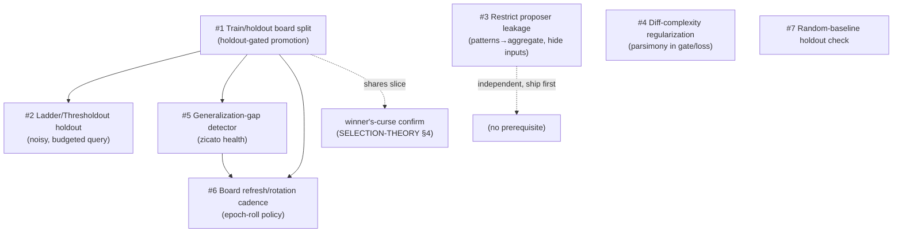

# Overfitting the board — adaptive board reuse, Goodhart, and what to do about it

> **Status.** RESEARCH / DESIGN NOTE, now **partially shipped**. The body
> below is a literature survey of overfitting under repeated, adaptive
> evaluation — train/test discipline, the reusable holdout, Goodhart's
> law, regularization, early stopping, and selection-bias correction —
> mapped onto zicato's loop, with a ranked set of concrete mechanisms.
> Several of those mechanisms have since been built and are default-on:
> the **#1 train/holdout board split** with holdout-gated promotion
> (`board/split.py`), the **#2 Ladder/Thresholdout** noisy-holdout query
> (`tournament/ladder.py`), the **#3 proposer-leakage restrictions**
> (train-slice-only patterns, aggregated entry ids, withheld inputs), the
> **#5 generalization-gap detector** (a `zicato health` finding), and the
> **#6 board-rotation cadence**. The holdout confirmation has since been
> **extended through the non-gauntlet structures** (swiss / single_elim /
> double_elim / racing) via `orchestrator._evolve_multi_challenger` +
> `runner.confirm_crowning_holdout`, so a crowning under any structure is
> Ladder-mediated on the holdout. §12 now carries per-lever **SHIPPED /
> FUTURE** status tags (**#4** diff-complexity regularization is now shipped
> in FULL — both the loss-term half, `ScoringWeights.diff_complexity_weight`,
> and the complexity-CEILING half, `ScoringWeights.diff_complexity_ceiling`,
> both default-off — and **#7** the random-baseline check has since shipped as
> the opt-in placebo arm, `overfitting.random_baseline_every_n`); treat the
> *mechanism → verdict* analysis as the design rationale and those tags
> as the as-built status. The proposer **outcome-marginal failure-mode
> channel** (§11.5) is the most recent addition.

This is the companion to four shipped docs and one research note:

- [`SCORING.md`](SCORING.md) — how a board run becomes the scalar **loss**
  and the three-rule promote **gate**.
- [`SELECTION.md`](SELECTION.md) / [`SELECTION-THEORY.md`](SELECTION-THEORY.md)
  — the decision theory of the gate, the winner's-curse / optimizer's-curse
  treatment, and the **replicate-first** operating rule. This note does
  **not** re-derive those; it cross-references them and adds the *one*
  thing they do not cover — overfitting to the board's **identities**
  rather than promoting on **noise**.
- [`LOOP-HEALTH.md`](LOOP-HEALTH.md) — the `zicato health` detectors for a
  *toothless* eval. The generalization-gap detector proposed here is a new
  member of that family.
- [`EXPERIMENT-MEMORY.md`](EXPERIMENT-MEMORY.md) / [`PROPOSER.md`](PROPOSER.md)
  — what the proposer is fed each round (the leakage surface).

The distinction that organizes the whole note:

> [`SELECTION-THEORY.md`](SELECTION-THEORY.md) defends against **promoting
> on noise** — the *selected* challenger's loss is optimistically biased
> (the optimizer's curse) and one lucky draw should not crown a champion.
> **This note defends against a different failure: the proposer
> *memorizing the board***. Even with perfect noise control — infinite
> replication, zero-variance loss — an optimizer that adaptively queries a
> *fixed* board every round and selects edits that lower the measured loss
> will eventually fit the *specific board entries* rather than the true
> quality the board is a proxy for. The two failures are orthogonal:
> replication fixes the first and does *nothing* for the second.

---

## 1. zicato's overfitting threat model

### 1.1 The loop is a textbook adaptive-data-analysis setting

zicato runs a fixed board of task entries through a generation, reduces
the telemetry to a scalar loss (lower = better), shows the proposer the
results, and the proposer emits the next edit *to reduce that measured
loss*. This repeats for generations and epochs. Strip the agent framing
and it is exactly the setting the adaptive-data-analysis literature warns
about:

- The board is a **finite proxy** for true harness quality (the
  distribution of tasks the harness will actually face). Each entry's
  pass/fail and drift loss is a *sample statistic*, not the population
  truth.
- The proposer is an **adaptive analyst**: round *t*'s proposed edit is a
  function of rounds *1..t−1*'s measured losses on the *same* board (the
  loss summary, the detector patterns, and the per-experiment Δscalar in
  experiment memory). Dwork et al. call this the adaptive setting:
  `f_t = A(f_1, R_1, …, f_{t−1}, R_{t−1})`, where the queries depend on
  the previous answers ([Dwork et al. 2015][dfh-arxiv]).
- The board is **reused** across every round of an epoch. The contract
  hash ([`epoch/contract.py`](../../src/zicato/epoch/contract.py)) freezes
  it for the epoch's whole lifetime — which is *exactly* the regime where
  a single reused holdout "gets used up."

The classical (non-adaptive) generalization guarantee — Hoeffding plus a
union bound over `k` *fixed-in-advance* queries — **does not apply** once
the queries are chosen adaptively ([Blum & Hardt 2015][ladder-arxiv] §2
makes this explicit: in the adaptive setting Hoeffding's bound can no
longer control the empirical loss). The board's loss becomes an
*optimistically biased* estimate of true quality, and the bias grows with
the number of adaptive rounds.

### 1.2 Goodhart's law is the same statement in a different vocabulary

"When a measure becomes a target, it ceases to be a good measure." The
board *is* the target; the proposer is an optimizer pointed straight at
it. [Manheim & Garrabrant 2019][manheim] taxonomize four variants, three
of which are live in zicato:

- **Regressional Goodhart** — selecting for an imperfect proxy also
  selects for the *noise* in the proxy. (This is the winner's curse;
  [`SELECTION-THEORY.md`](SELECTION-THEORY.md) §4 owns it.)
- **Extremal Goodhart** — pushing hard on the metric drives the system
  into a regime where the proxy/quality correlation breaks down. A prompt
  edit that drives `off_topic` drift to zero by *refusing to answer* is
  the canonical zicato instance — and is exactly why the gate's pass-rate
  monotonicity rule ([`SCORING.md`](SCORING.md) §5.1) exists.
- **Causal/adversarial Goodhart** — the optimizer games the *measurement
  channel*. In zicato: the proposer hardcodes an answer keyed to a board
  entry's input, or special-cases the exact failing input it was shown.

The Goodhart framing and the adaptive-data-analysis framing are the same
phenomenon; the literature on each supplies different, composable
mitigations (§3–§11).

### 1.3 The leakage surface — exactly what the proposer sees (cite the code)

Overfitting is enabled by *what the optimizer can observe*. The narrower
and more aggregated the feedback, the harder the board is to memorize.
zicato's proposer prompt is assembled in
[`proposer/prompts.py`](../../src/zicato/proposer/prompts.py); the orchestrator
fills it in
([`orchestrator.py`](../../src/zicato/orchestrator.py) `_render_loss_summary`,
≈L3058). Enumerated by leakage risk:

| Surface | Built by | Per-entry identity leaked? | Memorization risk |
|---|---|---|---|
| **Loss summary** | `_render_loss_summary` (`orchestrator.py:3058`) | **No** — board-wide aggregate only: `drift_loss_mean=… over N runs, pass_rate=… over M entries`. | **Low.** This is the one surface that is already aggregated. It cannot, on its own, tell the proposer *which* entry to target. |
| **Detector patterns** | `patterns/detectors.py`, rendered by `render_pattern_block` (`prompts.py:196`) | **Yes.** `detect_metric_frequency` puts `affected_entry_ids` in `Pattern.detail` (`detectors.py:265`); `detect_hot_tasks` names `entry_id`+`task_id` (`detectors.py:380`); `detect_hot_agents` names `entry_id`+`agent` (`detectors.py:466`). `render_pattern_block` dumps `detail` verbatim as `k=v` pairs. | **High.** This is the primary per-entry channel. It tells the proposer *which specific entries* are failing and on *which task/agent* — the precise information needed to special-case them. |
| **Mutation manifest** | `render_mutation_block` (`prompts.py:246`) | n/a (shows full editable span content, up to 8000 chars) | **Medium.** The proposer sees, and may rewrite, the *entire* content of every mutable span (a prompt body, a tool docstring). This is the *capability* to hardcode; the patterns tell it *what* to hardcode toward. |
| **Experiment memory** | `render_prior_experiments_block` (`prompts.py:293`); digest from the index | Per-experiment `Δscalar` against the **same board** (`_render_prior_experiment_line`, `prompts.py:270`) | **Medium.** Settled `Δscalar` history is the gradient signal of an iterative optimizer: it tells the proposer which *directions* lowered the measured loss, round over round. See [`EXPERIMENT-MEMORY.md`](EXPERIMENT-MEMORY.md). |
| **Telemetry insights** | LLM-summarised per-round observations (`render_user_prompt(insights=…)`) | Possibly (free text — may name entries) | **Medium.** An auxiliary LLM summary that can re-surface per-entry specifics the structured channels withheld. |

**The honest read:** zicato's loss *summary* is already
overfitting-resistant (aggregated, no per-entry identities), but the
**detector-pattern channel leaks per-entry identities by design**, and
the mutation manifest gives the proposer the capability to act on them.
The combination — "entry `contradictory` fails on task `t3`" + "here is
the full prompt you may rewrite" — is the adversarial-Goodhart channel.
Restricting it (§11) is the single most zicato-specific lever in this
note, and it is *cheaper* than any holdout machinery because it changes
only what we render, not how we evaluate.

---

## 2. The mitigations, surveyed (mechanism → zicato mapping → verdict)

Nine areas. Each is one paragraph of mechanism, one of mapping, and a
ranked verdict. The concrete build recommendations are consolidated and
ranked in §12.

## 3. Train / validation / test splits & cross-validation

**Mechanism.** The foundational discipline: never evaluate generalization
on data you optimized against. A *training* set fits parameters, a
*validation* set selects among models/hyperparameters, and a held-out
*test* set — touched **once**, at the end — estimates true performance.
The moment you select on a set, its estimate is optimistically biased, so
a fresh untouched set is needed to de-bias. *k*-fold cross-validation
rotates the held-out fold so every point is tested once; **nested**
cross-validation adds an inner CV loop for model/hyperparameter selection
*inside* each outer fold, so the selection never sees the outer test fold
([Cawley & Talbot 2010][cawley] is the canonical treatment of the
"over-fitting in model selection and subsequent selection bias in
performance evaluation" that non-nested CV suffers; [scikit-learn's
nested-CV example][sklearn-nested] is the standard practitioner
reference). The single most important fact for zicato: **a single reused
test set fails under repeated selection** — its de-biasing power is
consumed the first time you select on it.

**Maps to zicato.** zicato today has *no split at all*: the same board is
the training signal (what the proposer optimizes against), the validation
signal (what the gate selects on), and — implicitly — the test signal
(what we trust as "the harness got better"). All three roles collapse
onto one frozen board, reused every round. That is precisely the
configuration CV exists to forbid. The natural port is a **train/holdout
split of the board**: the proposer and the patterns see only the *train*
slice; a held-out slice is used to *confirm* a promotion and to *measure
the generalization gap* — never shown to the proposer, never used to pick
the edit. `BoardEntry` already carries a `tags: tuple[str, ...]` field
([`core/types.py`](../../src/zicato/core/types.py):483), so a `holdout`
tag is a zero-schema-change way to declare the split.

**Verdict.** **BUILD — the foundational lever (§12 #1).** A
train/holdout board split with holdout-gated promotion is the highest-
leverage structural change. Full *k*-fold or nested CV over the board is
**SKIP for v0**: each "fold" is a full expensive board run, and rotating
folds multiplies an already costly evaluation by *k*. A single fixed
holdout slice captures most of the benefit at a fraction of the cost; CV
rotation is a later refinement (§12 #6) once replication exists.

## 4. Adaptive data analysis & the reusable holdout (THE most relevant theory)

**Mechanism.** This is the literature written for *exactly* zicato's
regime — an analyst who queries a holdout adaptively, round after round.
[Dwork, Feldman, Hardt, Pitassi, Reingold & Roth (Science 2015)][dfh-science],
with the full treatment in [Dwork et al., "Generalization in Adaptive
Data Analysis and Holdout Reuse"][dfh-arxiv] and the foundations in
[Dwork et al., "Preserving Statistical Validity in Adaptive Data
Analysis"][dfh-validity], prove that a holdout can be safely reused *many*
times if every interaction with it is mediated by a mechanism that limits
the information leaked back to the analyst. Two concrete mechanisms:

- **Thresholdout.** To validate a statistic `φ`, compare its value on the
  *training* slice to its value on the *holdout*. If the two are close
  (within a tolerance `T`, plus calibrated noise), return the **training**
  value and reveal *only a single bit* ("they agree") — leaking almost
  nothing about the holdout. Only when they *diverge* (the analyst has
  overfit the training slice) does Thresholdout return the holdout value,
  perturbed by noise, and **charge the query against a finite budget
  `B`**. The budget — and thus the number of overfitting-detections you
  can afford — grows with the holdout size (the paper: the number of
  queries Thresholdout can answer is exponential in the holdout size `n`
  as long as the analyst overfits at most quadratically in `n`). The
  noise and the budget are what preserve validity under adaptivity.
- **The Ladder** ([Blum & Hardt 2015][ladder-arxiv]). A leaderboard
  mechanism for *exactly* zicato's "submit, see score, submit again" loop.
  The rule: **only release a new score to the analyst when the submission
  improves on its previous best by more than a noise threshold `η`** (it
  performs a one-sided significance check; if the improvement is within
  the noise band, it re-reports the *old* score). By withholding the
  score on insignificant "improvements," the Ladder prevents the analyst
  from chasing minor fluctuations, and it achieves leaderboard error
  `O((log k / n)^{1/3})` against an *unbounded, even adversarial* number
  of submissions `k` — an exponential improvement over the naive
  "report every score" mechanism whose error scales as `√k`. The
  parameter-free variant needs no tuning.

**Maps to zicato.** The Ladder is the closest analogue in the entire
literature to zicato's structure: the board is the holdout, each
generation is a submission, and the gate's "report the score back to the
proposer" is the leaderboard release. zicato's gate *already* has the
Ladder's core instinct — `promote_margin` is a noise threshold below
which an improvement is not believed ([`SCORING.md`](SCORING.md) §5.2).
What zicato *lacks* is the Ladder's second half: even when the gate
**rejects**, the proposer is fed the *full* per-entry detail of that
round (the patterns), so it keeps the information that lets it climb the
*board* rather than true quality. A Ladder-faithful zicato would (a) gate
promotion on a noisy, budgeted holdout score, and (b) feed *back* to the
proposer only a coarse, threshold-gated signal — never the raw per-entry
holdout result. Thresholdout maps onto the **proposer-feedback** path:
the patterns/insights the proposer sees should be computed on the
**train** slice, and the holdout should return only a confirmation bit
("the train-measured win held out on the holdout: yes/no") plus a
budgeted, noised divergence signal when it does *not* hold out.

**Verdict.** **BUILD — the theoretical backbone (§12 #2).** A
Thresholdout/Ladder-style **noisy, budgeted holdout** is the
right-shaped mechanism for an adaptively-querying proposer, and it
composes cleanly with the §3 split (the split *creates* the holdout; this
mechanism *governs how it is queried*). Start with the Ladder's
parameter-free "only report a holdout score on threshold-clearing
improvement" rule — it is the smallest faithful version and needs no
noise calibration. Full differential-privacy-grade noise calibration is a
later refinement.

## 5. Regularization & parsimony (prefer the smaller, more general edit)

**Mechanism.** Penalize complexity so the optimizer cannot spend capacity
memorizing. In parametric models this is an L1/L2 penalty; the
distribution-free version is the **Minimum Description Length** /
Occam's-razor principle — among hypotheses that fit, prefer the one with
the shorter description, because shorter hypotheses provably generalize
better. The adaptive-data-analysis papers make the connection sharp:
[Dwork et al.][dfh-arxiv] show that **bounding the *description length* of
the analyst's outputs directly bounds overfitting** under adaptivity (if
the outputs so far can be described in `k` bits, there are at most `2^k`
ways the next query can depend on the data, which controls the
generalization failure). Short, general edits leak less about the board
than long, specific ones.

**Maps to zicato.** A challenger is a *diff* against the champion. A small
diff (one mutation point, a short prose change) is a short-description
edit; a large diff (rewriting several spans, adding special-case
branches) is a long-description edit with the capacity to hardcode. zicato
can regularize toward parsimony at two sites: (a) a **diff-complexity
penalty in the loss or gate** — add `λ · complexity(diff)` to the
challenger's scalar, or reject diffs over a complexity ceiling, where
complexity counts mutation points touched / characters changed / new
conditional branches introduced; (b) a **trust-region step bound** —
[`SELECTION-THEORY.md`](SELECTION-THEORY.md) and `SELECTION.md` §9 lever 4
already propose capping mutation distance from the champion via the
proposer brief's mutation budget. The MDL framing says this is not only a
variance-reduction lever (its stated purpose there) but *also* an
anti-memorization lever: a bounded-description edit provably overfits the
board less.

**Verdict.** **BUILT — cheap and composable (§12 #4).** A diff-complexity
term is a bounded change to `gate.py`/`scoring.py` and pairs naturally
with the existing mutation-budget idea. Both halves now ship: the loss
term (`diff_complexity_weight`) and the hard ceiling
(`diff_complexity_ceiling`, a `tournament/gate.py` reject rule). Rank it below the split and the
holdout (it dampens the *rate* of overfitting but, unlike a holdout,
cannot *detect* or *correct* it), but above most others because it is
nearly free and synergistic.

## 6. Early stopping / patience & the generalization gap

**Mechanism.** Stop optimizing when held-out performance stops improving,
even if *training* performance keeps dropping. The signal is the
**generalization gap** — the divergence between training loss (falling)
and validation loss (flat or rising). When the gap opens, the optimizer
has begun fitting noise/idiosyncrasy rather than signal; **patience**
(stop after `p` consecutive non-improving validation evaluations) is the
standard rule for acting on it ([standard early-stopping
references][early-stop]). Early stopping is itself a regularizer: it caps
how specialized to the training set the parameters can get.

**Maps to zicato.** zicato's "epochs" are the optimization horizon; the
generalization gap is `train_slice_loss` vs `holdout_slice_loss` tracked
across the lineage. A widening gap — the champion's *train* loss keeps
falling while its *holdout* loss stalls or rises — is the signature of
the proposer overfitting the board, and it is the cue to **end the epoch
and refresh the board** rather than keep mining a contract the proposer
has started to memorize. This refines, and does not replace, the existing
stop rules: `--max-consecutive-rejections`
([`SELECTION.md`](SELECTION.md) §5 / [`LOOP-HEALTH.md`](LOOP-HEALTH.md)
§3.5) is an *unproductive*-loop stop; a generalization-gap stop is an
*overfitting* stop — a productive loop that is producing fake progress.

**Verdict.** **BUILD — as a `zicato health` detector (§12 #5).** A
`generalization_gap` detector is the natural home: it slots beside the
existing five detectors, needs only the train/holdout split (§3) to exist,
and surfaces overfitting *loudly* exactly as `LOOP-HEALTH.md` surfaces a
toothless eval. Depends on §3.

## 7. Board rotation, refresh, augmentation, randomization

**Mechanism.** If the target can't be pinned down, it can't be memorized.
Rotate or refresh evaluation entries over time, hold out *fresh* tasks the
optimizer has never queried, augment/perturb inputs so the exact string
can't be hardcoded. The NAS literature's hard-won lesson is precisely
this: [Li & Talwalkar, "Random Search and Reproducibility for NAS"][nas]
and the broader practice show that **rotating or strictly partitioning the
validation data, and re-deriving it, is what keeps a long architecture
search from overfitting its validation set**.

**Maps to zicato.** Two cadences. (a) **Refresh on epoch roll.** Because
the board is part of the contract hash
([`epoch/contract.py`](../../src/zicato/epoch/contract.py):92 —
`_canon_board`), *any* board edit rolls the epoch by construction. So
board rotation/refresh is **already a first-class operation** — it is an
epoch boundary. The design question is *cadence and discipline*: refresh
the train slice (or swap in fresh holdout tasks) when the
generalization-gap detector (§6) fires, treating the roll as the
"horizon reset" [`SELECTION-THEORY.md`](SELECTION-THEORY.md) §5.4 already
names. (b) **Input perturbation/augmentation** within an epoch — paraphrase
an entry's input, vary a numeric, so a hardcoded answer fails — is a
within-epoch anti-hardcoding lever that does *not* roll the epoch if the
perturbation is applied at run time rather than baked into the board file.

**Verdict.** **BUILD — refresh cadence is nearly free (§12 #6); augmentation
is a later refinement.** The epoch-roll-on-board-change machinery already
exists; what's missing is the *policy* of when to refresh (tie it to the
gap detector) and the *holdout rotation* discipline (rotate which entries
are holdout across epochs so no fixed slice is mined forever). Run-time
input augmentation is higher-effort (it touches the runner and risks
changing what a "pass" means) — defer it.

## 8. Selection bias / winner's curse / post-selection inference

**Mechanism.** The *selected* candidate's score is optimistically biased:
you chose it *because* it scored well, so its score is conditioned on a
favorable draw and will disappoint on re-measurement. The fix is a fresh,
selection-independent re-evaluation (and, statistically, shrinking the
winner's estimate back toward the prior — "disciplined skepticism").

**Maps to zicato.** This is **already owned** by
[`SELECTION-THEORY.md`](SELECTION-THEORY.md) §4 (the optimizer's curse,
Smith & Winkler) and `SELECTION.md` §9 lever 3 (winner's-curse
confirmation: re-evaluate the promoted challenger on a *fresh draw or a
held-out board slice never used for proposal/selection*). The connection
to *this* note: that "held-out board slice" is **the same holdout** §3
creates. The winner's-curse confirmation and the overfitting holdout-gate
are the *same physical slice* serving two purposes — de-biasing the
selected challenger's score (selection bias) *and* detecting board
memorization (overfitting). Building the split once serves both.

**Verdict.** **CROSS-REFERENCE, do not duplicate.** Defer the mechanism
to `SELECTION-THEORY.md`; this note's contribution is to point out that
the holdout slice it needs is the same one §3 builds, so the two designs
should share it (§12 #1 + #2 carry it). The replication backbone that
makes the re-eval trustworthy is also `SELECTION-THEORY.md`'s
(Bradley–Terry rating, CI-driven replication).

## 9. Meta-overfitting in AutoML / NAS / hyperparameter search

**Mechanism.** Across *many* trials, even the *validation* set gets
overfit — you try so many configurations that one wins on the validation
set by luck. Remedies: a separate/rotating validation set, nested CV,
limiting the number of trials, and (the NAS-specific finding) checking
that the search actually beats a **random-search baseline** evaluated
under the *same* data discipline ([Li & Talwalkar 2019][nas]; the
reproducibility crisis in NAS was largely a story of validation
overfitting and inconsistent splits).

**Maps to zicato.** Generations-per-epoch *is* the trial count, and the
board *is* the validation set being overfit across trials. Three imports:
(a) **limit trials per contract** — the optimal-stopping rule in
[`SELECTION-THEORY.md`](SELECTION-THEORY.md) §5 already caps how long to
mine one champion/contract; the overfitting lens adds a *reason* (more
trials → more validation overfitting) to its existing *reason* (diminishing
returns). (b) **rotating validation** — §7's holdout rotation. (c) the
**random-baseline sanity check** — periodically score a *random* mutation
(or the unmodified champion re-drawn) on the holdout; if the optimized
lineage's holdout gain over the random baseline is within noise, the
"progress" was validation overfitting.

**Verdict.** **PARTIAL BUILD via existing levers.** The trial-limit is
`SELECTION-THEORY.md`'s; rotation is §7; the random-baseline check has
since shipped as the §12 #7 placebo arm (a re-drawn no-op champion the
gate must reject each cadence tick).

## 10. Goodhart's law / proxy gaming / reward hacking (the general framing)

**Mechanism.** §1.2 named the four variants ([Manheim & Garrabrant
2019][manheim]). The general mitigations from the reward-hacking
literature ([Weng, "Reward Hacking in RL"][weng] surveys; [Laidlaw et al.,
"Correlated Proxies"][correlated-proxies] for a modern regularization
result): **multiple proxies** (optimize several imperfect measures so
gaming one is caught by another), **regularization toward a trusted
reference** (penalize divergence from a known-good baseline policy — KL /
occupancy-measure regularization), and **restricting optimizer pressure**
(don't let the optimizer push the metric to its extreme).

**Maps to zicato.** zicato's scalar is **already a multi-proxy blend** —
drift loss *and* pass-rate, with per-namespace monotonicity guards
([`SCORING.md`](SCORING.md) §4–§5). The pass-rate monotonicity rule is
*precisely* a "second proxy catches the first being gamed" mechanism
(reduce drift by refusing to answer → pass-rate tanks → gate rejects;
[`SCORING.md`](SCORING.md) §5.1 says this in so many words). The
"regularize toward a trusted reference" idea maps onto the trust-region
step bound (§5 / `SELECTION.md` §9 lever 4): the champion *is* the trusted
reference, and bounding the diff is bounding divergence from it.
"Restricting optimizer pressure" maps onto the leakage restriction (§11).

**Verdict.** **MOSTLY ALREADY BUILT; the gap is leakage restriction.**
The multi-proxy and monotonicity machinery exists. The under-served
Goodhart variant is *adversarial/causal* (hardcoding to the measurement
channel), and its mitigation is §11 — the one lever this framing adds that
zicato does not already have.

## 11. Limiting information leakage to the optimizer (the most zicato-specific lever)

**Mechanism.** The cleanest anti-overfitting move is often not a better
test but a *narrower channel*: the less the optimizer learns about the
exact evaluation instances, the harder they are to memorize. This is the
shared engine under both Thresholdout (reveal only a confirmation bit; §4)
and the description-length bound (short outputs → bounded overfitting;
§5). Aggregate the feedback, obfuscate per-entry specifics, and — above
all — **withhold the exact failing inputs** so the optimizer must produce
a *general* fix rather than a special-case for the input it was shown.

**Maps to zicato.** This is where §1.3's leakage audit pays off. Concrete,
ordered restrictions, each a change to *what the prompt renders*, not how
zicato evaluates:

1. **Compute patterns on the train slice only.** The detectors
   (`patterns/detectors.py`) run over *all* loss profiles today; restrict
   their input to the train slice so the holdout's per-entry behavior is
   never surfaced. (Prerequisite: §3.)
2. **Aggregate `affected_entry_ids` out of the pattern detail.** Replace
   the verbatim entry-id list in `detect_metric_frequency`'s detail
   (`detectors.py:265`) and the named `entry_id`/`task_id` in
   `detect_hot_tasks`/`detect_hot_agents` with *counts and rates*
   ("`off_topic` fires in 40% of runs across 4 entries") — which is
   enough to steer a *general* fix but not to special-case a named entry.
   The summary string already reads this way; the *detail* dict is the
   leak.
3. **Withhold the exact failing input.** The proposer never needs the
   literal task text to propose a prompt edit; surfacing the failing
   *input string* is what enables a hardcoded keyed response. Keep inputs
   out of the patterns and insights entirely.
4. **Coarsen experiment-memory deltas.** `Δscalar` per experiment is a
   fine-grained gradient; bucketing it ("improved / flat / regressed")
   leaks less of the board's exact response surface while preserving the
   build-on-wins / avoid-failures value ([`EXPERIMENT-MEMORY.md`](EXPERIMENT-MEMORY.md)).

**Verdict.** **BUILD — highest ratio of overfitting-reduction to effort
(§12 #3).** Restrictions 1–3 are localized edits to `detectors.py` /
`prompts.py` with no new evaluation cost and no new machinery. They are
the cheapest lever in this note and attack the *adversarial-Goodhart*
channel that nothing else closes. The only tradeoff is proposer
*efficiency*: a proposer told "4 entries fail `off_topic`" steers less
precisely than one told "entries `a,b,c,d` fail," so it may need more
rounds to find a fix — which is the *intended* trade (a general fix found
slowly beats a memorized fix found fast).

### 11.5 The outcome-marginal failure-mode channel (Shipped)

Restrictions 1–3 narrow the *decision-telemetry* channel (what drift
fired, on how many entries). They left a gap: the proposer saw a
coarsened `Δscalar` plus a digest of goldfive's process telemetry, but
never a summary of *why answers were wrong* — over-retrieval vs misses
vs empty answers. It could target "the scalar moved" but not "the agent
over-retrieves." Capability 2 of issue #18 adds a narrow channel for
that, and it is the same leakage-discipline engine as §11 #1–#4, not a
new evaluation:

- **Marginal, never joint.** `zicato.analyzer.outcome_marginals
  .aggregate_outcome_marginals` reduces a list of per-entry
  `LossProfile`-shaped results to **board-wide rates** — `% of runs` for
  generic, board-agnostic failure modes (empty answer, schema failure,
  …), plus, when Capability 1's continuous-score `metrics` carry
  `precision` / `recall` (see [`BOARD-AUTHORING.md`](BOARD-AUTHORING.md)
  §2.1), the recall-vs-precision decomposition. The proposer may learn
  aggregate *properties of the agent's behaviour* ("over-retrieves 40% of
  runs") but the summary carries no entry id, question text, or output
  token by construction — the module reads only the scalar/count fields
  of each profile.
- **Train slice only.** The orchestrator passes the same *train-slice*
  losses it loaded for the patterns + loss summary (it threads the same
  `split_board` / `rotation_seed` partition; §3, §7). The holdout's
  per-entry behaviour never reaches this channel — the module cannot
  widen the slice it is handed because it never reads the board or the
  filesystem.
- **Bucketed.** Every rendered rate is banded at the prompt boundary by
  `prompts.render_failure_mode_profile`, mirroring `_bucket_scalar_delta`
  (§11 #4), so no round-over-round response surface leaks. An empty or
  signal-free slice renders the empty string, leaving the prompt
  byte-identical to the pre-channel path.
- **Operator hook, structured + sanitized.** A board's
  `ScoringWeights.outcome_summarizer_spec` (a dotted path) can contribute
  *additional* marginals. The hook is constrained to return a
  **structured** `{marginal_name: numeric_rate}` dict, **not prose** —
  free text would be an un-auditable leak vector — and
  `sanitize_operator_marginals` strips anything non-numeric or
  identifying before the operator's marginals are merged and banded. So
  zicato enforces the bucketing + anonymity invariant on the operator's
  contribution, not just its own.

Because the channel reuses the existing holdout split, the existing
bucketing step, and reads only aggregate scalars, it adds no new holdout
exposure: it is restriction #3 extended from *which drift fired* to *why
the outcome failed*, under the same marginal-not-joint guarantee.

### 11.6 The process-exemplar channel (opt-in — its own doc)

One further, **opt-in** widening of the channel exists: drift-anchored,
mechanically-redacted event windows that show the proposer *how* a
detected failure pattern unfolds (the wandering plan step, the looping
tool call) without ever naming *which* entry it unfolded on. Unlike
§11.5 it is **off by default and not scaffolded** — it touches this
boundary directly, so the operator opts in deliberately, under an
empirical harm-detection runbook keyed to the §12 #5
`generalization_gap` detector. Design, normative redaction rules, and
the runbook: [`PROCESS-EXEMPLARS.md`](PROCESS-EXEMPLARS.md).

---

## 12. The recommendation (ranked)

Ranked by leverage-per-effort, with what changes, where it lives, and the
cost. **Status: most of this is shipped and default-on** (reconciling the
survey's original future-tense framing with the §0 "Shipped" callouts).
Built and live: **#1** train/holdout board split with holdout-gated
promotion (`board/split.py`, `tournament/gate.py`); **#2** the
Ladder/Thresholdout noisy-holdout query (`tournament/ladder.py`); **#3**
the proposer-leakage restrictions (train-slice patterns, aggregated entry
ids, withheld inputs — plus the §11.5 outcome-marginal channel); **#5**
the `generalization_gap` loop-health detector (`health/diagnostics.py`);
and **#6** the board-refresh / holdout-rotation cadence (`board/split.py`
`rotation_seed`). The holdout confirmation has since been **extended
through the non-gauntlet structures** (swiss / single_elim / double_elim /
racing) via `orchestrator._evolve_multi_challenger` +
`runner.confirm_crowning_holdout`, so a crowning under any structure — not
just the gauntlet — is Ladder-mediated on the holdout; and **#7** the
random-baseline placebo arm (`overfitting.random_baseline_every_n`).
All seven levers are now built (the complexity-ceiling half of **#4** —
once the last future item — has since shipped; see below). Levers compose;
the dependency arrows are noted.

**#1 — Train/holdout board split with holdout-gated promotion. (SHIPPED.)**
*What:* tag a subset of the board `holdout`
(`BoardEntry.tags`, already exists); the proposer + detectors see only the
*train* slice; the gate confirms a promotion on the *holdout* slice (the
train-measured win must also hold on the holdout). *Where:* board loading
+ a holdout filter in the orchestrator's proposer-context assembly;
`gate.py` gains a holdout-confirmation step; `_render_loss_summary`
restricted to train. *Cost:* the holdout entries must be *run* to confirm
(more compute per promotion) — but they are run *anyway* under the
winner's-curse confirmation idea (§8), so the two share the cost.
*Tradeoff:* a smaller train slice means weaker per-round steering; needs a
board large enough to split (small boards can't afford it — make the split
opt-in, off by default, like the namespace guards).

**#2 — A Ladder/Thresholdout-style noisy, budgeted holdout. (SHIPPED.)**
*What:* mediate every holdout query through a Ladder rule — release a
holdout-based promotion signal *only* when the train-measured improvement
clears a noise threshold, and feed the proposer back only a
threshold-gated bit, never the raw holdout per-entry result. *Where:* a
new mechanism between the runner and the gate; `promote_margin` is the
existing seed of the threshold. *Cost:* noise calibration and a query
budget to track per epoch; start parameter-free (Ladder's tuning-free
variant). *Tradeoff:* strictly more conservative promotion (fewer, more
trustworthy crowns) — which is the point. Depends on #1.

**#3 — Restrict the proposer's per-entry visibility. (SHIPPED.)**
*What:* §11's restrictions 1–4 — patterns on train only, aggregate
`affected_entry_ids` to counts, withhold exact failing inputs, coarsen
experiment-memory deltas. *Where:* `patterns/detectors.py` (the detail
dicts) and `proposer/prompts.py` (`render_pattern_block`,
`render_prior_experiments_block`). *Cost:* near-zero compute; localized
edits. *Tradeoff:* less precise steering → possibly more rounds to a fix.
**Independently shippable — no prerequisite — so ship it first** as the
cheapest, most direct strike at adversarial Goodhart.

**#4 — Diff/complexity regularization in the gate or loss. (SHIPPED — both halves.)**
*What:* two paired parsimony levers over `complexity = added + removed +
patches` (the challenger's patch records). (a) The **loss term** — `λ ·
complexity(diff)` added to the challenger scalar; (b) the **hard ceiling** —
reject any challenger whose `complexity` exceeds a budget outright. *Where
(a):* `ScoringWeights.diff_complexity_weight` (default `0.0`) folds a
`diff_complexity` component into the built-in scalar
(`scoring/builtins.py::builtin_scalar` + `tournament/scoring.py`), surfaced
through the existing `scalar_components` mechanism and a
`diff_size:{champion,challenger}:{added,removed,patches}` gate evidence line
(`tournament/gate.py::diff_size_evidence`); the diff size comes from
`scoring/diff_complexity.py::diff_size` (the lifted best-of-N `_diff_size`
proxy). *Where (b):* `ScoringWeights.diff_complexity_ceiling` (default `0.0` =
OFF) is a first-class gate rule in `tournament/gate.py::evaluate_gate` — a
Rule-0 admissibility veto checked BEFORE the scoring rules: when the ceiling is
`> 0` and the challenger's diff complexity (`diff_complexity(diff_size)`)
exceeds it, the gate returns a `REJECTED` outcome with an honest, specific
reason (`"diff_complexity_ceiling: diff complexity 14 exceeds ceiling 10"`)
that lands on the experiment record's `rejection_reason` and, via
`_emit_gate_evaluated`, on the round-log `gate_evaluated` rule. `child_agg`
carries the challenger `diff_size` whenever EITHER half is active (see
`aggregate_generation_score`). BOTH DEFAULT-OFF and byte-identical at `0.0` —
neither term is present and the contract canonicalizer omits both fields at
their defaults so no existing epoch rolls. The orchestrator threads the
challenger's diff size on the full A/B promotion path only (the champion side
pays no parsimony cost; fast-mode and multi-challenger matchup scoring are
untouched, exactly like the loss term). *Cost:* a new weight / a new budget to
calibrate. *Tradeoff:* may suppress a legitimately large beneficial refactor;
pair with the proposer-brief mutation budget (`SELECTION.md` §9 lever 4) rather
than duplicating it.

**#5 — A `generalization_gap` loop-health detector. (SHIPPED.)**
*What:* track `train_loss` vs `holdout_loss` across the lineage; fire
`warning`/`critical` when the gap widens past a threshold. *Where:* a new
detector in [`health/diagnostics.py`](../../src/zicato/health/diagnostics.py)
beside the existing five ([`LOOP-HEALTH.md`](LOOP-HEALTH.md) §3), with a
`config.json` `health`-block knob. *Cost:* trivial (a pure function over history).
*Tradeoff:* none beyond needing the split. Depends on #1.

**#6 — Board refresh / rotation cadence. (SHIPPED.)**
*What:* a policy that refreshes the train slice and rotates the holdout
entries on epoch roll, triggered when #5 fires. *Where:* operator workflow
+ orchestrator epoch-roll path; the contract-hash machinery
([`epoch/contract.py`](../../src/zicato/epoch/contract.py)) already rolls
the epoch on any board change, so this is *policy*, not new mechanism.
*Cost:* operator effort to author fresh entries; a roll resets the
lineage. *Tradeoff:* loses warm-start within the contract — but that's the
intended horizon reset ([`SELECTION-THEORY.md`](SELECTION-THEORY.md) §5.4).
Depends on #1, #5.

**#7 — Random-baseline sanity check. (SHIPPED — the placebo arm.)**
*What (as built):* every Nth round (opt-in
`overfitting.random_baseline_every_n`, default off) the orchestrator
fields one ADDITIONAL challenger whose patch is a semantics-preserving
no-op — the re-drawn champion, hypothesis marked with the placebo prefix
(`zicato.core.experiment.PLACEBO_HYPOTHESIS_MARKER`). The gate must
reject it (identical behaviour clears no margin); a PROMOTED placebo is
the alarm — the CRITICAL `placebo_promoted` health finding (gate
discrimination broken; recent wins suspect). *Where:*
`zicato/evolve/placebo.py`; the gauntlet runs it as one extra scheduled
duel after the round (never advancing the champion pointer), a
multi-challenger field carries it as one extra slate slot; placebo
experiments are filtered out of the optimization-stream health detectors
(an always-rejected control must not read as a stall). *Cost:* one extra
board evaluation per cadence tick. *Still open:* the original
holdout-gain-vs-baseline comparison (measuring the LINEAGE's holdout gain
against the baseline arm over time) is a natural follow-on analysis over
the persisted placebo outcomes.

**Explicitly deferred / cross-referenced (not new work here):**

- **Winner's-curse confirmation, replication, paired significance,
  Bradley–Terry rating** — owned by
  [`SELECTION-THEORY.md`](SELECTION-THEORY.md) / `SELECTION.md` §9. They
  fix *promoting-on-noise*; this note's levers fix *board-memorization*.
  They **share the holdout slice** (#1) — build it once.
- **Full k-fold / nested CV over the board** — too expensive for v0
  (every fold is a full board run); a single fixed holdout (#1) captures
  most of the benefit. Revisit once replication exists.
- **Run-time input augmentation/perturbation** — higher-effort (touches
  the runner, risks redefining "pass"); defer behind the cheaper #3/#6.

---

## 13. How these compose with the existing machine

- **The gate is unchanged in spirit.** Holdout confirmation (#1/#2) adds a
  *step* to `evaluate_gate` — the train-measured win must survive the
  holdout — but the three rules ([`SCORING.md`](SCORING.md) §5) and the
  protected-incumbent invariant are untouched. A holdout that fails to
  confirm is just another reason to *reject*; the champion always stands
  on reject, exactly as today.
- **Replication and overfitting are orthogonal and additive.** Replication
  ([`SELECTION-THEORY.md`](SELECTION-THEORY.md)) shrinks the *variance* of
  each board run; the holdout split shrinks the *bias* from board reuse.
  You want both: replicate *within* the train and holdout slices, *and*
  split. The holdout slice doubles as the winner's-curse confirmation set
  (§8) — one slice, two jobs.
- **Epochs are the overfitting horizon.** The contract hash already makes
  any board change an epoch boundary; this note adds the *policy* (refresh
  when the gap opens) and the *discipline* (rotate the holdout) on top of
  machinery that exists. The optimal-stopping rule
  ([`SELECTION-THEORY.md`](SELECTION-THEORY.md) §5) gains a second reason
  to retire a contract: not just diminishing returns, but *measured
  overfitting*.
- **Loop health gains a detector.** The generalization-gap detector (#5)
  is the natural extension of [`LOOP-HEALTH.md`](LOOP-HEALTH.md)'s
  "running-but-meaningless" family — here, "running-but-fake-progress."

---

## 14. Citations

Authoritative sources, original papers preferred.

**Adaptive data analysis & the reusable holdout (the core theory):**

- Dwork, Feldman, Hardt, Pitassi, Reingold & Roth, "The reusable holdout:
  Preserving validity in adaptive data analysis," *Science* 349(6248),
  2015. <https://www.science.org/doi/10.1126/science.aaa9375> (PubMed:
  <https://pubmed.ncbi.nlm.nih.gov/26250683/>)
- Dwork, Feldman, Hardt, Pitassi, Reingold & Roth, "Generalization in
  Adaptive Data Analysis and Holdout Reuse" (Thresholdout / SparseValidate),
  NeurIPS 2015 / arXiv:1506.02629. <https://arxiv.org/abs/1506.02629>
- Dwork, Feldman, Hardt, Pitassi, Reingold & Roth, "Preserving Statistical
  Validity in Adaptive Data Analysis," STOC 2015 / arXiv:1411.2664.
  <https://arxiv.org/abs/1411.2664>
- Blum & Hardt, "The Ladder: A Reliable Leaderboard for Machine Learning
  Competitions," ICML 2015 / arXiv:1502.04585.
  <https://arxiv.org/abs/1502.04585>

**Cross-validation & selection bias:**

- Cawley & Talbot, "On Over-fitting in Model Selection and Subsequent
  Selection Bias in Performance Evaluation," *JMLR* 11, 2010.
  <https://jmlr.org/papers/v11/cawley10a.html>
- scikit-learn, "Nested versus non-nested cross-validation."
  <https://scikit-learn.org/stable/auto_examples/model_selection/plot_nested_cross_validation_iris.html>

**Early stopping & the generalization gap:**

- Prechelt, "Early Stopping — But When?" in *Neural Networks: Tricks of
  the Trade*, Springer.
  <https://link.springer.com/chapter/10.1007/978-3-642-35289-8_5>
- Goodfellow, Bengio & Courville, *Deep Learning* (MIT Press), §7.8 (Early
  Stopping as regularization). <https://www.deeplearningbook.org/>

**AutoML / NAS validation overfitting:**

- Li & Talwalkar, "Random Search and Reproducibility for Neural
  Architecture Search," UAI 2019 / arXiv:1902.07638.
  <https://arxiv.org/abs/1902.07638>

**Goodhart's law / reward hacking:**

- Goodhart's law (overview). <https://en.wikipedia.org/wiki/Goodhart%27s_law>
- Manheim & Garrabrant, "Categorizing Variants of Goodhart's Law,"
  arXiv:1803.04585. <https://arxiv.org/abs/1803.04585>
- Weng, "Reward Hacking in Reinforcement Learning" (survey).
  <https://lilianweng.github.io/posts/2024-11-28-reward-hacking/>
- Laidlaw, Singhal & Dragan, "Correlated Proxies: A New Definition and
  Improved Mitigation for Reward Hacking," arXiv:2403.03185.
  <https://arxiv.org/abs/2403.03185>

**Winner's curse / optimizer's curse (cross-referenced, owned by SELECTION-THEORY.md):**

- Smith & Winkler, "The Optimizer's Curse: Skepticism and Postdecision
  Surprise in Decision Analysis," *Management Science* 52(3), 2006.
  <https://pubsonline.informs.org/doi/10.1287/mnsc.1050.0451>

---

## 15. Cross-references

| Topic | Document |
|---|---|
| The scalar loss, the three-rule gate, multi-proxy blend + monotonicity | [`SCORING.md`](SCORING.md) |
| Winner's curse / optimizer's curse, replication, paired significance, holdout *confirmation* | [`SELECTION-THEORY.md`](SELECTION-THEORY.md), [`SELECTION.md`](SELECTION.md) |
| What the proposer is fed each round (the leakage surface) | [`PROPOSER.md`](PROPOSER.md), [`EXPERIMENT-MEMORY.md`](EXPERIMENT-MEMORY.md) |
| `zicato health` detectors the generalization-gap detector joins | [`LOOP-HEALTH.md`](LOOP-HEALTH.md) |
| The contract hash that makes a board change an epoch boundary | [`EPOCHS-AND-JOURNALING.md`](EPOCHS-AND-JOURNALING.md), `epoch/contract.py` |
| Board entry `tags` / `weight` used for the holdout split | [`BOARD-FORMAT.md`](BOARD-FORMAT.md) |

[dfh-science]: https://www.science.org/doi/10.1126/science.aaa9375
[dfh-arxiv]: https://arxiv.org/abs/1506.02629
[dfh-validity]: https://arxiv.org/abs/1411.2664
[ladder-arxiv]: https://arxiv.org/abs/1502.04585
[cawley]: https://jmlr.org/papers/v11/cawley10a.html
[sklearn-nested]: https://scikit-learn.org/stable/auto_examples/model_selection/plot_nested_cross_validation_iris.html
[early-stop]: https://link.springer.com/chapter/10.1007/978-3-642-35289-8_5
[nas]: https://arxiv.org/abs/1902.07638
[manheim]: https://arxiv.org/abs/1803.04585
[weng]: https://lilianweng.github.io/posts/2024-11-28-reward-hacking/
[correlated-proxies]: https://arxiv.org/abs/2403.03185
