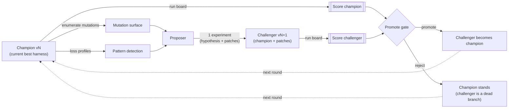
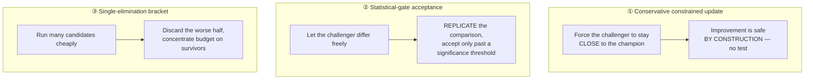
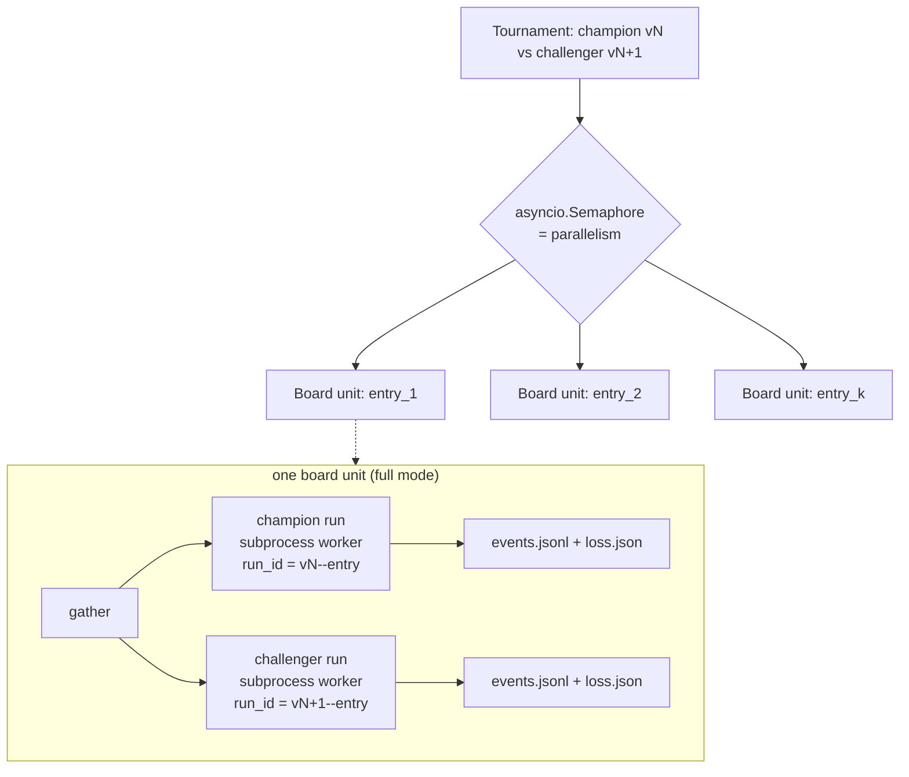
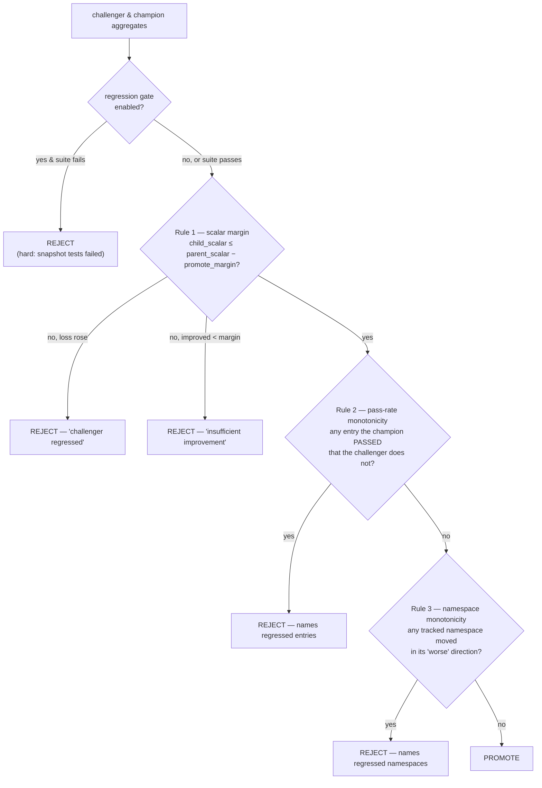
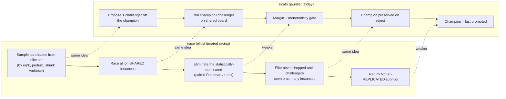
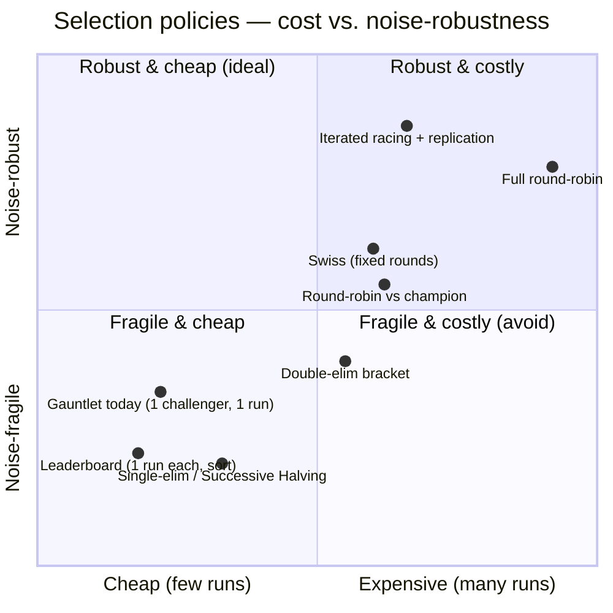
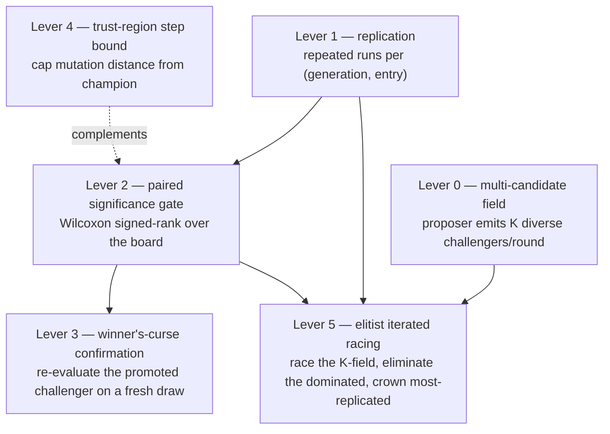
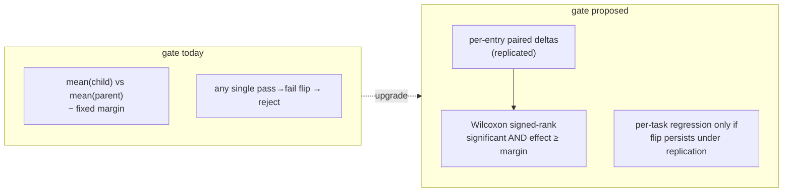
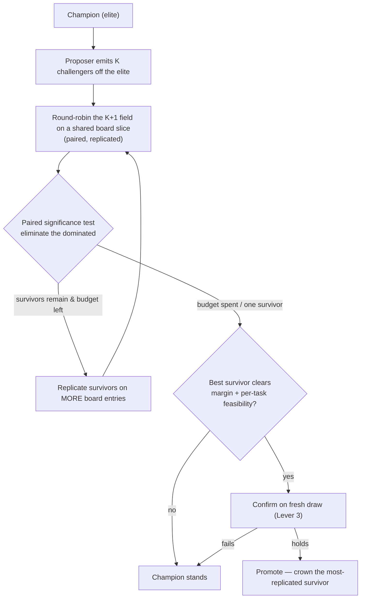

# Candidate selection — the tournament, and the theory under it

> **Status.** This document describes the *shipped* selection mechanism
> (the king-of-the-hill gauntlet and the three-rule promote gate) and
> the *design direction* for evolving it (replication-based iterated
> racing). The "Today" sections are reconciled against the code in
> `src/zicato/tournament/` and `src/zicato/orchestrator.py`; the
> "Proposed" sections are not yet implemented and are clearly marked.

This is the most consequential part of zicato. Everything else —
mutation enumeration, the proposer, telemetry, the dashboard — exists
to feed one decision, made over and over: **does this challenger
deserve to replace the reigning champion?** Get that decision right and
the loop climbs; get it wrong and the loop either stalls (too timid) or
walks off a cliff (too credulous, promoting noise). This document
explains what that decision *is*, how the wider machine-learning world
makes the same decision, why zicato makes it the way it does, and where
it should go.

Read [`TOURNAMENT.md`](TOURNAMENT.md) for the operational view (the CLI,
the dashboard bracket, the per-matchup analytics) and
[`SCORING.md`](SCORING.md) for how a run becomes the scalar this
document treats as a black-box loss. This doc is the *why* and the
*decision theory*; those two are the *what* and the *arithmetic*.

---

## 1. What problem is selection actually solving?

zicato is a meta-loop. The inner harness — a multi-agent system you
already have — is the thing under optimization. zicato runs it over a
**board** of tasks, reduces the runtime telemetry to a scalar **loss**
(lower is better), proposes a small structured edit to the harness, and
keeps the edit only if it helps. A kept edit is a new **generation**;
generations chain into a lineage; the lineage lives inside an **epoch**
whose evaluation contract (board + proposer brief + scoring) is frozen.



The selection problem is the diamond in that diagram — the gate, plus
the question of *how many challengers we consider and how we compare
them*. Four properties make it unusual, and every design choice below
is a response to one of them:

1. **Candidates are generated, not given.** There is no fixed roster of
   contestants. Each challenger is *synthesized conditioned on the
   current champion* (patches applied to the champion's source tree). A
   classic tournament bracket assumes N independent entrants exist up
   front; zicato has a generator that emits them on demand, one (today)
   per round.
2. **Evaluation is expensive and noisy.** A "match" is running the
   whole board through a multi-agent system — many LLM calls, tool
   invocations, wall-clock minutes. And it is *stochastic*: the same
   harness on the same task can drift differently run to run (sampling
   temperature, tool nondeterminism, a judge that wobbles). Two runs of
   the *same* generation do not produce the same loss.
3. **The score is absolute and cardinal, not merely a match outcome.**
   A generation run over the board yields a real-valued scalar. We do
   not only learn "A beat B"; we learn *how much* and *on which tasks*.
   This is a luxury most tournament theory does not assume — and, as
   §3 shows, it changes which mechanisms are appropriate.
4. **There is a hard, per-task, non-regression constraint.** A
   challenger that improves the aggregate loss but *breaks a task the
   champion passed* must be rejected. Selection is not "maximize a
   scalar"; it is "maximize a scalar **subject to** a monotonicity
   constraint." Most scalar-optimizers in the literature have no analog
   of this — it is zicato's defining guarantee.

Stated in the language of decision theory, this is **best-arm
identification under expensive, noisy evaluation, with a generative arm
source and a feasibility constraint** (Audibert & Bubeck 2010 is the
canonical treatment of best-arm identification, and of why the objective
here is *simple regret* — the quality of the one arm you finally pick —
not the cumulative regret of a bandit that must earn reward while it
learns). Hold that phrase; the whole literature organizes around it.

---

## 2. Three families of "should the challenger win?"

A deep survey of how machine learning makes this exact decision —
across reinforcement learning, hyperparameter and model selection,
evolutionary computation, and AutoML/NAS — collapses into **three
structurally distinct mechanisms.** They differ in *where* they put the
defense against promoting noise. Understanding the three is the key
intuition for everything after.



### Family ① — Conservative constrained update (trust regions)

**Intuition.** Don't ask "did the challenger win?" Instead, *only ever
produce challengers that can't lose by much.* If each step is small
enough, an improvement to a tractable lower bound on performance is a
real improvement, so you can take the step without an accept/reject
test at all. The incumbent is protected because the challenger is, by
construction, never far from it.

**Who does this.** TRPO (Schulman et al. 2015) maximizes a surrogate
objective under a hard constraint that the new policy stay within a
KL-divergence "trust region" of the old one; its Theorem 1 gives a
monotonic-improvement lower bound
`η(π_new) ≥ L(π_new) − C·D_TV(π_old, π_new)²`. PPO replaces the hard
constraint with a clipped objective — a cruder but cheaper way to keep
the step small. Off-policy variants (Iwaki & Asada 2017;
Meng et al. 2022) adopt a new policy only when a performance-difference
lower bound is positive, which again requires small KL.

**Noise handling / incumbent protection.** Indirect: by never moving
far, the *variance* of the improvement estimate stays small enough to
trust. But the guarantee is **global and in-expectation** — it bounds
expected return, *not* per-task behavior — and the strict version holds
only for the idealized penalty algorithm; practical TRPO "tends to" be
monotone, and PPO has no formal guarantee at all.

**Verdict for zicato.** This is a *complementary* idea, not a
replacement for the gate. zicato gates only on *outcome*; trust regions
suggest also bounding the *step* — capping how much one experiment may
change (patch size, number of mutation points, distance from the
champion). Smaller steps → tighter comparison variance → fewer
catastrophic regressions. But because trust regions cannot enforce
per-task non-regression, they can only sit *underneath* zicato's
predicate gate, never instead of it. (See §7, lever 4.)

### Family ② — Statistical-gate acceptance (replicate, then test)

**Intuition.** Let the challenger differ as much as it likes. Before
crowning it, *play enough matches that luck washes out*, and require it
to win by a margin large enough that the win is unlikely to be noise.

**Who does this.** This is the workhorse family:

- **AlphaGo Zero** (Silver et al. 2017) promotes a new network only if
  it beats the current best in **>55% of 400 evaluation games** — the
  margin "to avoid selecting on noise alone," the 400-game replication
  to shrink the estimate's variance. (Tellingly, AlphaZero-2018 later
  *dropped* the gate once training was stable enough — gating is a tool,
  not a commandment.)
- **Population-Based Training** (Jaderberg et al. 2017) offers a "T-test
  selection" variant: copy a competitor's weights only if it is
  *significantly* better by a Welch's t-test over recent rewards.
- **Racing algorithms** — Hoeffding races (Maron & Moore 1993), F-Race
  and **irace** (López-Ibáñez et al. 2016) — evaluate candidates on
  shared problem instances and **eliminate a candidate only when a
  confidence bound or a paired statistical test says it is significantly
  worse.** Confidence intervals shrink as more instances accumulate;
  the survivors keep racing.

**Noise handling / incumbent protection.** Directly, via **replication +
significance.** The more samples, the tighter the estimate, the safer
the decision. Crucially, the comparison is *paired*: the same games /
the same instances are used for both sides, so shared difficulty cancels
(common random numbers — the single biggest variance-reduction lever
available).

**Verdict for zicato.** This is zicato's family. The promote gate is an
AlphaGo-Zero-style margin test. The gap is that zicato does **not yet
replicate** — it runs the board once. §3 and §5 make this precise.

### Family ③ — Single-elimination bracket (triage by resource)

**Intuition.** When you have *many* cheap-to-probe candidates and a
fixed budget, don't replicate — *triage*. Give everyone a little
budget, throw out the worst fraction, give the survivors more, repeat.
Resources concentrate exponentially on what looks promising.

**Who does this.** Successive Halving, **Hyperband** (Li et al. 2017),
and the asynchronous **ASHA** (Li et al. 2020) are the canonical
schedulers. They are how AutoML/NAS rank hundreds of hyperparameter or
architecture candidates under a wall-clock budget.

**Noise handling / incumbent protection.** This is the family's
weakness. Brackets defend against waste, not against noise: a candidate
eliminated in an early rung is gone, even if it lost to variance.
Hyperband's own analysis is explicit — the resource needed to
distinguish two candidates grows as their scores get *closer* or their
evaluation gets *noisier*, and in that regime you should **use fewer
candidates with more budget each** (i.e., replicate), not halve
aggressively. Brackets are noise-fragile precisely at the decision
boundary that matters.

**Verdict for zicato.** *Wrong primitive.* Brackets shine for cheap
triage of a large field; zicato has a *small* field of *expensive*,
*noisy* candidates where a false promotion is costly (it corrupts the
champion the next round builds on). The verified guidance is blunt:
"brackets are the wrong primitive when each candidate yields a noisy
absolute scalar and the cost of a false promotion is high." This is the
direct evidence against the single-elimination and double-elimination
structures considered earlier (§6).

### A note on elitism — the same idea under a fourth name

Evolutionary computation arrives at incumbent protection from its own
direction, and the vocabulary is worth knowing because it is exactly
zicato's situation. **Elitist** selection — the `(μ+λ)` scheme, where
the next generation is chosen from parents *and* offspring so the best
individual can never be lost — protects the incumbent by *never letting
a worse candidate displace a better one*, in contrast to the
non-elitist `(μ,λ)` scheme that discards all parents each generation
(Beyer & Schwefel 2002, the comprehensive ES introduction). CMA-ES
(Hansen & Ostermeier 2001), the de-facto standard continuous optimizer,
is built on this selection-and-recombination spine. The connection that
matters: irace's "elite is never eliminated until challengers are
evaluated on at least as many instances" (§4) is *elitism plus
replication* — the evolutionary incumbent-protection idea, made
noise-aware by demanding the challenger earn its place over an equal
sample. zicato's "champion stands on reject" is plain `(μ+λ)` elitism;
the upgrade in §7 is to make it elitism-with-replication.

---

## 3. Where zicato sits today: the king-of-the-hill gauntlet

The shipped mechanism is a **king-of-the-hill gauntlet** — a degenerate,
single-replicate instance of Family ②. There is one reigning champion
per epoch (the generation named by the per-epoch `current_generation`
marker). Each round mounts exactly one challenger against it.

```mermaid
sequenceDiagram
    autonumber
    participant O as Orchestrator
    participant Pr as Proposer
    participant R as Tournament runner
    participant G as Promote gate
    Note over O: champion = current_generation marker
    O->>O: enumerate mutation points on champion snapshot
    O->>O: detect patterns over champion's loss profiles
    O->>Pr: propose(brief, patterns)
    Pr-->>O: 1 Experiment (hypothesis + patch set)
    O->>O: apply patches → challenger snapshot vN+1
    O->>R: run_tournament(champion vN, challenger vN+1)
    R->>R: run every board entry under BOTH gens (paired)
    R-->>O: champion aggregate, challenger aggregate
    O->>G: evaluate_gate(parent_agg, child_agg, weights)
    G-->>O: promoted | rejected (+ reason, deltas)
    alt promoted
        O->>O: challenger becomes champion (advance marker)
    else rejected
        O->>O: champion stands; challenger recorded as dead branch
    end
    Note over O: loop, until rounds exhausted or<br/>max-consecutive-rejections hit
```

### 3.1 How a single tournament actually runs

The runner's unit of scheduling is the **board unit** — one per board
entry. This is the key to how compute is spent:



- **Full mode** (`--mode full`): each board unit runs the champion *and*
  the challenger on the same entry, **simultaneously**, under one
  `asyncio.gather`. Both sides see the *same task* — that is the paired
  comparison (common random numbers) that cancels per-entry difficulty.
  Each run is a fully isolated subprocess worker pointed at its own
  ephemeral snapshot copy, writing `events.jsonl` + `loss.json` keyed on
  `run_id = {generation_id}--{entry_id}`.
- **Fast mode** (`--mode fast`, the `evolve` default): the board unit
  runs **only the challenger**; the champion's cached aggregate
  (`gen_score.json`) is reused. This halves the compute per round but
  *re-uses* a champion score from an earlier draw — a subtle break in
  the pairing that matters under noise (see §5).

Board units run concurrently — the "tournament hall," many boards in
flight at once — bounded by a single semaphore sized from
`RuntimeConfig.parallelism`. Each generation's per-entry losses are then
aggregated (an *unweighted* mean across the board in v0) into the
generation's scalar and pass-rate.

### 3.2 The promote gate — three rules, in order

`evaluate_gate` is the decision. The scalar is a **loss** (lower
better); the champion is the parent, the challenger is the child.



1. **Scalar margin.** The challenger's loss must beat the champion's by
   at least `promote_margin` (default `0.01`):
   `child_scalar ≤ parent_scalar − promote_margin`. A challenger that
   improved but by *less* than the margin is rejected as "insufficient
   improvement"; one whose loss *rose* is rejected as "challenger
   regressed." This is the AlphaGo-Zero margin — a deliberate
   noise-threshold so a microscopic, possibly-spurious gain does not
   change the crown.
2. **Pass-rate monotonicity** (`pass_rate_monotonicity=True` by
   default). For *every* board entry the champion passed
   (`pass_fail=True`), the challenger must also pass. Any such regression
   rejects the challenger outright, *regardless of how much the scalar
   improved*. This is the hard per-task feasibility constraint from §1.4
   — the half of the gate the RL trust-region methods cannot express.
3. **Per-namespace monotonicity.** For each metric namespace flagged in
   `namespace_monotonicity`, the challenger's per-namespace aggregate may
   not move in that namespace's "worse" direction (the sign of its
   coefficient in `namespace_weights` defines which way is worse). Lets
   an operator say "never let *latency* regress even if the blended
   scalar improves."

An optional **regression gate** (`regression_gate_enabled`) runs the
snapshot's own test suite *before* scoring; a failing suite is a hard
reject. It is the coarsest, cheapest non-regression guard — "did we
break the build" — sitting in front of the statistical rules.

### 3.3 The loop's stopping behavior

`evolve` runs `--rounds` rounds. `--max-consecutive-rejections` (default
3) halts early when the champion fends off that many challengers in a
row — the operator's signal that the proposer has run dry against the
current contract. Loop-health diagnostics (see
[`LOOP-HEALTH.md`](LOOP-HEALTH.md)) independently flag a *degenerate*
loop (one whose scoring can no longer distinguish anyone) and stop on
sustained criticality by default.

---

## 4. The reframe: this is a degenerate elitist iterated race

Lay the gauntlet beside **irace** (elitist iterated racing, the mature
algorithm for exactly zicato's problem) and the correspondence is
near-total:



irace even *generates* candidates the way zicato does: it samples a
parent from the elite set (higher-ranked elites more likely), perturbs
each parameter around that elite, and shrinks the perturbation variance
over time. zicato's "propose a patch off the champion" is the same
move in a different representation. **zicato is one batch and one
significance test away from being elitist irace over agent harnesses.**

The two places zicato is *weaker* than irace are exactly the two gaps
the research flagged:

- **No replication.** irace's confidence in a survivor comes from
  evaluating it on *more and more* instances; zicato evaluates each
  generation on the board *once*. The fixed `promote_margin` is a
  stand-in for a confidence interval it never actually measures.
- **No most-replicated guarantee / no winner's-curse defense.** irace
  returns the candidate evaluated on the most instances (the
  most-precisely-estimated one); zicato promotes on a single draw, so
  the promoted challenger's loss is an *optimistically biased* estimate
  — it was selected *because* it looked good, and the act of optimizing
  over noisy estimates systematically overshoots. This is the
  **optimizer's curse** (Smith & Winkler 2006): even with *unbiased*
  per-candidate estimates, the *selected* candidate's estimate is
  biased high in expectation, so the realized loss disappoints. Their
  prescribed remedy — Bayesian "disciplined skepticism," i.e. shrinking
  the winner's estimate back toward the prior before acting — is exactly
  the motivation for the confirmation re-run in §7, lever 3.

---

## 5. The selection options as a spectrum

Every option is a point on a **compute-vs-confidence** curve, given a
*field* of candidates. (Producing a field of more than one challenger
per round is the prerequisite unlock — see §7, lever 0.)



- **Leaderboard** (run each candidate once, sort by scalar). Cheapest;
  uses the absolute score directly. But one noisy run per candidate =
  noisy ranking. Fine for a first cut, unsafe as the sole gate.
- **Single-elimination / Successive Halving.** Cheap triage; *the wrong
  primitive here* (§2 Family ③) — noise-fragile at the boundary, and a
  good candidate can die to one unlucky pairing.
- **Double-elimination.** Buys a "second life" for a variance victim —
  but the research is consistent that **replication dominates bracket
  position** for noise robustness. The compute a losers' bracket spends
  is better spent re-running before eliminating. *Not recommended.*
- **Round-robin vs champion / Swiss.** The right *instinct* (rank a
  whole field, no single-loss death) but the mature, cited form is
  **racing**, which is Swiss made adaptive: spend more comparisons only
  where the ranking is still statistically uncertain.
- **Iterated racing + replication.** The convergent recommendation:
  generate off the elite, race on shared board entries, eliminate by
  paired significance test, keep replicating survivors, crown the
  most-replicated candidate that also clears the feasibility gate.

The throughline: because zicato has an **absolute** score and an
**expensive, noisy** evaluation, the lever that matters is **how many
times you re-evaluate**, not **what bracket shape** you arrange matches
in. Brackets are machinery for extracting a ranking from cheap pairwise
games; zicato's scarce resource is samples, so it should spend them on
replication.

---

## 6. Why not double-elimination or Swiss (the explicit verdict)

These were considered directly. The evidence-backed answer:

| Structure | What it buys | Why it's wrong for zicato |
|---|---|---|
| **Single-elimination** | Cheap triage of a large field | Noise-fragile at the boundary; a strong candidate dies to one unlucky run. Designed for *many cheap* candidates, not *few expensive noisy* ones. |
| **Double-elimination** | A second chance for a variance victim | Its only benefit — robustness to a single bad match — is delivered more directly and cheaply by **replication**. Same compute, more confidence, no bracket bookkeeping, no "freeze the field" constraint. |
| **Swiss** | Full ranking without elimination fragility | Right goal, superseded form. **Iterated racing** is Swiss with statistical elimination and adaptive replication — strictly more sample-efficient for the same confidence. |

Adopt **racing + replication**; do not build brackets.

---

## 7. The recommended design

A phased path from today's gauntlet to elitist iterated racing. Each
lever is independently shippable and independently valuable; they are
ordered by leverage-per-effort.



**Lever 0 — a multi-candidate field.** Have the proposer emit *K*
diverse experiments per round (different mutation targets / hypotheses
off the same champion). Without a field there is no race; with one,
every richer policy becomes possible. Independently valuable: it widens
exploration.

**Lever 1 — replication (highest leverage).** Run each (generation,
entry) more than once and aggregate (mean, or better, keep the samples).
This is the single change the entire literature points at: under noisy
absolute evaluation, *more samples per candidate* — not bracket shape —
is what makes a winner trustworthy. It also fixes the most dangerous bug
in the current gate (next lever).

**Lever 2 — a paired significance gate.** Today Rule 1 compares two
scalars against a fixed margin, and Rule 2 rejects on a *single* per-task
pass→fail flip. Both are noise-fragile: a genuinely-better challenger
can be rejected because one previously-passing entry got unlucky on its
single run. Replace the point comparison with a **paired Wilcoxon
signed-rank test** across the board's per-entry deltas (the board is
already a paired sample — champion and challenger see the same entries),
and require a per-task regression to be *statistically real* (a repeated
flip under replication), not a one-run accident. This is a bounded change
to `gate.py` and `scoring.py`. *Keep `promote_margin` as the effect-size
floor on top of the significance test — significance without a margin
promotes trivial wins.*



**Lever 3 — winner's-curse confirmation.** The promoted challenger's
loss is upward-biased: it was chosen *for* looking good (the optimizer's
curse, Smith & Winkler 2006). Before committing the crown,
**re-evaluate it on a fresh board draw** (or a held-out board slice
never used for proposal/selection — the epoch is a natural home for such
a confirmation set). Promote only if it holds up. A fresh-draw estimate
is unconditioned on the selection, so it is the cheap, model-free
version of the paper's Bayesian de-biasing. This is the debiasing step
zicato wholly lacks today.

**Lever 4 — a trust-region step bound (complementary).** Borrow Family
①: cap how far one experiment may move the champion (patch size,
mutation-point count). Smaller, safer steps tighten the comparison
variance and reduce catastrophic regressions. The proposer brief's
mutation budget is the natural home. It does *not* replace the gate (it
cannot enforce per-task feasibility), it makes the gate's job easier.

**Lever 5 — elitist iterated racing (the synthesis).** With levers 0–2
in place, the whole loop becomes irace over harnesses:



One inherited subtlety: irace **deliberately omits** multiple-comparison
correction in its *elimination* test (correction makes racing too timid
to ever discard). zicato should do the same in the race — but **do**
apply the winner's-curse defense (Lever 3) at *final promotion*. Two
different places, two opposite statistical stances: be liberal about
*eliminating*, conservative about *crowning*.

---

## 8. Open questions

1. **Per-task noise vs. true regression.** How many replications are
   enough to tell a real per-task regression from a chance pass→fail
   flip, without blowing the wall-clock budget? Is the right rule a
   per-entry sequential test (race each previously-passing entry until
   the flip is confirmed or refuted)?
2. **The winner's-curse magnitude.** How large is the optimizer's-curse
   inflation (Smith & Winkler 2006) given a board of this size and K
   challengers per round? Is a fresh-draw confirmation enough, or is an
   explicit Bayesian-shrinkage estimator on the selected candidate worth
   the complexity?
3. **Exploration vs. elitism.** Elitist racing converges fast but can
   converge *prematurely*; the literature has non-elitist variants that
   explore better. How much exploration pressure does the proposer need,
   and should rejected-but-promising challengers be carried across rounds
   as additional elites?
4. **Common random numbers under internal stochasticity.** The board
   gives champion and challenger the same *tasks*, but each run has its
   own internal randomness (LLM sampling, tool nondeterminism). What is
   the analogue of a shared seed — fixing decode seeds per entry so the
   paired comparison cancels even *intra-run* noise?

---

## 9. References

Primary sources, grouped by the family they anchor. Every claim that
attaches a name+year in the body resolves to an entry here. Sources tied
to the verified research findings (TRPO, AlphaGo Zero, AlphaStar, PBT,
Hyperband, Hoeffding races, irace, Demšar, the off-policy bound) were
adversarially fact-checked against the original papers; the additional
canonical references (ASHA, CMA-ES, the ES introduction, best-arm
identification, the optimizer's curse) were added to anchor claims the
body makes by inference.

**Reinforcement-learning policy improvement & gating**

- Schulman, Levine, Abbeel, Jordan & Moritz 2015, *Trust Region Policy Optimization*, ICML — the monotonic-improvement lower bound and the trust-region constrained update. <https://arxiv.org/pdf/1502.05477>
- Iwaki & Asada 2017, *Implicit Incremental Natural Actor Critic* — off-policy monotonic improvement via a positive performance-difference lower bound. <https://arxiv.org/pdf/1710.03442>
- Meng et al. 2022, IEEE Transactions on Neural Networks and Learning Systems (IEEE Xplore doc 9334437) — an off-policy TRPO surrogate objective that uses both on- and off-policy data while preserving monotonic policy improvement. <https://ieeexplore.ieee.org/document/9334437/>
- Silver et al. 2017, *Mastering the Game of Go without Human Knowledge* (AlphaGo Zero), Nature 550 — the >55%-over-400-games gating evaluator, the margin chosen "to avoid selecting on noise alone." <https://discovery.ucl.ac.uk/10045895/1/agz_unformatted_nature.pdf>
- Vinyals et al. 2019, *Grandmaster level in StarCraft II using multi-agent reinforcement learning* (the AlphaStar league; main vs. exploiter agents), Nature 575. <https://www.nature.com/articles/s41586-019-1724-z>
- Jaderberg et al. 2017, *Population Based Training of Neural Networks* — truncation selection (ranking) vs. T-test selection (statistical gate). <https://arxiv.org/pdf/1711.09846>

**Hyperparameter / model selection & racing**

- Li, Jamieson, DeSalvo, Rostamizadeh & Talwalkar 2017, *Hyperband: A Novel Bandit-Based Approach to Hyperparameter Optimization*, JMLR 18 — Successive Halving brackets and the formal noise-vs-bracket tradeoff. <https://www.jmlr.org/papers/volume18/16-558/16-558.pdf>
- Li, Jamieson, Rostamizadeh, Gonina, Ben-Tzur, Hardt, Recht & Talwalkar 2020, *A System for Massively Parallel Hyperparameter Tuning* (ASHA), MLSys. <https://arxiv.org/abs/1810.05934>
- Maron & Moore 1993, *Hoeffding Races: Accelerating Model Selection Search for Classification and Function Approximation*, NeurIPS — confidence-bound elimination. <https://proceedings.neurips.cc/paper/1993/file/02a32ad2669e6fe298e607fe7cc0e1a0-Paper.pdf>
- López-Ibáñez, Dubois-Lacoste, Pérez Cáceres, Birattari & Stützle 2016, *The irace package: Iterated racing for automatic algorithm configuration*, Operations Research Perspectives 3 — elitist iterated racing, EDA candidate generation, replication-based incumbent protection. <https://www.sciencedirect.com/science/article/pii/S2214716015300270>
- Demšar 2006, *Statistical Comparisons of Classifiers over Multiple Data Sets*, JMLR 7 — the Wilcoxon signed-rank test (two systems) and Friedman + Nemenyi (many) across a task set. <https://www.jmlr.org/papers/volume7/demsar06a/demsar06a.pdf>

**Evolutionary computation (elitism & noisy fitness)**

- Beyer & Schwefel 2002, *Evolution strategies — A comprehensive introduction*, Natural Computing 1(1):3–52 — `(μ+λ)` elitist vs `(μ,λ)` non-elitist selection. <https://link.springer.com/article/10.1023/A:1015059928466>
- Hansen & Ostermeier 2001, *Completely Derandomized Self-Adaptation in Evolution Strategies* (CMA-ES), Evolutionary Computation 9(2):159–195. <https://direct.mit.edu/evco/article/9/2/159/892>

**Statistics of selection under noise**

- Audibert & Bubeck 2010, *Best Arm Identification in Multi-Armed Bandits*, COLT — best-arm identification and the simple-regret objective (successive rejects). <https://inria.hal.science/hal-00654404>
- Smith & Winkler 2006, *The Optimizer's Curse: Skepticism and Postdecision Surprise in Decision Analysis*, Management Science 52(3):311–322 — selecting over noisy estimates systematically overshoots; Bayesian skepticism as the correction. <https://ideas.repec.org/a/inm/ormnsc/v52y2006i3p311-322.html>

*See also* [`TOURNAMENT.md`](TOURNAMENT.md), [`SCORING.md`](SCORING.md),
[`LOOP-HEALTH.md`](LOOP-HEALTH.md), [`VOCABULARY.md`](VOCABULARY.md).
