# Candidate selection — the tournament, and the theory under it

> **Status.** This document describes the *shipped* selection mechanism
> (the king-of-the-hill gauntlet and the three-rule promote gate) and
> the *design direction* for evolving it (replication-based iterated
> racing). The "Today" sections are reconciled against the code in
> `src/zicato/tournament/` and `src/zicato/orchestrator.py`; the
> "Proposed" sections are unbuilt and are marked as such.
>
> One recommendation in this document has since been adopted: replication
> is a per-structure contract default. The gauntlet, Swiss and both
> elimination structures default `tournament.params["replicates"]` to 2,
> and racing pins it to 1 because escalating board slices replicate
> intrinsically (`src/zicato/selection/strategies/` and
> `src/zicato/selection/experimental/`). Passages below that
> reason from a single unreplicated duel describe the cheapest
> configuration, which an operator can still pin, rather than the
> default.

Selection is the most consequential part of zicato. Everything else —
mutation enumeration, the proposer, telemetry, the dashboard — exists
to feed one decision, made over and over: **whether a challenger
deserves to replace the reigning champion.** A rule that is too timid
stalls the loop. A rule that is too credulous promotes noise, and the
corrupted champion is what every later round builds on. This document
states what that decision is, how the wider machine-learning world makes
the same decision, why zicato makes it the way it does, and where it
should go.

Read [`TOURNAMENT.md`](TOURNAMENT.md) for the operational view (the CLI,
the dashboard bracket, the per-matchup analytics) and
[`SCORING.md`](SCORING.md) for how a run becomes the scalar this
document treats as a black-box loss. Those two documents give the
mechanics and the arithmetic; this one gives the decision theory behind
them.

---

## 1. The problem selection solves

zicato is a meta-loop. The system under test — a system you already have,
typically but not necessarily a multi-agent one — is the thing under
optimization. zicato runs it over a
**board** of tasks, reduces the runtime telemetry to a scalar **loss**
(lower is better), proposes a small structured edit to the harness, and
keeps the edit only if it helps. A kept edit is a new **generation**;
generations chain into a lineage; the lineage lives inside an **epoch**
whose evaluation contract (board + proposer brief + scoring) is frozen.

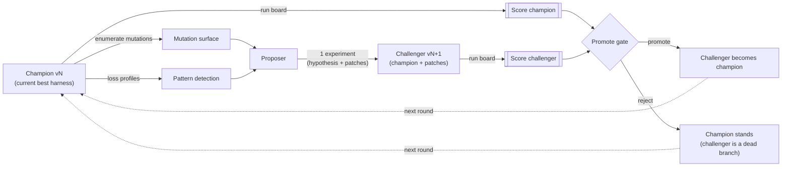

The selection problem is the diamond in that diagram — the gate, plus
the question of *how many challengers we consider and how we compare
them*. Four properties make it unusual, and every design choice below
is a response to one of them:

1. **Candidates are generated rather than given.** There is no fixed roster of
   contestants. Each challenger is *synthesized conditioned on the
   current champion* (patches applied to the champion's source tree). A
   classic tournament bracket assumes N independent entrants exist up
   front; zicato has a generator that emits them on demand, one (today)
   per round.

   > **Orthogonal to this document: what the generator *knows*.** The
   > proposer that synthesizes each challenger can be fed a digest of
   > **prior experiment outcomes** (what was already tried this epoch and
   > how it fared) so it stops re-proposing known failures and builds on
   > known wins. This **experiment memory** changes candidate
   > *generation* rather than selection — it is shared identically by the
   > gauntlet, Swiss, racing, and elimination structures and does not
   > touch the gate. It is *not* intra-tournament adaptive generation
   > (proposing challenger k+1 from the realised results of 0..k within
   > one round — a separate, larger lever named and scoped out there).
   > See [EXPERIMENT-MEMORY.md](EXPERIMENT-MEMORY.md).
2. **Evaluation is expensive and noisy.** A "match" is running the
   whole board through a multi-agent system — many LLM calls, tool
   invocations, wall-clock minutes. And it is *stochastic*: the same
   harness on the same task can drift differently run to run (sampling
   temperature, tool nondeterminism, a judge that wobbles). Two runs of
   the *same* generation do not produce the same loss.
3. **The score is absolute and cardinal rather than merely a match outcome.**
   A generation run over the board yields a real-valued scalar. We do
   not only learn "A beat B"; we learn *how much* and *on which tasks*.
   This is a luxury most tournament theory does not assume — and, as
   §3 shows, it changes which mechanisms are appropriate.
4. **There is a hard, per-task, non-regression constraint.** A
   challenger that improves the aggregate loss but *breaks a task the
   champion passed* must be rejected. Selection is not "maximize a
   scalar"; it is "maximize a scalar **subject to** a monotonicity
   constraint." Most scalar-optimizers in the literature have no analog
   of this — it is zicato's defining guarantee.

Stated in the language of decision theory, this is **best-arm
identification under expensive, noisy evaluation, with a generative arm
source and a feasibility constraint**. Audibert & Bubeck 2010 give the
canonical treatment of best-arm identification. They also give the
reason the objective here is *simple regret* — the quality of the one
arm finally picked — rather than the cumulative regret of a bandit that
must earn reward while it learns. The whole literature organizes around
that description.

---

## 2. Three families of promotion decision

Machine learning makes the same decision in reinforcement learning, in
hyperparameter and model selection, in evolutionary computation, and in
automated machine learning and neural architecture search (AutoML and
NAS). Across those fields the mechanisms fall into **three structurally
distinct families**, differing in *where* they place the defense against
promoting noise.

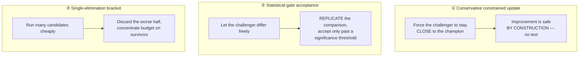

### Family ① — Conservative constrained update (trust regions)

**Intuition.** Do not test whether the challenger won. Instead, produce
only challengers that cannot lose by much. If each step is small enough,
an improvement to a tractable lower bound on performance is a real
improvement, so the step can be taken without an accept/reject test at
all. The incumbent is protected because the challenger is, by
construction, never far from it.

**Who does this.** TRPO (Schulman et al. 2015) maximizes a surrogate
objective under a hard constraint that the new policy stay within a
KL-divergence "trust region" of the old one; its Theorem 1 gives a
monotonic-improvement lower bound
`η(π_new) ≥ L(π_new) − C·D_TV(π_old, π_new)²`. PPO replaces the hard
constraint with a clipped objective — a cruder but cheaper way to keep
the step small. Off-policy variants (Iwaki & Asada 2017;
Meng et al. 2022) adopt a new policy only when a performance-difference
lower bound is positive, which again requires small KL.

**Noise handling / incumbent protection.** Indirect: by never moving
far, the *variance* of the improvement estimate stays small enough to
trust. But the guarantee is **global and in-expectation**: it bounds
expected return rather than per-task behavior. The strict version holds
only for the idealized penalty algorithm; practical TRPO "tends to" be
monotone, and PPO has no formal guarantee at all.

**Verdict for zicato.** This is a *complementary* idea rather than a
replacement for the gate. zicato gates only on *outcome*; trust regions
suggest also bounding the *step* — capping how much one experiment may
change (patch size, number of mutation points, distance from the
champion). Smaller steps → tighter comparison variance → fewer
catastrophic regressions. But because trust regions cannot enforce
per-task non-regression, they can only sit *underneath* zicato's
predicate gate, never instead of it. (See the trust-region step bound in
§9.)

### Family ② — Statistical-gate acceptance (replicate, then test)

**Intuition.** Let the challenger differ as much as it likes. Before
crowning it, *play enough matches that luck washes out*, and require it
to win by a margin large enough that the win is unlikely to be noise.

**Who does this.** Most of the literature sits here:

- **AlphaGo Zero** (Silver et al. 2017) promotes a new network only if
  it beats the current best in **>55% of 400 evaluation games** — the
  margin "to avoid selecting on noise alone," the 400-game replication
  to shrink the estimate's variance. AlphaZero in 2018 dropped the gate
  once training was stable enough, so gating is a response to a noise
  regime rather than a fixed requirement.
- **Population-Based Training** (Jaderberg et al. 2017) offers a "T-test
  selection" variant: copy a competitor's weights only if it is
  *significantly* better by a Welch's t-test over recent rewards.
- **Racing algorithms** — Hoeffding races (Maron & Moore 1993), F-Race
  and **irace** (López-Ibáñez et al. 2016) — evaluate candidates on
  shared problem instances and **eliminate a candidate only when a
  confidence bound or a paired statistical test says it is significantly
  worse.** Confidence intervals shrink as more instances accumulate;
  the survivors keep racing.

**Noise handling / incumbent protection.** Directly, via **replication +
significance.** The more samples, the tighter the estimate, the safer
the decision. Crucially, the comparison is *paired*: the same games /
the same instances are used for both sides, so shared difficulty cancels
(common random numbers — the single biggest variance-reduction lever
available).

**Verdict for zicato.** This is zicato's family. The promote gate is an
AlphaGo-Zero-style margin test. Replication is the second half of the
family, and it is a contract knob whose default is 2 per duel for every
structure except racing. §3 and §7 make the argument precise.

### Family ③ — Single-elimination bracket (triage by resource)

**Intuition.** When many candidates are cheap to probe and the budget is
fixed, triage instead of replicating. Give every candidate a little
budget, discard the worst fraction, give the survivors more, and repeat.
Resources concentrate exponentially on what looks promising.

**Who does this.** Successive Halving, **Hyperband** (Li et al. 2017),
and the asynchronous **ASHA** (Li et al. 2020) are the canonical
schedulers. They are how AutoML/NAS rank hundreds of hyperparameter or
architecture candidates under a wall-clock budget.

**Noise handling / incumbent protection.** This is the family's
weakness. Brackets defend against waste rather than against noise: a candidate
eliminated in an early rung is gone, even if it lost to variance.
Hyperband's own analysis is explicit — the resource needed to
distinguish two candidates grows as their scores get *closer* or their
evaluation gets *noisier*, and in that regime the right response is
**fewer candidates with more budget each** (that is, replication) rather
than aggressive halving. Brackets are noise-fragile at the decision
boundary that matters.

**Verdict for zicato.** Brackets are unnecessary at zicato's field size.
A bracket earns its bookkeeping by triaging a large field of cheap
candidates; zicato's field is two to four candidates measured by an
expensive, noisy evaluator, where a false promotion corrupts the champion
the next round builds on. At that size every candidate can meet the
champion directly, and noise is answered the same way for every
structure: by replication sized to the measured noise floor, the spread
of the champion evaluated against itself (§9, §10.2). The elimination
structures remain available as experimental options (§8).

### A note on elitism — the same idea under a fourth name

Evolutionary computation arrives at incumbent protection from its own
direction, and the vocabulary is worth knowing because it describes
zicato's situation. **Elitist** selection is the `(μ+λ)` scheme, where
the next generation is chosen from parents *and* offspring so the best
individual can never be lost. It protects the incumbent by *never
letting a worse candidate displace a better one*. The non-elitist
`(μ,λ)` scheme discards all parents each generation (Beyer & Schwefel
2002, the comprehensive introduction to evolution strategies). CMA-ES
(Hansen & Ostermeier 2001), the de-facto standard continuous optimizer,
is built on this selection-and-recombination spine. The connection that
matters: irace's "elite is never eliminated until challengers are
evaluated on at least as many instances" (§4) is *elitism plus
replication* — the evolutionary incumbent-protection idea, made
noise-aware by demanding the challenger earn its place over an equal
sample. zicato's "champion stands on reject" is plain `(μ+λ)` elitism;
the upgrade in §9 is to make it elitism-with-replication.

---

## 3. Where zicato sits today: the king-of-the-hill gauntlet

The shipped mechanism is a **king-of-the-hill gauntlet**, an instance of
the statistical-gate family (§2) that degenerates to a single duel per
round and, at `replicates = 1`, to a single unreplicated
measurement. There is one reigning champion
per epoch (the generation named by the per-epoch `current_generation`
marker). Each round mounts exactly one challenger against it.

```mermaid
sequenceDiagram
    autonumber
    participant O as Orchestrator
    participant Pr as Proposer
    participant R as Tournament runner
    participant G as Promote gate
    Note over O: champion = current_generation marker
    O->>O: enumerate mutation points on champion snapshot
    O->>O: detect patterns over champion's loss profiles
    O->>Pr: propose(brief, patterns)
    Pr-->>O: 1 Experiment (hypothesis + patch set)
    O->>O: apply patches → challenger snapshot vN+1
    O->>R: run_tournament(champion vN, challenger vN+1)
    R->>R: run every board entry under BOTH gens (paired)
    R-->>O: champion aggregate, challenger aggregate
    O->>G: evaluate_gate(parent_agg, child_agg, weights)
    G-->>O: promoted | rejected (+ reason, deltas)
    alt promoted
        O->>O: challenger becomes champion (advance marker)
    else rejected
        O->>O: champion stands; challenger recorded as dead branch
    end
    Note over O: loop, until rounds exhausted or<br/>max-consecutive-rejections hit
```

### 3.1 How a single tournament actually runs

The runner's unit of scheduling is the **board unit** — one per board
entry. This is the key to how compute is spent:

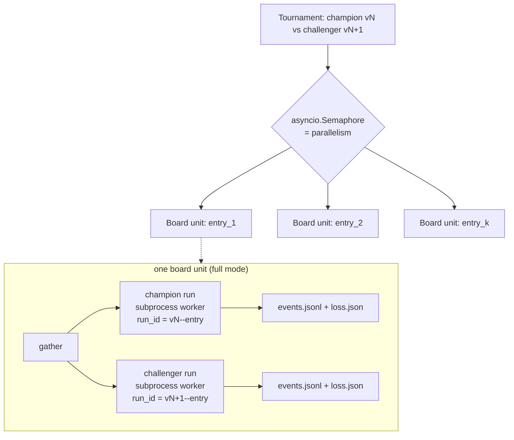

- **Full mode** (`--mode full`): each board unit runs the champion *and*
  the challenger on the same entry, **simultaneously**, under one
  `asyncio.gather`. Both sides see the *same task* — that is the paired
  comparison (common random numbers) that cancels per-entry difficulty.
  Each run is a fully isolated subprocess worker pointed at its own
  ephemeral snapshot copy, writing `events.jsonl` + `loss.json` keyed on
  `run_id = {generation_id}--{entry_id}`.
- **Fast mode** (`--mode fast`, the `evolve` default): the board unit
  runs **only the challenger**; the champion's cached aggregate
  (`gen_score.json`) is reused. This halves the compute per round but
  *re-uses* a champion score from an earlier draw — a subtle break in
  the pairing that matters under noise (see §7).

Board units run concurrently — the "tournament hall," many boards in
flight at once — bounded by a single semaphore sized from
`RuntimeConfig.parallelism`. Each generation's per-entry losses are then
aggregated (an *unweighted* mean across the board in v0) into the
generation's scalar and pass-rate.

### 3.2 The promote gate — three rules, in order

`evaluate_gate` is the decision. The scalar is a **loss** (lower
better); the champion is the parent, the challenger is the child.

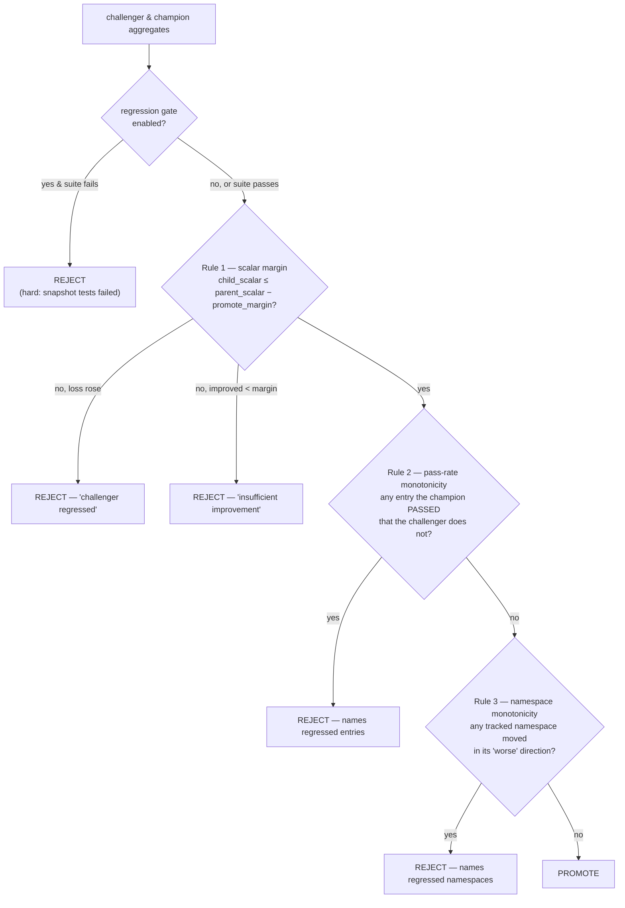

1. **Scalar margin.** The challenger's loss must beat the champion's by
   at least `promote_margin` (default `0.01`):
   `child_scalar ≤ parent_scalar − promote_margin`. A challenger that
   improved but by *less* than the margin is rejected as "insufficient
   improvement"; one whose loss *rose* is rejected as "challenger
   regressed." This is the AlphaGo-Zero margin: a noise threshold that
   keeps a microscopic, possibly spurious gain from changing the crown.
2. **Pass-rate monotonicity** (`pass_rate_monotonicity=True` by
   default). Its granularity is set by `pass_rate_monotonicity_scope`
   (`"per_entry"` default, or `"aggregate"`). Under `per_entry`, for
   *every* board entry the champion passed (`pass_fail=True`) the
   challenger must also pass. Any such regression rejects the challenger
   outright, *regardless of how much the scalar improved*. This is the
   hard per-task feasibility constraint from §1, property 4 — the half of the gate
   the reinforcement-learning trust-region methods cannot express. Under
   `aggregate`, only a drop in
   the challenger's *overall* pass-rate rejects, so a strictly-better
   challenger may reshuffle which entries pass — the right policy for
   sampled evaluation boards where individual pass/fail is noisy. See
   [`SCORING.md`](SCORING.md) §5 for the trade-off.
3. **Per-namespace monotonicity.** For each metric namespace flagged in
   `namespace_monotonicity`, the challenger's per-namespace aggregate may
   not move in that namespace's "worse" direction (the sign of its
   coefficient in `namespace_weights` defines which way is worse). Lets
   an operator say "never let *latency* regress even if the blended
   scalar improves."

An optional **regression gate** (`regression_gate_enabled`) runs the
snapshot's own test suite *before* scoring; a failing suite is a hard
reject. It is the coarsest, cheapest non-regression guard — "did we
break the build" — sitting in front of the statistical rules.

### 3.3 The loop's stopping behavior

`evolve` runs `--rounds` rounds. `--max-consecutive-rejections` (default
3) halts early when the champion fends off that many challengers in a
row — the operator's signal that the proposer has run dry against the
current contract. Loop-health diagnostics (see
[`LOOP-HEALTH.md`](LOOP-HEALTH.md)) independently flag a *degenerate*
loop (one whose scoring cannot distinguish anyone) and stop on
sustained criticality by default.

---

## 4. The reframe: this is a degenerate elitist iterated race

Lay the gauntlet beside **irace** (elitist iterated racing, the mature
algorithm for zicato's problem) and the correspondence is near-total:

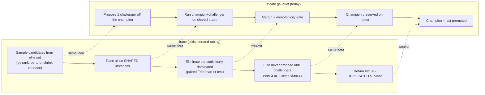

irace even *generates* candidates the way zicato does: it samples a
parent from the elite set (higher-ranked elites more likely), perturbs
each parameter around that elite, and shrinks the perturbation variance
over time. zicato's "propose a patch off the champion" is the same
move in a different representation. **zicato is one batch and one
significance test away from being elitist irace over agent harnesses.**

zicato is weaker than irace in two places:

- **No replication.** irace's confidence in a survivor comes from
  evaluating it on *more and more* instances; zicato evaluates each
  generation on the board *once*. The fixed `promote_margin` is a
  stand-in for a confidence interval it never actually measures.
- **No most-replicated guarantee / no winner's-curse defense.** irace
  returns the candidate evaluated on the most instances, which is the
  most precisely estimated one. zicato promotes on a single draw, so
  the promoted challenger's loss is an *optimistically biased* estimate:
  it was selected *because* it looked good, and optimizing over noisy
  estimates systematically overshoots. This is the
  **optimizer's curse** (Smith & Winkler 2006): even with *unbiased*
  per-candidate estimates, the *selected* candidate's estimate is
  biased high in expectation, so the realized loss disappoints. Their
  prescribed remedy — Bayesian "disciplined skepticism," i.e. shrinking
  the winner's estimate back toward the prior before acting — is the
  motivation for the winner's-curse confirmation re-run in §9.

---

## 5. Selection as an optimal-stopping problem

§4 framed the *crowning* decision as elitist racing. The loop makes a
second decision the gate never touches: **when to stop spawning
challengers at all.** Today that answer is crude (§3.3): a preset
`--rounds`, plus `--max-consecutive-rejections` (default 3) as an early
bail-out, plus the loop-health degeneracy stop. None of them reasons
about the value of continuing; each is a fixed threshold. Treated as an
**optimal stopping problem**, the question yields a stop rule that
weighs the expected gain of one more round against its cost.

### 5.1 The framing — a sequential stop-or-continue decision under cost

Each round against the current champion has a real, roughly constant
**cost** `c` (the wall-clock and compute of proposing one challenger and
running it over the board). Spending `c` buys one chance that the
challenger clears the gate and the champion improves by some gated
amount `Δ ≥ promote_margin`. Two forces oppose:

- **Continuing has value** while the proposer can still find gated
  improvements off this champion.
- **That value decays.** As the proposer exhausts the mutation
  surface and the contract (the board + proposer brief), the
  per-round probability of a gated win falls and the expected `Δ`
  shrinks — diminishing returns, the same exhaustion
  `--max-consecutive-rejections` is a blunt proxy for.

So the loop should continue *only while the expected gated improvement
of the next round exceeds its cost*, and retire the champion (end the
epoch / reset to a fresh contract) once it does not. That is the shape
of an optimal-stopping problem: at each step, observe the history, then
choose `stop` or `continue`, paying `c` for each continue, to maximise
expected net gain. Peskir & Shiryaev 2006 is the standard reference for
the continuous theory and its free-boundary stop-or-continue region.

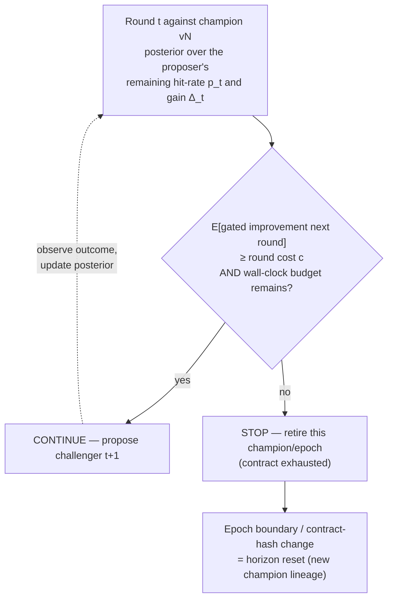

### 5.2 Why the textbook secretary problem fits poorly

The **secretary problem** is the obvious first reference, because zicato
also sees candidates one at a time and must decide on each. Its closed
form is the **odds algorithm** (Bruss 2000), which for the classical
no-information case recovers the `1/e ≈ 37%` look-then-leap rule:
observe a fixed fraction of the candidates, then take the next one that
beats every candidate seen so far.

The secretary assumptions do not hold for zicato, in three ways:

1. **Ordinal-only feedback.** Secretary knows only *relative* rank
   ("better than all seen so far"). zicato has **cardinal noisy
   scores** — it knows by *how much*, and on which tasks. Throwing that
   away to fit the secretary mould discards the loop's richest signal.
2. **No recall.** Secretary forbids returning to a passed-over
   candidate. zicato **always recalls the incumbent** — the champion is
   a persistent option, re-runnable at will (the very thing that makes
   §6's bandit framing apply).
3. **Known finite horizon, uniform random order.** Secretary fixes `N`
   up front and assumes candidates arrive in random order. zicato's
   horizon is *open* (that is the whole question), and challengers are
   **not** i.i.d. draws — they are *generated conditioned on the
   champion*, so their quality is correlated and drifts as the surface
   is mined.

The secretary result therefore supplies only an analogy. What carries
over is the qualitative lesson: commit to a stopping region rather than
running forever. The formula does not transfer.

### 5.3 The right tools: cardinal reward with a continuation cost

Once cardinal scores and recall are admitted, the problem becomes
**optimal stopping with a continuation cost** over a sequence of noisy
rewards, and two well-matched lenses apply:

- **Bayesian optimal stopping.** Maintain a posterior over the
  proposer's *current* productivity against this champion — concretely,
  a hit-rate `p_t` (probability the next challenger clears the gate) and
  a gain distribution for `Δ`. A natural model: a Beta posterior on
  `p_t` updated from the recent sequence of promote/reject outcomes
  (Bernoulli trials), times a posterior on the gated `Δ` when a win
  occurs. **Stop when the posterior expected improvement of one more
  round falls below the marginal cost of that round:**
  `E[p_t · Δ | history] < c`. This is the principled generalisation of
  `--max-consecutive-rejections`. A long run of rejections drives the
  Beta posterior's mass toward small `p_t`, which trips the same stop,
  but graded by how decisive those rejections were. It also stops when
  wins are real but too *small* to be worth `c`, a case the rejection
  counter cannot see.

- **The Gittins-index view.** Treat "keep mining this champion" as one
  arm and "retire and start a fresh epoch/contract" as the alternative.
  Gittins (1979) showed that for this *continue-vs-retire* family the
  optimal policy is an **index policy**: compute, per arm, the
  retirement value at which you are indifferent between continuing and
  stopping, and act on whichever index is highest. The champion's index
  *falls* as its productivity posterior decays; you retire it when the
  index drops below the value of a fresh start. This is the exact bridge
  to §6 — optimal stopping and bandits are two faces of the same
  sequential-decision coin, and the Gittins index is where they meet.

### 5.4 What this changes for zicato (refines §3.3)

This section *refines, and does not contradict,* §3.3. The shipped stop
rules stay as safe defaults; the proposal is to make them the crude
limits of a posterior rule:

- **Replace the fixed rejection counter with a posterior stop.** Keep
  `--max-consecutive-rejections` as a hard ceiling, but add an *earlier,
  smarter* stop: end the run when the Beta-Bernoulli posterior on the
  proposer's hit-rate puts the expected gated improvement below the
  round cost. This subsumes the counter (a run of `k` rejections is one
  observable that lowers the posterior) while also catching the
  "improving, but not worth the compute" regime.
- **Tie the stop to the epoch wall-clock budget.** The project already
  carries an autoresearch-style **per-epoch wall-clock budget** (see
  [`EPOCHS-AND-JOURNALING.md`](EPOCHS-AND-JOURNALING.md)). That budget is
  the `c`-denominated horizon: the stop rule should compare *expected
  gated improvement per round* against *remaining budget*, so the loop
  spends its last rounds only if they still pay for themselves.
- **Treat contract-hash auto-epoching as a horizon reset.** When the
  evaluation contract changes (board / proposer brief / scoring — the
  contract hash that defines an epoch), the proposer faces a *fresh*
  optimisation landscape: the productivity posterior should reset and
  the champion's Gittins index is recomputed against the new contract.
  Auto-epoching is therefore the natural "new horizon" event in the
  stopping model — the moment the secretary's fixed `N` would have been
  redrawn anyway.

The open calibration questions (how to estimate `c` in board-units, how
much prior to put on proposer productivity, whether to stop *per
champion* or *per epoch*) are collected in §10.

---

## 6. Bandits and dueling bandits — the relative-feedback view

§1 already named the task **best-arm identification**; §4 cast it as
racing. Both are *bandit* framings. Making the bandit structure explicit
sharpens why zicato optimises for simple regret rather than cumulative
regret. It also reveals that zicato's gate consumes a **paired,
relative** comparison, which places it in the **dueling-bandit**
subfield. That subfield
has algorithms the gauntlet is a degenerate case of, and adopting them
is the same destination §9 reaches from the racing direction.

### 6.1 The regret zicato minimises

A multi-armed bandit faces `K` arms of unknown reward and must allocate
pulls. Two objectives, often confused, pull in opposite directions:

- **Cumulative-regret minimisation.** Maximise reward *earned while
  learning*; every pull of a sub-optimal arm costs you. This is the
  classic exploration/exploitation tension that **UCB** (Auer,
  Cesa-Bianchi & Fischer 2002) and **Thompson sampling** (Thompson
  1933; Russo et al. 2018 for the modern treatment) are built for.
- **Best-arm identification / pure exploration (simple regret).** You
  get a *separate* budget to explore, are judged *only* on the one arm
  you finally name, and pay nothing for sub-optimal pulls along the way
  (Audibert, Bubeck & Munos 2010; Jamieson & Nowak 2014 survey the
  fixed-confidence and fixed-budget variants).

zicato is unambiguously the **second**. A challenger that loses the gate
costs compute but does not "go to production" — the loss it incurred
during evaluation is not charged against the deployed system; only the
*crowned* champion's quality matters. That is the definition of simple
regret, and it is why the regret-minimising machinery (UCB indices,
Thompson allocation tuned for cumulative reward) is the *wrong* import.
The right imports are the pure-exploration and racing algorithms, which
is what §4 (irace and racing) and the statistical-gate family of §2
already point at. Bandit theory and racing are not alternatives here;
best-arm identification *is* the bandit name for racing.

### 6.2 Dueling bandits: the gate consumes relative feedback

The standard multi-armed bandit formulation misses one feature of the
gate. zicato's gate does **not** read two independent absolute scores
and subtract them. In full mode (§3.1)
each board entry is run under *both* generations on the *same task* with
*common random numbers*, and the gate's decisive input is the **paired,
per-entry delta** — a *relative* comparison whose shared difficulty has
cancelled. That is **preference feedback** rather than absolute reward,
and it defines the **dueling-bandit** problem (Yue & Joachims 2009; Yue,
Broder, Kleinberg & Joachims 2012): you may not observe an arm's reward
directly, only **noisy outcomes of pairwise duels** between arms.

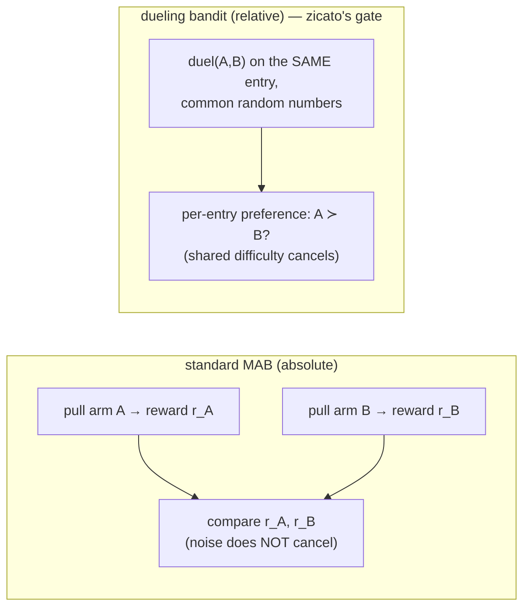

The dueling-bandit literature supplies the vocabulary for *what a winner
even is* under relative feedback, which matters as soon as more than one
challenger is in flight (the multi-candidate field of §9):

- **Condorcet winner** — an arm that beats *every* other in pairwise
  preference. The cleanest target; zicato's "beat the champion" gate is
  a one-opponent Condorcet test.
- **Copeland winner** — when no Condorcet winner exists (preferences can
  cycle), the arm that beats the *most* others. The robust fallback for
  a multi-challenger field with non-transitive deltas.
- **von Neumann / mixed winner** — the randomised strategy that is
  unbeatable in expectation when even Copeland is ambiguous.

And it supplies the **algorithms** that turn noisy duels into a
confident pick, all of which spend duels adaptively to tighten
*relative*-confidence bounds:

- **Interleaved Filtering** (Yue et al. 2012) — duel a candidate against
  survivors, eliminate when a confidence bound on the pairwise
  preference is decisive.
- **Beat-the-Mean** (Yue & Joachims 2011) — robust to violations of the
  strong-transitivity assumptions IF relies on.
- **Relative UCB (RUCB)** and Relative Confidence Sampling (Zoghi,
  Whiteson, Munos & de Rijke 2014) — a UCB analogue that maintains
  *pairwise* upper-confidence bounds and needs no Condorcet assumption
  baked into its exploration.
- **Double Thompson Sampling** (Wu & Liu 2016) — samples a posterior
  over the preference matrix *twice* to pick the duel pair; handles
  general Copeland bandits.
- **Sparring** — run two ordinary bandit learners against each other,
  one picking the "left" arm and one the "right"; a simple,
  reduction-style baseline.

Sui, Zoghi, Hofmann & Yue 2018 survey the area; the recurring theme is
that **repeated duels tighten relative-confidence bounds**, and you
promote only once the bound on "challenger ≻ champion" clears a target
confidence.

### 6.3 Mapping the dueling-bandit view onto zicato — and what it adds

The correspondence is exact:

| Dueling-bandit concept | zicato today |
|---|---|
| Arm | A candidate generation |
| A duel | One paired board run, champion vs challenger, common random numbers (§3.1, already implemented) |
| Persistent / incumbent arm | The reigning champion (recallable — cf. §5.2) |
| Preference outcome of a duel | The per-entry / aggregate sign of `child − parent` |
| Relative-preference acceptance test with a margin | The promote gate's scalar-margin rule (§3.2, the AlphaGo-Zero-style threshold) |
| Condorcet test against one opponent | "Beat the champion" |

zicato has already built the duel; what it lacks is the dueling-bandit
**confidence discipline**. A dueling-bandit acceptance rule would add
three things, each of them a change §9 already proposes, stated here in
the bandit idiom:

1. **A confidence-bounded relative comparison rather than a one-shot
   delta.**
   The gate today reads a *single* duel and applies a fixed margin.
   RUCB-style acceptance keeps a confidence bound on `P(challenger ≻
   champion)` and promotes only when that bound clears a target. The
   duel is replicated until the *relative* confidence, rather than the
   point estimate alone, justifies the crown. This is replication plus
   the paired significance gate (§9) seen from the bandit side, and it
   sharpens the statistical-gate family's "replicate, then test" (§2).
2. **Principled replication under noise to a target confidence.**
   Repeated duels on common-random-number entries are the cheapest
   possible variance reduction, because the pairing already cancels
   shared difficulty. The dueling-bandit stopping rule says how many
   duels to run: keep duelling until the relative bound is tight enough.
   That rule also defends against the **optimizer's curse** (§4).
   Promoting on one lucky duel is selecting on noise, and a
   confidence-bounded relative test is the guard.
3. **Condorcet (or Copeland) identification with a multi-challenger
   field.** Once a multi-candidate field puts `K > 1` challengers in
   flight, beating the champion is not a sufficient criterion, because
   preferences among challengers can cycle. The dueling-bandit notions
   say what to crown: the Condorcet winner if one exists, otherwise the
   Copeland winner. This is the relative-feedback form of the elitist
   iterated racing in §9, which races the `K`-field and crowns the
   most-replicated survivor.

**The size of the gap.** A gauntlet round is a **degenerate dueling
bandit**: one challenger, one duel, a fixed margin, and no confidence
bound. At `replicates = 1` it also carries no replication, which is the
cheapest legitimate instance of the framework; the shipped default of 2
buys one repeat of each measurement. The bandit view's recommendation
is the one §9 reaches from racing: add replication, turn the fixed
margin into a confidence-bounded relative test, and generalise "beat the
champion" to Condorcet or Copeland identification once a field exists. Both derivations reach the same design: optimal stopping
to bandits to dueling bandits, and constrained update to statistical
gate to racing.

---

## 7. The selection options as a spectrum

Every option is a point on a **compute-vs-confidence** curve, given a
*field* of candidates. Producing a field of more than one challenger per
round is the prerequisite; see the multi-candidate field in §9.

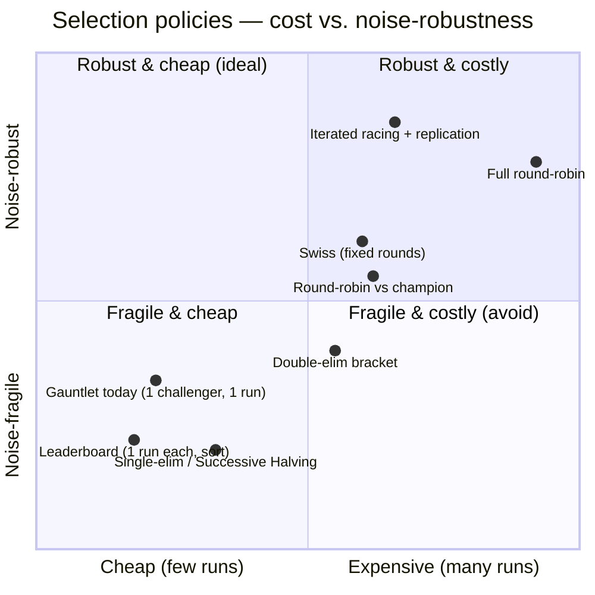

- **Leaderboard** (run each candidate once, sort by scalar). Cheapest;
  uses the absolute score directly. But one noisy run per candidate =
  noisy ranking. Fine for a first cut, unsafe as the sole gate.
- **Single-elimination / Successive Halving.** Cheap triage; *the wrong
  primitive here* (§2, the single-elimination family) — noise-fragile at
  the boundary, and a
  good candidate can die to one unlucky pairing.
- **Double-elimination.** Buys a "second life" for a variance victim —
  but the research is consistent that **replication dominates bracket
  position** for noise robustness. The compute a losers' bracket spends
  is better spent re-running before eliminating. *Not recommended.*
- **Round-robin vs champion / Swiss.** The right *instinct* (rank a
  whole field, no single-loss death) but the mature, cited form is
  **racing**, which is Swiss made adaptive: spend more comparisons only
  where the ranking is still statistically uncertain.
- **Iterated racing + replication.** The convergent recommendation:
  generate off the elite, race on shared board entries, eliminate by
  paired significance test, keep replicating survivors, crown the
  most-replicated candidate that also clears the feasibility gate.

Because zicato has an **absolute** score and an **expensive, noisy**
evaluation, the lever that matters is **how many times each candidate is
re-evaluated** rather than the shape of the bracket. Brackets extract a
ranking from cheap pairwise games; zicato's scarce resource is samples,
so it should spend them on replication.

---

## 8. Single elimination, double elimination and Swiss are experimental

The three structures pair challengers against each other, so a
candidate's fate depends on its draw. Each buys something that zicato's
regime has a cheaper answer for:

| Structure | What it buys | Why the default choice does without it |
|---|---|---|
| **Single-elimination** | Triage of a large field | At two to four candidates there is nothing to triage: every candidate can meet the champion directly, and a candidate cut by one noisy match is lost. |
| **Double-elimination** | A second chance for a variance victim | `replicates` buys the same second chance for the same compute, with no losers' bracket and no frozen field. |
| **Swiss** | A full ranking without elimination | Racing is Swiss with the board slice escalating rung by rung, and the crowning duel is the only ranking the loop consumes. |

None of the three has a measured case for zicato's regime: the two
144-cell sweeps in [CAMPAIGN.md](CAMPAIGN.md#r4-zero-of-nine-features-graduate--twice)
graduated no feature. They remain available to an operator who wants to
try them: set `experimental.tournament_structures` to `true` in
`scoring.json` alongside the `tournament` block. The default structure
choice is `gauntlet` and `racing`, with replication as the noise lever in
both.

---

## 9. The recommended design

A phased path from today's gauntlet to elitist iterated racing. Each
lever is independently shippable and independently valuable; they are
ordered by leverage-per-effort.

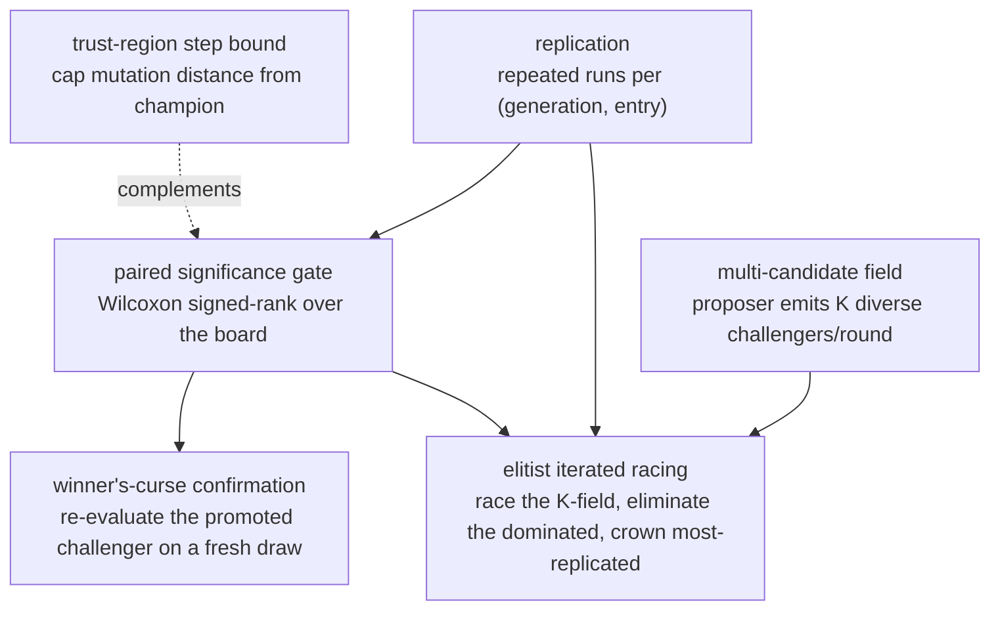

**A multi-candidate field.** Have the proposer emit *K*
diverse experiments per round (different mutation targets / hypotheses
off the same champion). Without a field there is no race; with one,
every richer policy becomes possible. Independently valuable: it widens
exploration.

**Replication (highest leverage).** Run each (generation,
entry) more than once and aggregate (mean, or better, keep the samples).
This is the single change the entire literature points at: under noisy
absolute evaluation, *more samples per candidate* — not bracket shape —
is what makes a winner trustworthy. It also fixes the most dangerous
fragility in the current gate, described next.

**A paired significance gate.** Today the scalar-margin rule compares two
scalars against a fixed margin, and the pass-rate monotonicity rule
rejects on a *single* per-task pass→fail flip. Both are noise-fragile: a
better challenger can be rejected because one entry the champion passed
was unlucky on its single run. Replace the point comparison with a **paired Wilcoxon
signed-rank test** across the board's per-entry deltas; the board is
already a paired sample, because champion and challenger see the same
entries. Require a per-task regression to be *statistically real* — a
repeated flip under replication — rather than a one-run accident. This
is a bounded change to `gate.py` and `scoring.py`. *Keep `promote_margin` as the effect-size
floor on top of the significance test — significance without a margin
promotes trivial wins.*

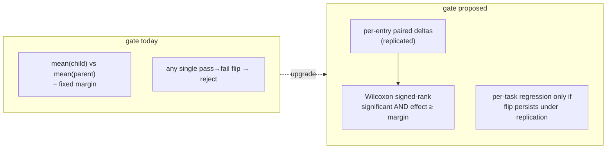

**Winner's-curse confirmation.** The promoted challenger's
loss is upward-biased: it was chosen *for* looking good (the optimizer's
curse, Smith & Winkler 2006). Before committing the crown,
**re-evaluate it on a fresh board draw** (or a held-out board slice
never used for proposal/selection — the epoch is a natural home for such
a confirmation set). Promote only if it holds up. A fresh-draw estimate
is unconditioned on the selection, so it is the cheap, model-free
version of the paper's Bayesian de-biasing. zicato applies it as
holdout confirmation of the crowned challenger
(`confirm_crowning_holdout` in `src/zicato/tournament/runner.py`, and
`_holdout_confirms` in `src/zicato/tournament/gate.py`).

**A trust-region step bound (complementary).** Borrow Family
①: cap how far one experiment may move the champion (patch size,
mutation-point count). Smaller, safer steps tighten the comparison
variance and reduce catastrophic regressions. The proposer brief's
mutation budget is the natural home. It does *not* replace the gate (it
cannot enforce per-task feasibility), it makes the gate's job easier.

**Elitist iterated racing (the synthesis).** With the multi-candidate
field, replication, and the paired significance gate in place, the whole
loop becomes irace over harnesses:

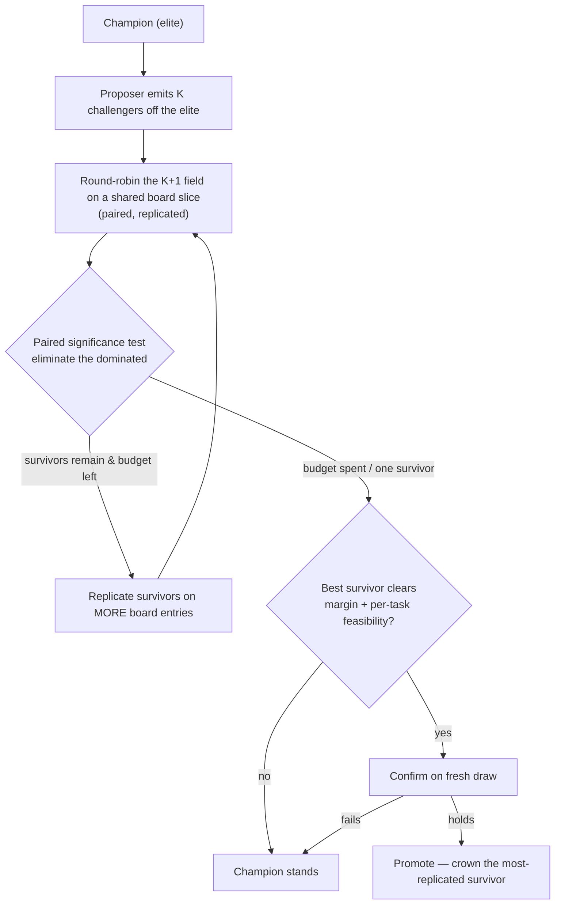

One inherited subtlety: irace omits multiple-comparison correction in
its *elimination* test by design, because correction makes racing too
timid to ever discard a candidate. zicato should do the same inside the
race, and still apply the winner's-curse confirmation at *final
promotion*. The two stances are opposite on purpose: eliminate
liberally, crown conservatively.

### 9.1 The measured noise floor sizes the replicate count and the racing cuts

The replication lever has a measured input. The A/A calibration
(`src/zicato/tournament/calibration.py`) persists `noise_floor.delta_std`
on the epoch record: the standard deviation of one duel's `delta_scalar`
when the champion meets itself, a statistic that sharpens rather than
grows as calibration draws accumulate. The two-sample minimum detectable
effect (`src/zicato/tournament/detectable_effect.py`),
`MDE = (t_{α/2,df} + t_{β,df}) · sd · √(2/n)` with `df = 2(n−1)` at α 0.05
and power 0.80, states the smallest difference `n` replicates resolve at
that floor. Its inverse, `replicates_for_margin`, returns the smallest
count whose effect is within `promote_margin`, up to a cap of 32
(`REPLICATE_SIZING_CAP`, the evidence gate's scaffolded replicate budget).

**The replicate count in effect.** At epoch open, once the floor is
persisted, `resolve_replicates` (`src/zicato/selection/replicates.py`)
attributes the count to one of three tiers. The contract's
`params["replicates"]` wins when pinned. Otherwise the floor sizes the
count against the margin, or the structure's default applies when that is
larger. Without a usable floor the structure's default applies. The loop
records the count and its tier under
`tournament.replicates` in the heartbeat's effective-settings record, logs
it once per invocation, and hands it to `make_strategy`, which injects it as
`params["replicates"]` only when the contract pins none. A pinned count
runs unchanged; when its detectable effect exceeds the margin, the round-0
log states both numbers. A margin no count up to the cap resolves leaves
the default in force and says so: the margin is the quantity to change
there rather than the replicate count, and the margin check of §3.2 already
recommends the value. The derived count is a runtime record and never
enters the contract, so the contract hash does not move.

**Racing cuts within resolution.** With a floor on the epoch,
`make_strategy` also injects `params["noise_floor_delta_std"]`, and each
racing rung computes the gap its own sample resolves. Taking the `M` board
entries as independent, equally weighted units of one full-board scalar,
one entry-replicate has deviation `delta_std · √(M/2)`, and a rung that
scores `m` entries at `r` replicates holds `m·r` units per arm. A candidate
whose scalar trails the last survivor's by less than the detectable effect
at that sample advances with the survivors, and the next rung's larger
slice resolves it. A rung that cuts nobody still advances, because the
escalation is the added sample. The final rung, on the full board, ranks
the survivors and sends the best to the champion gate. Without a floor the
cut is by rank alone.

The instrument-health panel serves the same ladder over the same
`delta_std` and names the tier the replicate count came from
([EVAL-VIEW.md §4](EVAL-VIEW.md#4-statistical-honesty-rules-the-views-must-obey)).

---

## 10. Configurable per-epoch tournament structures

> **Status.** SHIPPED. The `SelectionStrategy` interface, the five
> structures (gauntlet and racing in the default choice; single_elim,
> double_elim and swiss under the `experimental.tournament_structures`
> opt-in), the `tournament` contract block, and the CLI surface are in the tree; the
> full interface spec and reference live in
> [`TOURNAMENT-STRUCTURES.md`](TOURNAMENT-STRUCTURES.md). This section is
> the *decision-theory* placement of that work into the rest of this
> document — which structure approximates which §2/§5/§6 mechanism, and
> the honesty about noise each one demands.

§3–§9 describe *one* selection structure — the king-of-the-hill gauntlet
(§3), shown to be the degenerate single-replicate instance of the
statistical-gate family (§2②) / the dueling-bandit framework (§6.3) /
elitist iterated racing (§4). The recommended path (§9) keeps the
gauntlet's shape and adds replication and a confidence-bounded test
*inside* it.

An orthogonal axis is exposed as well: **which competition the field
runs, chosen per epoch.** The gauntlet stays the default and racing is
the scaffold's recommendation; an epoch may instead elect
single-elimination, double-elimination or Swiss pairing under the
`experimental.tournament_structures` opt-in. Each structure below is
stated in the language of §2, §5 and §6. §2 and §8 give the reason the
three are experimental: at zicato's field size a bracket is unnecessary,
and noise is answered by replication for every structure. Exposing them
makes the trade explicit and per-epoch, and every non-gauntlet structure
carries the replication §9 prescribes.

### 10.1 The strategy abstraction

A `SelectionStrategy` is the per-epoch object the orchestrator consults
to decide **which champion-vs-challenger duel(s) to run next** and **how
a completed duel's gate verdict advances, eliminates, or seeds the
field** — and **when the epoch's tournament is resolved.** It owns
*scheduling + bracket bookkeeping + champion-advance + stopping*; it does
**not** own the accept/reject decision of a single duel. That stays the
existing three-rule promote gate (§3.2) — every structure consumes the
*same* `GateOutcome` per duel, so the feasibility guarantee of §1, property 4, is
preserved no matter which bracket is wrapped around it. The full
interface, per-structure design, and backend plan are in
[`TOURNAMENT-STRUCTURES.md`](TOURNAMENT-STRUCTURES.md).

### 10.2 Each structure, mapped to this document's theory

| Structure (`tournament.structure`) | What it is here | §-mapping | Selection / advance | Stopping rule | Replication stance |
|---|---|---|---|---|---|
| **`gauntlet`** *(default)* | Today's king-of-the-hill (§3) | Degenerate single-replicate dueling bandit (§6.3); `(μ+λ)` elitism (§2 elitism note) | One duel/round: champion vs the round's one challenger; promote on gate `promoted` | §3.3 / §5 — `rounds`, `max_consecutive_rejections`, posterior stop (§5.4) | None today; §9 adds replication, a paired significance gate, and winner's-curse confirmation in place |
| **`single_elim`** | Bracket of *K* challengers; winners advance; champion is a seed/bye | Condorcet identification (§6.2) over a one-shot field; **experimental** (§8; opt-in `experimental.tournament_structures`) | Each bracket node is a duel; node winner = the side the gate prefers; champion enters as a bye and meets the bracket survivor in the final | Tournament resolves when one finalist remains; champion promoted only if it clears the gate as the final duel's challenger | **Mandatory** ≥ r duels/node, or a strong candidate dies to one unlucky run (§2, §8) |
| **`double_elim`** | Winners' + losers' brackets; one loss is survivable | Condorcet ID with a second life (§6.2); **experimental** (§8; the same opt-in) | Two brackets; a node-loser drops to the losers' bracket; grand final is winners'-survivor vs losers'-survivor | Resolves when the losers' bracket is exhausted; champion-gate applied to the grand-final survivor | §8: the second-life benefit is **delivered more cheaply by replication** — prefer raising `replicates` over building the losers' bracket |
| **`swiss`** | Fixed `rounds_n` rounds, pair by running standing | Copeland identification (§6.2); Swiss-as-non-adaptive-racing (§7); **experimental** (§8; the same opt-in) | Each round pairs near-standing generations into duels; standing = Copeland score (duels won) tie-broken by mean scalar | Resolves after `rounds_n` Swiss rounds; champion = top of final standing if it clears the gate vs the incumbent | Pairings repeat opponents rarely; **per-pairing replication** is how Swiss earns noise robustness (§6.2's "duels tighten the relative bound") |
| **`racing`** | All challengers on a board *subset*, cut the worst, escalate budget | **Successive Halving / best-arm identification** (§2); the *adaptive* form of Swiss/round-robin (§7) and the structure §9's elitist-iterated-racing synthesis converges on | Rung 0: every challenger duels the champion on a board slice; eliminate the worst `1−1/eta`; survivors re-duel on a larger slice; repeat | Resolves when one survivor remains or the board is fully consumed; that survivor faces the full-board gate (plus the optional winner's-curse confirmation of §9) | **Built-in** — racing *is* escalating replication; this is the structure §7–§9 actually recommend, and the only bracket-shaped option this document endorses |

§7's conclusion holds here: every non-gauntlet structure spends more
duels, and the lever that buys confidence is **how many times each
candidate is re-evaluated** rather than the bracket shape. `single_elim`,
`double_elim` and `swiss` resolve only when the contract sets
`experimental.tournament_structures` to `true`; the contract loader, the
strategy registry, the builder and the CLI refuse them otherwise, each
naming that key. They serve an operator who wants to try a cheap-field
regime, such as a large proposer fan-out under a generous budget.
`racing` is the one structure whose noise handling the literature
endorses for zicato's regime, because its replication is intrinsic
rather than added on top. The default stays `gauntlet`.

### 10.3 The prerequisite: a multi-candidate field

Every structure except `gauntlet` needs *K > 1* challengers per round —
the **multi-candidate field of §9**. The gauntlet asks the proposer for one
`Experiment`; a bracketed/racing epoch asks for `field_size` diverse
experiments off the same champion. This is the shared unlock: without a
field there is no bracket to schedule. The `tournament` config block
therefore carries `field_size` (1 for `gauntlet`), and a non-gauntlet
structure with `field_size = 1` degrades to the gauntlet (one challenger,
one duel) rather than erroring — the same graceful degeneracy fast mode
already uses when no champion cache exists (§3.1).

### 10.4 The stopping rule composes with §5

The per-epoch structure decides *intra-tournament* resolution (which
duel next, when the bracket is settled). The §5 optimal-stopping rule
decides *whether to keep spawning rounds at all*. These compose: a
`racing` epoch resolves its rung ladder to a single survivor (intra), and
the §5 posterior stop still governs whether the *next* round's fresh
field is worth the cost `c` (inter). For `gauntlet` the two collapse into
one decision (one duel per round, so "resolve the tournament" and
"finish the round" coincide) — which is why §3.3 / §5 read as a single
stopping story today. The implementation must keep the §5 stop *outside*
the strategy, at the `evolve_n_rounds` level, so it applies uniformly
across structures.

---

## 11. Open questions

1. **Per-task noise vs. true regression.** How many replications are
   enough to tell a real per-task regression from a chance pass→fail
   flip, without exhausting the wall-clock budget? Is the right rule a
   per-entry sequential test, racing each entry the champion passed
   until the flip is confirmed or refuted?
2. **The winner's-curse magnitude.** How large is the optimizer's-curse
   inflation (Smith & Winkler 2006) given a board of this size and K
   challengers per round? Is a fresh-draw confirmation enough, or is an
   explicit Bayesian-shrinkage estimator on the selected candidate worth
   the complexity?
3. **Exploration vs. elitism.** Elitist racing converges fast but can
   converge *prematurely*; the literature has non-elitist variants that
   explore better. How much exploration pressure does the proposer need,
   and should rejected-but-promising challengers be carried across rounds
   as additional elites?
4. **Common random numbers under internal stochasticity.** The board
   gives champion and challenger the same *tasks*, but each run has its
   own internal randomness (sampling, tool nondeterminism). What is
   the analogue of a shared seed — fixing decode seeds per entry so the
   paired comparison cancels even *intra-run* noise?
5. **Calibrating the optimal-stopping rule (§5).** How is the round cost
   `c` best expressed (board-units? wall-clock? a fraction of the epoch
   budget), and what prior on proposer productivity avoids stopping too
   early on a champion that is merely between good ideas? Should the stop
   be evaluated *per champion* or only at *epoch* granularity, and how
   does the Gittins-style retire-vs-continue index interact with the
   contract-hash horizon reset?
6. **Target relative-confidence for promotion (§6).** What confidence
   level on `P(challenger ≻ champion)` should the dueling-bandit
   acceptance demand before crowning, and how many common-random-number
   duels does that imply per round given the board's observed
   per-entry-delta variance? With a `K`-challenger field, is Condorcet
   identification worth its duel budget, or does a Copeland fallback pay
   for itself only past some field size?
7. **Which structure for which epoch (§10).** Given §8, when is an
   experimental structure ever the right per-epoch choice — only under a large
   proposer fan-out with a generous budget, or never? What
   `field_size` / `eta` / board-subset schedule does `racing` need to
   beat the replicated gauntlet on simple regret per unit compute, and
   should the structure default to `racing` rather than `gauntlet` once
   the multi-candidate field of §9 exists?

---

## 12. References

Primary sources, grouped by the family they anchor. Every claim that
attaches a name+year in the body resolves to an entry here. Sources tied
to the verified research findings (TRPO, AlphaGo Zero, AlphaStar, PBT,
Hyperband, Hoeffding races, irace, Demšar, the off-policy bound) were
adversarially fact-checked against the original papers. The remaining
canonical references (ASHA, CMA-ES, the evolution-strategies
introduction, best-arm identification, the optimizer's curse) anchor
claims the body makes by inference. The optimal-stopping and (dueling-)bandit
sources (§5–§6) were likewise verified against their originals; the one
exception is Peskir & Shiryaev 2006, a standard textbook cited from
canonical knowledge for the optimal-stopping free-boundary theory rather
than for a specific verifiable result.

**Reinforcement-learning policy improvement & gating**

- Schulman, Levine, Abbeel, Jordan & Moritz 2015, *Trust Region Policy Optimization*, ICML — the monotonic-improvement lower bound and the trust-region constrained update. <https://arxiv.org/pdf/1502.05477>
- Iwaki & Asada 2017, *Implicit Incremental Natural Actor Critic* — off-policy monotonic improvement via a positive performance-difference lower bound. <https://arxiv.org/pdf/1710.03442>
- Meng et al. 2022, IEEE Transactions on Neural Networks and Learning Systems (IEEE Xplore doc 9334437) — an off-policy TRPO surrogate objective that uses both on- and off-policy data while preserving monotonic policy improvement. <https://ieeexplore.ieee.org/document/9334437/>
- Silver et al. 2017, *Mastering the Game of Go without Human Knowledge* (AlphaGo Zero), Nature 550 — the >55%-over-400-games gating evaluator, the margin chosen "to avoid selecting on noise alone." <https://discovery.ucl.ac.uk/10045895/1/agz_unformatted_nature.pdf>
- Vinyals et al. 2019, *Grandmaster level in StarCraft II using multi-agent reinforcement learning* (the AlphaStar league; main vs. exploiter agents), Nature 575. <https://www.nature.com/articles/s41586-019-1724-z>
- Jaderberg et al. 2017, *Population Based Training of Neural Networks* — truncation selection (ranking) vs. T-test selection (statistical gate). <https://arxiv.org/pdf/1711.09846>

**Hyperparameter / model selection & racing**

- Li, Jamieson, DeSalvo, Rostamizadeh & Talwalkar 2017, *Hyperband: A Novel Bandit-Based Approach to Hyperparameter Optimization*, JMLR 18 — Successive Halving brackets and the formal noise-vs-bracket tradeoff. <https://www.jmlr.org/papers/volume18/16-558/16-558.pdf>
- Li, Jamieson, Rostamizadeh, Gonina, Ben-Tzur, Hardt, Recht & Talwalkar 2020, *A System for Massively Parallel Hyperparameter Tuning* (ASHA), MLSys. <https://arxiv.org/abs/1810.05934>
- Maron & Moore 1993, *Hoeffding Races: Accelerating Model Selection Search for Classification and Function Approximation*, NeurIPS — confidence-bound elimination. <https://proceedings.neurips.cc/paper/1993/file/02a32ad2669e6fe298e607fe7cc0e1a0-Paper.pdf>
- López-Ibáñez, Dubois-Lacoste, Pérez Cáceres, Birattari & Stützle 2016, *The irace package: Iterated racing for automatic algorithm configuration*, Operations Research Perspectives 3 — elitist iterated racing, EDA candidate generation, replication-based incumbent protection. <https://www.sciencedirect.com/science/article/pii/S2214716015300270>
- Demšar 2006, *Statistical Comparisons of Classifiers over Multiple Data Sets*, JMLR 7 — the Wilcoxon signed-rank test (two systems) and Friedman + Nemenyi (many) across a task set. <https://www.jmlr.org/papers/volume7/demsar06a/demsar06a.pdf>

**Evolutionary computation (elitism & noisy fitness)**

- Beyer & Schwefel 2002, *Evolution strategies — A comprehensive introduction*, Natural Computing 1(1):3–52 — `(μ+λ)` elitist vs `(μ,λ)` non-elitist selection. <https://link.springer.com/article/10.1023/A:1015059928466>
- Hansen & Ostermeier 2001, *Completely Derandomized Self-Adaptation in Evolution Strategies* (CMA-ES), Evolutionary Computation 9(2):159–195. <https://direct.mit.edu/evco/article/9/2/159/892>

**Statistics of selection under noise**

- Audibert & Bubeck 2010, *Best Arm Identification in Multi-Armed Bandits*, COLT — best-arm identification and the simple-regret objective (successive rejects). <https://inria.hal.science/hal-00654404>
- Smith & Winkler 2006, *The Optimizer's Curse: Skepticism and Postdecision Surprise in Decision Analysis*, Management Science 52(3):311–322 — selecting over noisy estimates systematically overshoots; Bayesian skepticism as the correction. <https://ideas.repec.org/a/inm/ormnsc/v52y2006i3p311-322.html>
- Jamieson & Nowak 2014, *Best-arm identification algorithms for multi-armed bandits in the fixed confidence setting*, 48th Annual Conference on Information Sciences and Systems (CISS) — survey of fixed-confidence/fixed-budget pure-exploration. <https://nowak.ece.wisc.edu/bestArm.pdf>

**Optimal stopping (§5)**

- Bruss 2000, *Sum the odds to one and stop*, The Annals of Probability 28(3):1384–1391 — the odds algorithm for optimal stopping; the secretary problem's `1/e` rule as a special case. <https://projecteuclid.org/journals/annals-of-probability/volume-28/issue-3/Sum-the-odds-to-one-and-stop/10.1214/aop/1019160340.full>
- Gittins 1979, *Bandit Processes and Dynamic Allocation Indices*, Journal of the Royal Statistical Society: Series B 41(2):148–164 — the Gittins index; the continue-vs-retire index policy that bridges optimal stopping and bandits. <https://rss.onlinelibrary.wiley.com/doi/10.1111/j.2517-6161.1979.tb01068.x>
- Peskir & Shiryaev 2006, *Optimal Stopping and Free-Boundary Problems*, Lectures in Mathematics ETH Zürich, Birkhäuser — the canonical reference for the stop/continue region and continuous optimal-stopping theory. <https://link.springer.com/book/10.1007/978-3-7643-7390-0>

**Multi-armed and dueling bandits (§6)**

- Auer, Cesa-Bianchi & Fischer 2002, *Finite-time Analysis of the Multiarmed Bandit Problem*, Machine Learning 47:235–256 — the UCB1 algorithm and its cumulative-regret bound. <https://link.springer.com/article/10.1023/A:1013689704352>
- Thompson 1933, *On the Likelihood that One Unknown Probability Exceeds Another in View of the Evidence of Two Samples*, Biometrika 25(3/4):285–294 — the original Thompson sampling idea. <https://www.jstor.org/stable/2332286>
- Russo, Van Roy, Kazerouni, Osband & Wen 2018, *A Tutorial on Thompson Sampling*, Foundations and Trends in Machine Learning 11(1):1–96 — the modern treatment. <https://arxiv.org/abs/1707.02038>
- Yue & Joachims 2009, *Interactively Optimizing Information Retrieval Systems as a Dueling Bandits Problem*, ICML — the dueling-bandit formulation from relative/pairwise feedback. <https://www.cs.cornell.edu/people/tj/publications/yue_joachims_09a.pdf>
- Yue, Broder, Kleinberg & Joachims 2012, *The K-armed Dueling Bandits Problem*, Journal of Computer and System Sciences 78(5):1538–1556 — Interleaved Filtering and the formal K-armed dueling-bandit analysis. <https://www.sciencedirect.com/science/article/pii/S0022000012000281>
- Yue & Joachims 2011, *Beat the Mean Bandit*, ICML — a dueling-bandit algorithm robust to violations of strong stochastic transitivity. <https://www.cs.cornell.edu/people/tj/publications/yue_joachims_11a.pdf>
- Zoghi, Whiteson, Munos & de Rijke 2014, *Relative Upper Confidence Bound for the K-Armed Dueling Bandit Problem* (RUCB / RCS), ICML — pairwise upper-confidence bounds without a Condorcet assumption in exploration. <https://proceedings.mlr.press/v32/zoghi14.html>
- Wu & Liu 2016, *Double Thompson Sampling for Dueling Bandits*, NeurIPS — D-TS for general Copeland (and Condorcet) dueling bandits. <https://proceedings.neurips.cc/paper/2016/hash/9de6d14fff9806d4bcd1ef555be766cd-Abstract.html>
- Sui, Zoghi, Hofmann & Yue 2018, *Advancements in Dueling Bandits*, IJCAI (survey) — Condorcet/Copeland/von Neumann winners and the algorithm landscape. <https://www.ijcai.org/proceedings/2018/776>

*See also* [`TOURNAMENT.md`](TOURNAMENT.md),
[`TOURNAMENT-STRUCTURES.md`](TOURNAMENT-STRUCTURES.md),
[`SCORING.md`](SCORING.md), [`LOOP-HEALTH.md`](LOOP-HEALTH.md),
[`VOCABULARY.md`](VOCABULARY.md).
