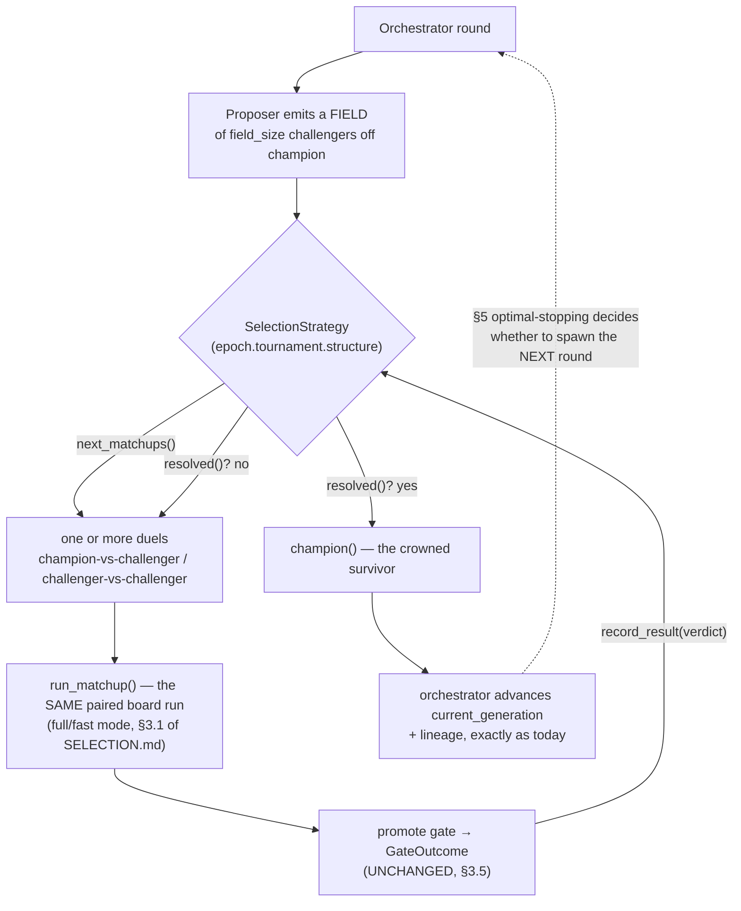

# Tournament

This document describes the **tournament** — zicato's competition
model. A tournament is how a candidate generation earns its place
in the lineage: it must beat the reigning champion over the frozen
board, judged by the scoring gate.

[SCORING.md](SCORING.md) specifies the *scalar* — the weighted
drift-loss-plus-pass-rate number and the promotion gate that
consumes it. This document specifies the *structure around* that
scalar: the king-of-the-hill gauntlet shape, the dashboard's
Tournament view, the tournament-detail analytics, and the
relationship between zicato's competition view and harmonograf's
execution view.

This document covers:

- The gauntlet / king-of-the-hill structure (§1).
- The dashboard's Tournament view: the bracket and the
  per-matchup detail (§2-3).
- The tournament-detail analytics (§4).
- The harmonograf split: execution view vs competition view (§5).
- Cross-epoch: the bracket is per-epoch; the tree links epochs
  (§6).

## 1. The gauntlet structure

zicato's tournament is **not** a single-elimination bracket where
sixteen entrants pair off and a winner emerges. It is a
**king-of-the-hill gauntlet**: there is one reigning champion at
any moment, and challengers arrive one at a time to face it.

> **Orthogonal: how challengers are generated.** This document is about
> the *competition* — how a challenger earns promotion. What the
> proposer *sees* when it synthesizes a challenger is a separate concern:
> **experiment memory** feeds it a digest of prior experiment outcomes
> (verdicts + Δscalars + touched mutation ids) so it stops re-proposing
> known failures and builds on known wins. That digest is assembled and
> threaded the same way regardless of structure — gauntlet here, or
> Swiss / racing / elimination ([TOURNAMENT-STRUCTURES.md](TOURNAMENT-STRUCTURES.md)) —
> and never touches the gate. See [EXPERIMENT-MEMORY.md](EXPERIMENT-MEMORY.md).

### 1.1 King of the hill

At the start of an epoch, the champion is `v0` — the inner
harness as registered, the baseline. Then, round after round:

1. The proposer studies the patterns and proposes an
   `Experiment` — a hypothesis plus the patches that test it
   (see [EPOCHS-AND-JOURNALING.md §3](EPOCHS-AND-JOURNALING.md#3-the-experiment)).
2. The applier turns that Experiment into a **challenger
   generation** — `vN+1`, a candidate snapshot.
3. The tournament runs the **whole board** against both the
   reigning champion `vN` and the challenger `vN+1`.
4. The scoring gate ([SCORING.md §5](SCORING.md#5-the-tournament-promotion-gate))
   decides (`GateOutcome.decision`):
   - **Challenger wins** (`decision="promoted"`) → the challenger is
     *promoted*; it becomes the new champion. The lineage advances
     `vN → vN+1`.
   - **Champion holds** (`decision="rejected"`) → the challenger is
     *discarded*; the champion stays. No version bump; the next round
     proposes a fresh challenger against the *same* champion.

Every matchup is therefore **parent versus child**: the champion
is always the parent generation, the challenger is always the
child proposed against it. There is never a child-versus-child
matchup, never a matchup between two non-adjacent generations.
The competition is strictly "can this one new thing beat the
current best thing".

### 1.2 The winners' spine and the discarded challengers

The sequence of champions forms a single line — the **winners'
spine**. Every promoted generation is on the spine; the spine is
the lineage's backbone.

Challengers that lost are **discarded** — but not deleted. A
discarded challenger keeps its generation directory (v0
directory storage) or its `v{N}-rejected` tag (v0+1 git storage,
see [STORAGE.md §3](STORAGE.md#3-the-git-backed-roadmap-v01)); its
`experiment.json` carries the full hypothesis and the `outcome`
block explaining *why* it lost. A discarded challenger is
recoverable and inspectable; it is just not on the spine.

```
                          THE GAUNTLET (one epoch)

  champion:   v0 ═══════▶ v1 ═══════▶ v2 ═══════════════▶ v3 ═══▶ ...
              ║           ║           ║                   ║
   round 1 ───╫─ challenger c1        ║                   ║
              ║   PROMOTE → becomes v1║                   ║
              ║                       ║                   ║
   round 2 ───╫────────────╫─ challenger c2                ║
              ║            ║   PROMOTE → becomes v2        ║
              ║            ║                               ║
   round 3 ───┴────────────┴───╫─ challenger c3-rejected   ║
                               ║   DISCARD ✗               ║
                               ║   (champion v2 holds)     ║
   round 4 ──────────────────────────╫─ challenger c4      ║
                                      ║   PROMOTE → becomes v3
                                      ║
   round 5 ─────────────────────────────────╫─ challenger c5-rejected
                                             ║   DISCARD ✗

  ═══▶  winners' spine (champions)
  ─╫─   a matchup: parent champion  vs  child challenger
  ✗     discarded challenger (rejected; recoverable, off-spine)
```

The spine is `v0 → v1 → v2 → v3`. Rounds 3 and 5 produced
challengers (`c3`, `c5`) that the gate discarded — they ran the
full board, they have experiments and outcomes, but they never
joined the spine. Round numbers are global and independent of
promotion: round 5 is round 5 even though only three of the five
rounds promoted (see [EPOCHS-AND-JOURNALING.md §8](EPOCHS-AND-JOURNALING.md#8-round-mechanics)).

### 1.3 Why king-of-the-hill, not a fan-out bracket

A fan-out bracket — generate eight candidates, pair them off,
let a winner emerge — was considered and rejected:

- **The champion is the only baseline that matters.** zicato's
  job is to make the *current best* harness better. A candidate
  that beats six other weak candidates but loses to the
  incumbent has improved nothing. The only comparison that
  decides promotion is candidate-vs-incumbent.
- **The board is expensive.** Each side of a matchup re-runs the
  whole board (every entry, parent and candidate — see
  [SCORING.md §4](SCORING.md#4-per-generation-aggregate-score)).
  A fan-out bracket of eight candidates is eight board runs per
  round; the gauntlet is two (champion + one challenger, and the
  champion's runs are often cached from the previous round).
- **Each round carries a hypothesis.** A challenger is not a
  random mutation — it is a *designed experiment* with a
  predicted outcome ([EPOCHS-AND-JOURNALING.md §3.1](EPOCHS-AND-JOURNALING.md#31-hypothesis-schema-mandatory)).
  Running one well-reasoned challenger at a time and journaling
  whether its hypothesis held is worth more than running eight
  un-reasoned mutations and picking the luckiest.

The gauntlet trades breadth of search for depth of reasoning.
That is the right trade for a system whose unit of progress is a
*tested hypothesis*, not a *sampled mutation*.

### 1.4 The gauntlet is the *default*, not the only, structure

> **Status.** SHIPPED. The `SelectionStrategy` seam, all five concrete
> structures, the `tournament` contract block, and the
> `--tournament-structure` / `--tournament-param` CLI surface are in the tree.
> The interface spec and backend reference are in
> [`TOURNAMENT-STRUCTURES.md`](TOURNAMENT-STRUCTURES.md); the
> decision-theory placement is in
> [`SELECTION.md §10`](SELECTION.md#10-configurable-per-epoch-tournament-structures).

The king-of-the-hill gauntlet of §1.1–§1.3 is the **default** tournament
structure. The structure is a **per-epoch configurable choice**: an epoch's
frozen contract carries a `tournament` block selecting one of `gauntlet`
(default), `single_elim`, `double_elim`, `swiss`, or `racing`. The
arguments in §1.3 *for* the gauntlet remain the reason it is the default;
the other structures exist for regimes with a *large* proposer fan-out
(§9 lever 0 in `SELECTION.md`), and `racing` is the one whose noise
handling the selection theory endorses for zicato's few-expensive-noisy
regime (`SELECTION.md §7–§9`).

The runner stops being hard-wired to "one champion, one challenger, one
duel". Instead a **`SelectionStrategy`** — chosen from the epoch's
`tournament.structure` — owns the *scheduling* (which duel(s) to run
next), the *bracket bookkeeping*, the *champion-advance* rule, and the
*intra-tournament stopping* (when the bracket is settled). The promote
gate (§3.5, [`SCORING.md §5`](SCORING.md#5-the-tournament-promotion-gate))
is **unchanged**: it remains the per-duel accept/reject test every
structure consumes, so the per-task feasibility guarantee holds for all
of them.



The dashboard bracket (§2) generalises accordingly: today it renders the
gauntlet's single spine; under a configurable structure it renders the
structure's own shape (a single-elimination tree, a Swiss standings
table, a racing rung-ladder) from the same per-matchup records, with the
gauntlet remaining the default rendering. The persisted-record shape that
backs the bracket is owned by the data-model design (see
`TOURNAMENT-STRUCTURES.md §"interface from the data-model agent"`).

## 2. The dashboard Tournament view

The live dashboard ([DASHBOARD.md](DASHBOARD.md)) has a
**Tournament view**: the operator's window into the competition.
It has two levels — the bracket (the whole epoch's gauntlet at a
glance) and the per-matchup detail (one round, drilled into).

The dashboard's *active tournament panel* (DASHBOARD.md §4.2)
shows the round currently in flight — which entries have
completed, the predicted gate verdict. The Tournament view here
is the wider thing: the *settled* gauntlet, every round, with the
in-flight round highlighted at its head.

### 2.1 The bracket

The bracket renders the gauntlet of §1.2 as the dashboard's
primary competition display: the winners' spine running left to
right, each round's matchup hanging off it, discarded challengers
marked.

```
┌────────────────────────────────────────────────────────────────────────────┐
│ Tournament — epoch 2026-05-15_e1 — 5 rounds, 3 promotions                   │
│                                                                              │
│   v0 ──▶── v1 ──▶── v2 ────────▶── v3 ──▶── (v4 running)                    │
│   │        │        │              │        │                               │
│   r1       r2       r3   ✗         r4       r5   ✗      ◀── matchup row      │
│   │        │        │              │        │                               │
│   c1       c2       c3-rej         c4       c5-rej                            │
│   PROM     PROM     DISCARD        PROM     DISCARD                           │
│   Δ -0.31  Δ -0.18  +0.02          Δ -0.24  +0.07                             │
│                                                                              │
│   ▶ r4 in flight: c-r6 vs champion v3  ·  3/10 entries done                  │
│                                                                              │
│   click any round → matchup detail                                           │
└──────────────────────────────────────────────────────────────────────────────┘
```

Each matchup row shows: the round number, the challenger id, the
verdict (`PROM` / `DISCARD`), and the score delta (`Δ` — negative
is an improvement, since score is lower-is-better). Promoted
rounds sit on the spine; discarded rounds are marked `✗` and
their challenger is rendered off-spine. The in-flight round is
highlighted at the head with a live progress indicator.

The bracket is driven by the `tournaments` table in the
analytical index ([ANALYTICAL-INDEX.md §3.8](ANALYTICAL-INDEX.md#38-tournaments)) —
the bracket *is* `SELECT * FROM tournaments WHERE epoch_id = ?
ORDER BY round`. The in-flight round's partial state comes from
`.zicato/runtime/active_tournament.json` (the index only has
settled rounds).

### 2.2 Clicking through to a matchup

Clicking any round in the bracket opens that round's **matchup
detail** (§3). The bracket is the index; the matchup detail is
the page. The currently-running round opens the same detail
layout, just with live-updating partial data instead of a
settled `outcome`.

## 3. Per-matchup detail

The matchup detail is everything about one round — one
champion-vs-challenger competition. It has five sections.

### 3.1 Hypothesis

The challenger's `hypothesis` block, rendered:

```
Hypothesis — round 4 — challenger c-r4 (became v3)

  core_idea
    Tighten the researcher's system prompt so it stops asserting
    facts without citing sources.

  modulating       researcher.instruction, researcher.description
  why              Pattern across rounds 1-3: CONFABULATION_RISK
                   fires on 70% of [research]-tagged entries.
  expected drift   CONFABULATION_RISK  ↓ moderate
                   TOOL_ERROR          ↑ minor
  expected pass    +0.0 .. +0.15
  risks            Tighter prompt may slow the researcher.
                   May refuse instead of approximating.
```

This is the proposer's *stated intent before the run* — the
load-bearing artifact that makes the round interpretable later
(see [EPOCHS-AND-JOURNALING.md §3.1](EPOCHS-AND-JOURNALING.md#31-hypothesis-schema-mandatory)).

### 3.2 Patches

The patches the challenger applied — what the experiment
*changed*. One row per patch: the `mutation_id` it targeted, the
`op`, the `rationale`. Clicking a patch row opens the canonical
`patches/{patch_id}.json` (the full `new_content`) or, on a
git-backed workspace, the diff via `zicato show`.

```
Patches — 2 applied

  researcher.instruction   replace   "tighter wording to require citations"
  researcher.description   replace   "one-sentence scope, citation-first"
```

### 3.3 Per-entry A/B grid

The board, entry by entry, champion side versus challenger side
— the heart of the matchup. See §4.2 for the full spec; in the
matchup detail it renders as:

```
Per-entry A/B — champion v2  vs  challenger c-r4

  entry_id                    weight   champion        challenger      Δ-drift
  ─────────────────────────   ──────   ────────────    ────────────    ───────
  short_solar                 1.0      0.42  ✓ pass     0.31  ✓ pass    -0.11
  long_solar_with_constraints 1.5      0.55  ✗ fail     0.30  ✓ pass    -0.25  ✓✓
  contradictory_brief         1.0      2.50  ✗ fail     1.80  ✗ fail    -0.70
  revision_dialog             1.0      0.30  ✓ pass     0.33  ✓ pass    +0.03
  expert_review               1.0      0.41  ✓ pass     0.38  ✓ pass    -0.03
```

The grid is what makes a verdict legible: the operator sees
exactly *which* entries the challenger won, lost, or tied, and
whether any pass flipped.

### 3.4 Scalar breakdown

How the per-entry numbers aggregate into the two generation
scalars — the arithmetic of [SCORING.md §4](SCORING.md#4-per-generation-aggregate-score)
(`drift_loss_mean` is the unweighted mean over the five entries above;
defaults `drift_weight = pass_weight = 1.0`), shown:

```
Scalar breakdown

                            champion v2     challenger c-r4
  drift_loss_mean              0.836            0.624
  pass_rate                    0.600            1.000
  drift_weight · drift         0.836            0.624
  pass_weight · (1-pass_rate)  0.400            0.000
  ───────────────────────     ───────          ───────
  scalar                       1.236            0.624
```

This is the bridge between "the grid of per-entry numbers" and
"the single number the gate consumes".

> **Worker-transport fidelity.** Each board run executes in its own
> subprocess worker ([RUNTIME.md](RUNTIME.md)), so the scalar a matchup
> reports is only correct if the worker scores under the *same* weights the
> parent process configured. Two correctness guarantees back that: the
> per-epoch `per_judge_weights` (the per-judge loss weighting, scoring-side
> in [SCORING.md](SCORING.md)) now survives the worker transport intact
> (`src/zicato/_tournament_worker.py`), and the in-run process judges grade
> against the **real tool-call ledger** the run produced, not a narrated
> approximation of it — so a board judge like `file_findability` sees what
> the agent actually did. These keep the two sides of a duel scored on the
> identical, faithful basis the gate assumes.

### 3.5 Gate verdict

The promotion gate's decision and its reasoning — both sides of
the two-sided gate ([SCORING.md §5](SCORING.md#5-the-tournament-promotion-gate)):

```
Gate verdict — PROMOTED

  Rule 1 — scalar margin
    child.scalar                  = 0.624
    parent.scalar − promote_margin = 1.236 − 0.01 = 1.226
    delta_scalar (child − parent) = −0.612  (improvement)
    → PASS  (0.624 ≤ 1.226, no reject)

  Rule 2 — pass-rate monotonicity
    parent passed:    {short_solar, revision_dialog, expert_review}
    candidate passes: all of the above + long_solar + contradictory
    → PASS  (no previously-passing entry regressed)

  Rule 3 — per-namespace monotonicity
    rubric: / schema: aggregates absent; drift: unguarded by default
    → PASS

  decision: promoted — challenger c-r4 becomes champion v3
```

When the verdict is `rejected`, this section names the failing rule
and the exact `GateOutcome.reason` — `"insufficient improvement: ..."`
or `"challenger regressed: ..."` (Rule 1), `"pass-rate regression on
entries: <id>, ..."` (Rule 2), or `"monotonicity_regression on
namespace=<ns>, ..."` (Rule 3). When an operator
overrode the gate ([DASHBOARD.md §5.3](DASHBOARD.md#53-command-catalogue-and-safe-point-semantics)),
the section shows both the would-have-been verdict and the
override — the override is never silent.

## 4. Tournament-detail analytics

Beyond a single matchup, the Tournament view offers **analytics**
— cross-round aggregates that answer "how is the *competition
itself* going?". Every one of these is a cross-run query, served
from the analytical index ([ANALYTICAL-INDEX.md](ANALYTICAL-INDEX.md));
the supervisor reads the index via `rusqlite` rather than
walking the filesystem per panel refresh.

The analytics fall into six categories.

### 4.1 Verdict transparency

Make every gate verdict fully auditable. For each round: the two
generation scores, the margin computation, the monotonicity
check, the resulting `decision`, and the `rejection_reason` (or
`null`). If an operator overrode the gate, the category shows
the override alongside the gate's own verdict — the §3.5 gate
panel, aggregated to every round.

Verdict transparency exists so that no promotion or discard is
ever a black box: the operator can always see *why* the gate
decided what it decided. It is a direct projection of the
`tournaments` table plus the `experiments.rejection_reason` /
`experiments.override_by_operator` columns.

### 4.2 Per-entry A/B grid

The champion-vs-challenger grid of §3.3, available for any round
and aggregable across rounds. It is a **self-join of
`loss_profiles`** on `entry_id`:

```sql
SELECT p.entry_id, p.drift_loss AS champ_drift, c.drift_loss AS chal_drift,
       p.pass_fail AS champ_pass, c.pass_fail AS chal_pass
FROM loss_profiles p
JOIN loss_profiles c USING (epoch_id, generation? -- adjacent gens)
WHERE p.side = 'parent' AND c.side = 'candidate' AND ...;
```

(See [ANALYTICAL-INDEX.md §3.6](ANALYTICAL-INDEX.md#36-loss_profiles).)
Aggregated across the epoch, the grid surfaces *which entries
consistently differentiate generations and which never do* —
the latter being exactly the non-differentiating-entry signal
that loop-health diagnostics
([LOOP-HEALTH.md §3.2](LOOP-HEALTH.md#32-non-differentiating-board-entries))
escalates. The Tournament view and the loop-health panel read
the same underlying table from two angles.

### 4.3 Hypothesis ledger

The proposer's **calibration** — across the epoch, how often did
the proposer's predicted drift movements actually happen?

The ledger is built from the `hypothesis_movements` table
([ANALYTICAL-INDEX.md §3.9](ANALYTICAL-INDEX.md#39-a-derived-view-hypothesis_movements)).
For every round, for every drift kind the hypothesis predicted,
it has: the predicted direction and magnitude, the actual
direction and magnitude, and the `matched` boolean.

**The match semantics are explicit — sign AND magnitude.** A
predicted movement counts as *matched* only when both agree:

- **Sign (direction).** The predicted direction (`up` / `down` /
  `flat`) must equal the observed direction. "Predicted down,
  observed up" is a miss. "Predicted down, observed flat" is a
  miss — `flat` is its own direction, not a near-match of
  `down`.
- **Magnitude.** The predicted magnitude bucket (`minor` /
  `moderate` / `major`) must equal the observed magnitude
  bucket. "Predicted down moderate, observed down minor" is a
  **miss** — the sign is right but the magnitude bucket is
  wrong. There is no partial credit and no adjacent-bucket
  tolerance; the buckets are coarse precisely so that an exact
  match is a meaningful claim.

A prediction matches **iff sign matches AND magnitude matches.**
This is deliberately strict. The hypothesis ledger's whole value
is distinguishing a proposer that *reasons* (predicts the right
movement at the right scale) from one that *guesses* (gets the
sign right by coin-flip). A lenient "sign is close enough" rule
would inflate the match-rate and destroy that distinction.

The ledger renders as a per-round match-rate plus a running
epoch average:

```
Hypothesis ledger — epoch 2026-05-15_e1

  round   predicted   matched   rate     running avg
  ─────   ─────────   ───────   ────     ───────────
  r1      2           2         1.00     1.00
  r2      3           1         0.33     0.60
  r3      2           2         1.00     0.71
  r4      2           1         0.50     0.66
  r5      3           0         0.00     0.45    ◀ proposer calibration falling

  epoch hypothesis match-rate: 0.45  (6 of 12 predicted movements)
```

A falling match-rate is a loop-quality signal: it feeds the L5
circuit breaker's richer signals
([ROBUSTNESS.md §2.5](ROBUSTNESS.md#25-l5-consecutive-bad-circuit-breaker)
names "hypothesis match-rate below 25%" as a stop condition) and
is one input the operator weighs when deciding whether the
rubric needs re-steering.

### 4.4 Optimization trajectory

The score over rounds — is the champion actually getting better?
Two series, both from the `tournaments` / `generations` tables:

- The **champion score** at each round — the spine's score,
  which should be monotonically non-increasing (a champion is
  only replaced by something that beat it).
- The **challenger score** at each round — including the
  discarded ones, so the operator sees how close each failed
  challenger came.

```
scalar
1.0 ┤ ●─────●
    │        ╲
0.8 ┤         ●╲          champion (winners' spine)
    │           ╲────●────●
0.6 ┤            ◌    ╲     ╲
    │                  ╲     ●────────
0.4 ┤      ◌            ●         ◌
    │                                  ◌  ← discarded challengers
0.2 ┤
0.0 ┼───────────────────────────────────────
     r1    r2    r3    r4    r5    r6
```

The champion line is the headline "is the loop working?" gauge.
A flat champion line across many rounds, paired with a
loop-health finding, is the *stalled loop* signal of
[LOOP-HEALTH.md §3.5](LOOP-HEALTH.md#35-stalled-loop).

### 4.5 Mutation heat map

Which mutation points correlate with winning? Every challenger's
`hypothesis.modulating` list names the mutation-point ids it
touched ([ANALYTICAL-INDEX.md §3.3](ANALYTICAL-INDEX.md#33-experiments)
stores it as a JSON array, queryable with `json_each`). Cross
that against the round's `decision`:

```sql
SELECT m.value AS mutation_id,
       SUM(e.tournament_decision = 'promoted') AS wins,
       COUNT(*) AS appearances
FROM experiments e, json_each(e.modulating) m
WHERE e.epoch_id = ?
GROUP BY m.value;
```

Rendered as a heat map — mutation points down the side, a
win-correlation intensity per cell:

```
                              touched   promoted   win-correlation
  researcher.instruction         4          3        ███████░░  0.75
  researcher.description         3          3        █████████  1.00
  coordinator.routing            5          1        ██░░░░░░░  0.20
  writer.tools.summarize.descr   2          0        ░░░░░░░░░  0.00
```

The heat map is a **correlation, not a causation** — `researcher.
description` appearing in three promotes does not prove it caused
them (it was bundled with other patches). But it is a strong
steering hint: the operator reading "`coordinator.routing` has
been touched five times and promoted once" knows that surface is
resisting improvement, and can put it in the proposer brief's
`## Forbidden` list or focus the brief elsewhere.

### 4.6 Tournament cost

What the competition is *costing*. Per round and per epoch, from
the `tournaments` table's `wall_clock_seconds` and
`aux_llm_calls` columns ([ANALYTICAL-INDEX.md §3.8](ANALYTICAL-INDEX.md#38-tournaments)):

```
Tournament cost — epoch 2026-05-15_e1

  round   wall-clock   aux LLM calls   board runs
  ─────   ──────────   ─────────────   ──────────
  r1      00:06:51     3               2
  r2      00:07:12     4               2
  r3      00:05:40     3               2  (champion runs cached → 1)
  ...
  epoch total:  00:38:20   ·   21 aux calls   ·   ~9 board runs
```

Cost is the operator's budget gauge: it answers "how much have I
spent to get three promotions?" and, paired with the
optimization trajectory, "what is each point of score
improvement costing me?". Fast mode (see
[SCORING.md §7](SCORING.md#7-fast-mode-and-the-tournament)) shows
up here directly — a `mode = fast` round runs one board pass, not
two, and the cost column shows the saving.

> **Bounding the cost up front (racing's grind guard).** Where the cost
> column is the *retrospective* gauge, the `racing` structure also offers a
> *prospective* cap: opt-in `matchup_budget_seconds` /
> `final_rung_budget_seconds` params bound a duel's total board-unit
> wall-clock, with the final rung — the full-board × replicates × both-sides
> crowning duel — the pathological grinder the second param exists to bound.
> Enforcement is the worker's per-run wall-clock cancellation
> ([RUNTIME.md](RUNTIME.md), `src/zicato/_tournament_worker.py`); see
> [TOURNAMENT-STRUCTURES.md §3.5](TOURNAMENT-STRUCTURES.md#35-racing-the-endorsed-bracket-shaped-option).
> The builder's live cost meter, in turn, estimates per-round board-runs from
> the **per-structure default replicates** (swiss / single-elim / double-elim
> = 2, gauntlet / racing = 1) rather than a flat `1`, so the projected cost
> matches the schedule a structure actually runs
> ([TOURNAMENT-STRUCTURES.md §3](TOURNAMENT-STRUCTURES.md#3-the-five-concrete-strategies)).

## 5. The harmonograf split

zicato and harmonograf both render a "view of a run", and the
boundary between them is load-bearing. Stating it precisely:

> **harmonograf is the execution view; the zicato dashboard is
> the competition view. They are linked by a per-run drill-down,
> not merged.**

### 5.1 Two different objects

| | harmonograf | zicato dashboard |
|---|---|---|
| **Renders** | one goldfive *run* | one zicato *epoch* (many runs × many generations) |
| **The view is of** | the temporal trace of a single execution | the gauntlet of competition between generations |
| **Time axis** | wall-clock within the run (Gantt, trajectory) | round number across the epoch |
| **Unit** | a turn, a drift event, an intervention | a matchup, a verdict, a promotion |
| **Question it answers** | "what happened, moment by moment, in *this run*?" | "which generation is winning, and why?" |
| **Cadence** | within one run | across runs within an epoch |

harmonograf is the **execution view**: it shows the temporal
trace of *one run* — the plan unfolding, per-turn drift, the
intervention ladder, the operator steering. It is the right tool
for "this specific run wandered; show me the turn where it went
wrong".

The zicato dashboard is the **competition view**: it shows the
*comparison* — scoring, the bracket, the gate verdict, the
hypothesis ledger. It is the right tool for "this generation
beat that one; show me on which entries and by how much".

These are genuinely different objects. A run is a *trace*; the
tournament is a *comparison of aggregates over many traces*. One
is not a zoomed-in version of the other.

### 5.2 Linked by a per-run drill-down, not merged

The split is deliberate — the two views are **not** merged into
one super-UI. Merging would force a single tool to be good at
both a millisecond-resolution execution timeline and an
epoch-resolution competition bracket; it would be mediocre at
both. Instead they are *linked*.

The link is the **per-run drill-down**. Anywhere the zicato
dashboard shows a run — a cell in the per-entry A/B grid, a row
in the active runs list ([DASHBOARD.md §4.3](DASHBOARD.md#43-active-runs-list),
§4.8) — there is an "open in harmonograf" affordance. It hands
off to harmonograf pointed at that run's `events.jsonl` (the
`runs.events_path` column in the analytical index,
[ANALYTICAL-INDEX.md §3.5](ANALYTICAL-INDEX.md#35-runs), is the
exact join key).

```
   zicato dashboard                          harmonograf
   (competition view)                        (execution view)
   ──────────────────                        ─────────────────

   Tournament bracket
        │
        ▼  click round 4
   Matchup detail
        │
        ▼  click a cell in the A/B grid
   Run e4f2_long_solar_candidate
        │
        │   "open in harmonograf →"
        ╰──────────────────────────────────▶  events.jsonl for
                                               that one run:
                                               Gantt, drift trace,
                                               intervention history
```

The operator moves *down* the competition view — epoch, round,
matchup, run — and at the run level steps *across* into the
execution view. The competition view never tries to render a
turn-by-turn timeline; the execution view never tries to render
a bracket. Each does its one job, and the drill-down stitches
them.

This split is the same boundary the rest of the ecosystem keeps:
goldfive acts within a run, harmonograf observes within a run,
zicato acts across runs (see [ARCHITECTURE.md §3](ARCHITECTURE.md#3-cadence-comparison)).
harmonograf and the zicato dashboard are the *observability*
faces of the within-a-run and across-runs cadences respectively.

## 6. Cross-epoch: the bracket is per-epoch, the tree links epochs

The tournament bracket is scoped to **one epoch**. This follows
directly from the epoch being the unit of evaluation contract
(see [EPOCHS-AND-JOURNALING.md §1](EPOCHS-AND-JOURNALING.md#1-epoch-concept)):
the gauntlet's matchups are only meaningful while the board, the
proposer brief's `## Forbidden` list, and the scoring weights hold
steady.
A challenger in epoch `e1` and a champion in epoch `e0` were
judged against different contracts; a "matchup" between them
would be comparing two numbers that do not mean the same thing.
So each epoch has its own bracket, its own winners' spine, its
own analytics — all reset at the epoch boundary, exactly as
pattern aggregates reset.

What spans epochs is the **lineage tree**, not the bracket. The
tree view ([DASHBOARD.md §4.4](DASHBOARD.md#44-lineage-svg)
renders it as the lineage SVG) shows every epoch's spine, with a
*dashed cross-epoch edge* from each epoch's final champion to the
next epoch's `v0`. That cross-epoch edge is the baselining link:
a rolled epoch's `v0` is the promoted head of its predecessor
(see [EPOCHS-AND-JOURNALING.md §10.5](EPOCHS-AND-JOURNALING.md#105-baselining-a-rolled-epoch)).

```
   epoch e0 bracket          epoch e1 bracket          epoch e2 bracket
   ────────────────          ────────────────          ────────────────
   v0─▶v1─▶v2─▶v3            v0─▶v1─▶v2                v0─▶v1─▶...
               ╎                       ╎
               ╰┄┄┄┄┄┄┄┄┄┄┄┄┄┄▶ v0     ╰┄┄┄┄┄┄┄┄┄┄┄┄┄┄▶ v0

   ──▶  in-epoch winners' spine (the bracket lives here)
   ┄┄▶  cross-epoch baselining link (the tree lives here)
```

So the two structures compose cleanly:

- **Within an epoch** — the bracket. A king-of-the-hill gauntlet,
  comparable matchups, the analytics of §4.
- **Across epochs** — the tree. A shallow DAG, each epoch's
  spine joined to the next by a dashed baselining edge,
  recording how the harness evolved across changing evaluation
  contracts.

The bracket answers "who won, this epoch?"; the tree answers
"how did the harness get here, across all epochs?".

## 7. Cross-references

| Topic | Document |
|---|---|
| The scoring scalar and the promotion gate the tournament applies | [SCORING.md](SCORING.md) |
| The `Experiment` — hypothesis + patches each challenger carries | [EPOCHS-AND-JOURNALING.md §3](EPOCHS-AND-JOURNALING.md#3-the-experiment) |
| Round mechanics — where the tournament sits in a round | [EPOCHS-AND-JOURNALING.md §8](EPOCHS-AND-JOURNALING.md#8-round-mechanics) |
| Epoch as the evaluation contract; cross-epoch baselining | [EPOCHS-AND-JOURNALING.md §1](EPOCHS-AND-JOURNALING.md#1-epoch-concept), [§10.5](EPOCHS-AND-JOURNALING.md#105-baselining-a-rolled-epoch) |
| The live dashboard, the active tournament panel, the lineage SVG | [DASHBOARD.md](DASHBOARD.md) |
| The analytical index that backs every cross-round analytic | [ANALYTICAL-INDEX.md](ANALYTICAL-INDEX.md) |
| Loop-health detectors that read the same A/B and trajectory data | [LOOP-HEALTH.md](LOOP-HEALTH.md) |
| The L5 circuit breaker the hypothesis ledger feeds | [ROBUSTNESS.md §2.5](ROBUSTNESS.md#25-l5-consecutive-bad-circuit-breaker) |
| Discarded challengers as `v{N}-rejected` tags (git storage) | [STORAGE.md §3](STORAGE.md#3-the-git-backed-roadmap-v01) |
| The ecosystem cadence split zicato / goldfive / harmonograf | [ARCHITECTURE.md §3](ARCHITECTURE.md#3-cadence-comparison) |
</content>
</invoke>
